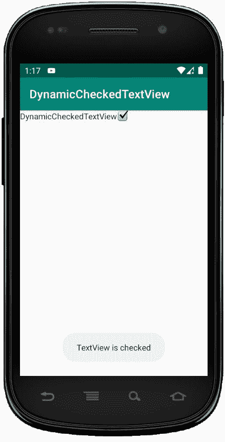
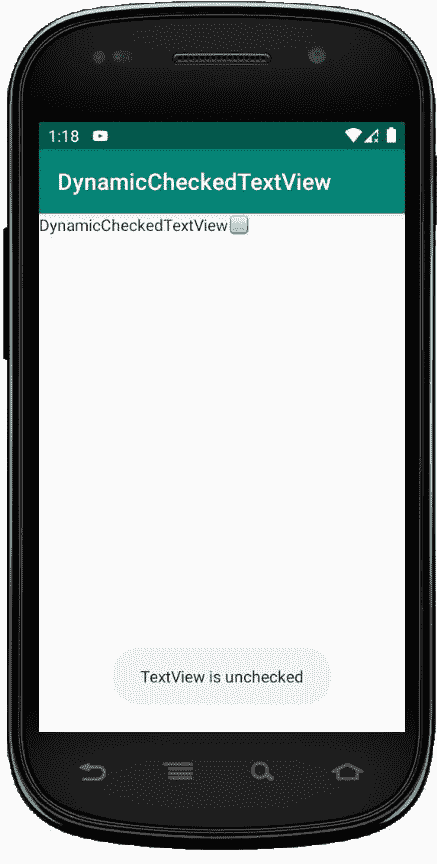

# 在 Kotlin 中动态检查文本视图

> 原文:[https://www . geeksforgeeks . org/dynamic-checked extview-in-kot Lin/](https://www.geeksforgeeks.org/dynamic-checkedtextview-in-kotlin/)

CheckedTextView 用于实现可检查的接口，用户可以勾选或检查需要或必需的项目，而忽略其余的项目。
在本文中，我们将讨论如何动态或以编程方式创建 CheckedTextView。

第一步是在安卓工作室制作或创建一个项目。在这里，我们将创建一个名为**dynamicccheckedtextview**的项目。
创建新项目:

*   点击文件，然后**新建** = > **新项目**
*   然后，勾选包含柯特林支持，点击下一步按钮。
*   选择最小的软件开发工具包，无论你需要什么。
*   选择**清空**活动，然后点击完成。

现在，我们需要修改我们的布局。为此:转到**app**>**RES**>**布局**并粘贴以下代码:

## 修改 activity_main.xml 文件

```kt
<?xml version="1.0" encoding="utf-8"?>
<RelativeLayout
    xmlns:android="http://schemas.android.com/apk/res/android"
    android:id="@+id/relativeLayout"
    xmlns:tools="http://schemas.android.com/tools"
    android:layout_width="match_parent"
    android:layout_height="match_parent"
    tools:context=".MainActivity">

</RelativeLayout>
```

下一步是添加当我们选中或取消选中 CheckedTextView 时将显示的字符串。
转到 res/values/strings.xml 并添加以下行。

```kt
<resources>
    <string name="app_name">DynamicCheckedTextView</string>
    <string name="checked">checked</string>
    <string name="unchecked">unchecked</string>
    <string name="pre_msg">TextView is</string>
</resources>
```

## 在 MainActivity.kt 文件中使用 CheckedTextView 代码

最后一步是对我们的 CheckedTextView 进行编码。打开 app/src/main/Java/**your package name**/main activity . kt

```kt
package com.geeksforgeeks.myfirstkotlinapp

import androidx.appcompat.app.AppCompatActivity
import android.os.Bundle
import android.view.ViewGroup
import android.widget.CheckedTextView
import android.widget.RelativeLayout
import android.widget.Toast

class MainActivity : AppCompatActivity() {

    override fun onCreate(savedInstanceState: Bundle?) {
        super.onCreate(savedInstanceState)
        setContentView(R.layout.activity_main)
        //getting our layout
        val relativeLayout = findViewById<RelativeLayout>(R.id.relativeLayout)
        //using checktextview
        val checkedTextView = CheckedTextView(this)
        checkedTextView.layoutParams = RelativeLayout.
            LayoutParams(ViewGroup.LayoutParams.WRAP_CONTENT,
            ViewGroup.LayoutParams.WRAP_CONTENT)
        //using our strings.xml to set text
        checkedTextView.setText(R.string.app_name)
        //initially the checkbox in unchecked
        checkedTextView.isChecked = false
        checkedTextView.setCheckMarkDrawable(android.R.drawable.
            checkbox_off_background)

        //Onclick event for checkbox
        checkedTextView.setOnClickListener {
            checkedTextView.isChecked = !checkedTextView.isChecked
            checkedTextView.setCheckMarkDrawable(if (checkedTextView.isChecked)
                android.R.drawable.checkbox_on_background 
                else android.R.drawable.checkbox_off_background)

            //using our strings.xml setting the starting message of the toast
            val message = getString(R.string.pre_msg) + " " + 
                    if (checkedTextView.isChecked)
                getString(R.string.checked) 
                    else getString(R.string.unchecked)
            Toast.makeText(this@MainActivity, message, Toast.LENGTH_LONG).show()
        }

        // Add Checkbox to RelativeLayout
        relativeLayout?.addView(checkedTextView)

    }
}
```

## AndroidManifest.xml 文件

```kt
<?xml version="1.0" encoding="utf-8"?>
<manifest xmlns:android="http://schemas.android.com/apk/res/android"
    package="com.geeksforgeeks.myfirstkotlinapp">

    <application
        android:allowBackup="true"
        android:icon="@mipmap/ic_launcher"
        android:label="@string/app_name"
        android:roundIcon="@mipmap/ic_launcher_round"
        android:supportsRtl="true"
        android:theme="@style/AppTheme">
        <activity android:name=".MainActivity">
            <intent-filter>
                <action android:name="android.intent.action.MAIN" />

                <category android:name="android.intent.category.LAUNCHER" />
            </intent-filter>
        </activity>
    </application>

</manifest>
```

## 作为模拟器运行:

