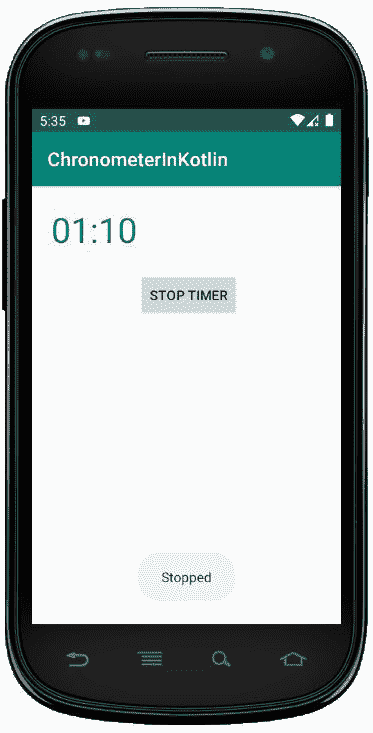

# 科特林动态计时器

> 原文:[https://www . geesforgeks . org/dynamic-chronometer-in-kot Lin/](https://www.geeksforgeeks.org/dynamic-chronometer-in-kotlin/)

安卓**计时器**是用户界面控件，在视图中显示计时器。我们可以使用计时器小部件轻松启动带基本时间的向上或向下计数器。默认情况下， **start()** 方法可以假定基准时间并启动计数器。

一般来说，我们可以在 XML 布局中创建使用**计时器**小部件，但是我们也可以通过编程来实现。

首先，我们按照以下步骤创建一个**新项目**:

1.  点击**文件**，然后**新建** = > **新建项目**。
2.  之后加入 Kotlin 支持，点击下一步。
3.  根据方便选择最小 SDK，点击下一步按钮。
4.  然后选择**清空**活动= > **下一个** = > **完成**。

## 修改 activity_main.xml 文件

在这个文件中，我们使用线性布局小部件和一个按钮来启动或停止血糖仪，并为它们设置属性。

```
<?xml version="1.0" encoding="utf-8"?>
<androidx.constraintlayout.widget.ConstraintLayout
    xmlns:android="http://schemas.android.com/apk/res/android"
    xmlns:app="http://schemas.android.com/apk/res-auto"
    android:layout_width="match_parent"
    android:layout_height="match_parent"
    android:orientation="vertical"
    android:id="@+id/constraint_layout">

    <LinearLayout
        android:id="@+id/l_layout"
        android:layout_width="match_parent"
        android:layout_height="wrap_content"
        android:orientation="vertical">
    </LinearLayout>

    <Button
        android:id="@+id/btn"
        android:layout_width="wrap_content"
        android:layout_height="wrap_content"
        android:layout_marginStart="163dp"
        android:layout_marginTop="20dp"
        android:layout_marginEnd="163dp"
        android:text="@string/start"
        app:layout_constraintEnd_toEndOf="@id/l_layout"
        app:layout_constraintHorizontal_bias="0.485"
        app:layout_constraintStart_toEndOf="@+id/l_layout"
        app:layout_constraintStart_toStartOf="@id/l_layout"
        app:layout_constraintTop_toBottomOf="@+id/l_layout" />

</androidx.constraintlayout.widget.ConstraintLayout>
```

## 更新 strings.xml 文件

这里，我们使用字符串标签更新应用程序的名称。我们也有其他可以在 MainActivity.kt 文件中使用的字符串。

```
<resources>
    <string name="app_name">ChronometerInKotlin</string>
    <string name="stop">Stop Timer</string>
    <string name="start">Start Timer</string>
    <string name="working">Started</string>
    <string name="stopped">Stopped</string>
</resources>
```

## 在 MainActivity.kt 文件中创建计时器

首先，我们声明一个变量**米**来创建 Kotlin 文件中的计时表。

```
val meter = Chronometer(this)
        // set color and size of the text
        meter.setTextColor(Color.BLUE)
        meter.setTextSize(TypedValue.COMPLEX_UNIT_IN,0.25f)

```

此外，使用在布局中添加计时器

```
val linearLayout = findViewById(R.id.l_layout)
        linearLayout?.addView(meter) 
```

然后，我们从 xml 文件中访问按钮，并设置 **setOnClickListener** 来启动和停止计时器。

```
val btn = findViewById<Button>(R.id.btn)
        btn?.setOnClickListener(object : View.OnClickListener {...}

```

```
package com.geeksforgeeks.myfirstkotlinapp

import android.graphics.Color
import androidx.appcompat.app.AppCompatActivity

import android.os.Bundle
import android.util.TypedValue
import android.widget.Button
import android.view.View
import android.view.ViewGroup
import android.widget.Chronometer
import android.widget.LinearLayout
import android.widget.Toast

class MainActivity : AppCompatActivity() {

    override fun onCreate(savedInstanceState: Bundle?) {
        super.onCreate(savedInstanceState)
        setContentView(R.layout.activity_main)

        // create the chronometer from XML file
        val meter = Chronometer(this)
        // set color and size of the text
        meter.setTextColor(Color.BLUE)
        meter.setTextSize(TypedValue.COMPLEX_UNIT_IN,0.25f)

        val layoutParams = LinearLayout.LayoutParams(
            ViewGroup.LayoutParams.MATCH_PARENT,
            ViewGroup.LayoutParams.MATCH_PARENT)
        layoutParams.setMargins(30, 40, 120, 40)
        meter.layoutParams = layoutParams

        val linearLayout = findViewById<LinearLayout>(R.id.l_layout)
        linearLayout?.addView(meter)

        //access the button using id
        val btn = findViewById<Button>(R.id.btn)
        btn?.setOnClickListener(object : View.OnClickListener {

            var isWorking = false

            override fun onClick(v: View) {
                if (!isWorking) {
                    meter.start()
                    isWorking = true
                } else {
                    meter.stop()
                    isWorking = false
                }

                btn.setText(if (isWorking) R.string.start else R.string.stop)

                Toast.makeText(this@MainActivity, getString(
                    if (isWorking)
                        R.string.working
                    else
                        R.string.stopped),
                    Toast.LENGTH_SHORT).show()
            }
        })
    }
}
```

## AndroidManifest.xml 文件

```
<?xml version="1.0" encoding="utf-8"?>
<manifest xmlns:android="http://schemas.android.com/apk/res/android"
package="com.geeksforgeeks.myfirstkotlinapp">

<application
    android:allowBackup="true"
    android:icon="@mipmap/ic_launcher"
    android:label="@string/app_name"
    android:roundIcon="@mipmap/ic_launcher_round"
    android:supportsRtl="true"
    android:theme="@style/AppTheme">
    <activity android:name=".MainActivity">
        <intent-filter>
            <action android:name="android.intent.action.MAIN" />

            <category android:name="android.intent.category.LAUNCHER" />
        </intent-filter>
    </activity>
</application>

</manifest>
```

## 作为模拟器运行:

