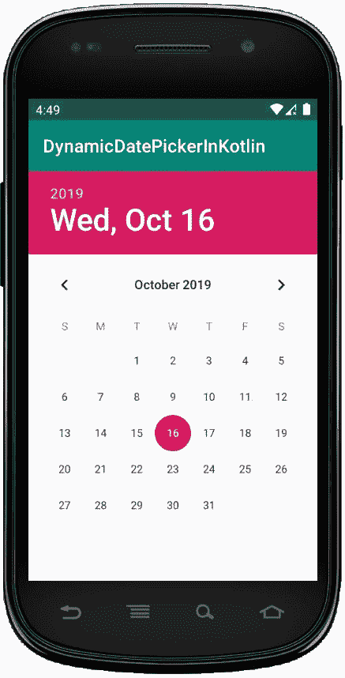

# 科特林动态日期选择器

> 原文:[https://www.geeksforgeeks.org/dynamic-datepicker-in-kotlin/](https://www.geeksforgeeks.org/dynamic-datepicker-in-kotlin/)

安卓**日期选择器**是一个用户界面控件，用于在我们的安卓应用中按日、月、年选择日期。日期选择器用于确保用户选择有效的日期。

在具有**和**两种模式的安卓日期选择器中，第一种模式显示完整的日历，第二种模式在微调视图中显示日期。

我们可以通过两种方式创建日期选择器控件，要么在 XML 文件中手动创建，要么在活动文件中以编程方式创建。

首先，我们按照以下步骤创建一个**新项目**:

1.  点击**文件**，然后**新建** = > **新建项目**。
2.  之后包含 Kotlin 支持，点击**下一步**。
3.  根据方便选择最小 SDK，点击下一步按钮。
4.  然后选择**清空**活动= > **下一个** = > **完成**。

## 修改 activity_main.xml 文件

```
<?xml version="1.0" encoding="utf-8"?>
<LinearLayout xmlns:android="http://schemas.android.com/apk/res/android"
    android:orientation="vertical"
    android:layout_width="match_parent"
    android:layout_height="match_parent"
    android:id="@+id/linear_layout"
    android:gravity = "center">

</LinearLayout>
```

**修改字符串. xml 文件**

```
<resources>
    <string name="app_name">DynamicDatePickerInKotlin</string>
</resources>
```

## 在 MainActivity.kt 文件中创建日期选择器

首先，我们声明一个变量 *datePicker* 在 Kotlin 文件中创建 datePicker 小部件。

```
val datePicker = DatePicker(this)

```

然后，我们将使用在线形布局中添加日期选择器

```
val linearLayout = findViewById(R.id.linear_layout)
        // add datePicker in LinearLayout
        linearLayout?.addView(datePicker) 
```

我们熟悉前面文章中的进一步活动。

```
package com.geeksforgeeks.myfirstkotlinapp

import androidx.appcompat.app.AppCompatActivity
import android.os.Bundle
import android.view.ViewGroup
import android.widget.*
import java.util.*

class MainActivity : AppCompatActivity() {

    override fun onCreate(savedInstanceState: Bundle?) {
        super.onCreate(savedInstanceState)
        setContentView(R.layout.activity_main)

        val datePicker = DatePicker(this)
        val layoutParams = LinearLayout.LayoutParams(
            ViewGroup.LayoutParams.MATCH_PARENT,
            ViewGroup.LayoutParams.MATCH_PARENT)
        datePicker.layoutParams = layoutParams

        val linearLayout = findViewById<LinearLayout>(R.id.linear_layout)
        // add datePicker in LinearLayout
        linearLayout?.addView(datePicker)

        val today = Calendar.getInstance()
        datePicker.init(today.get(Calendar.YEAR), today.get(Calendar.MONTH),
            today.get(Calendar.DAY_OF_MONTH)

        ) { view, year, month, day ->
            val month = month + 1
            val msg = "You Selected: $day/$month/$year"
            Toast.makeText(this@MainActivity, msg, Toast.LENGTH_SHORT).show()

        }
    }
}
```

## AndroidManifest.xml 文件

```
<?xml version="1.0" encoding="utf-8"?>
<manifest xmlns:android="http://schemas.android.com/apk/res/android"
package="com.geeksforgeeks.myfirstkotlinapp">

<application
    android:allowBackup="true"
    android:icon="@mipmap/ic_launcher"
    android:label="@string/app_name"
    android:roundIcon="@mipmap/ic_launcher_round"
    android:supportsRtl="true"
    android:theme="@style/AppTheme">
    <activity android:name=".MainActivity">
        <intent-filter>
            <action android:name="android.intent.action.MAIN" />

            <category android:name="android.intent.category.LAUNCHER" />
        </intent-filter>
    </activity>
</application>

</manifest>
```

## 作为模拟器运行:

