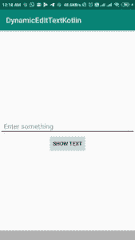
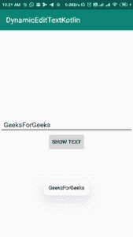

# 科特林动态编辑文本

> 原文:[https://www.geeksforgeeks.org/dynamic-edittext-in-kotlin/](https://www.geeksforgeeks.org/dynamic-edittext-in-kotlin/)

**编辑文本**用于获取用户的输入。编辑文本通常用于登录或注册屏幕。我们已经
学习了如何使用布局创建[编辑文本。在本文中，我们将学习如何在 kotlin 中以编程方式创建 android EditText。](https://www.geeksforgeeks.org/android-edittext-in-kotlin/)

首先，我们将创建一个新的安卓应用程序。然后，我们将动态创建一个编辑文本。
如果已经创建了项目，则忽略步骤 1。

**1。创建新项目**

| 步骤 | 描述 |
| --- | --- |
| 1. | 打开安卓工作室。 |
| 2. | 转到文件= >新建= >新项目。 |
| 3. | 然后，选择空活动并单击下一步 |
| 4. | 1.将应用程序名称写成 dynamiceditextkotlin
2。根据需要选择最小 SDK，这里我们选择了 21 作为最小 SDK
3。选择语言为 Kotlin，然后点击完成按钮。 |
| 5. | 如果您正确地遵循了上述过程，您将成功地获得一个新创建的项目。 |

创建项目后，我们将修改 xml 文件。

## 修改 activity_main.xml 文件

```kt
Open res/layout/activity_main.xml file and add code into it.
```

```kt
<?xml version="1.0" encoding="utf-8"?>
<LinearLayout
    android:id="@+id/activity_main"
    xmlns:android="http://schemas.android.com/apk/res/android"
    android:layout_width="match_parent"
    android:layout_height="match_parent"
    android:gravity="center"
    android:orientation="vertical">

    <LinearLayout
        android:id="@+id/editTextLinearLayout"
        android:layout_width="match_parent"
        android:layout_height="wrap_content"
        android:orientation="vertical">
    </LinearLayout>

    <Button
        android:id="@+id/buttonShow"
        android:layout_width="wrap_content"
        android:layout_height="wrap_content"
        android:text="Show text">
    </Button>

</LinearLayout>
```

所以在 **activity_main.xml** 文件中，我们创建了一个线性布局，id 为*的编辑文本线性布局*，我们使用这个线性布局作为创建编辑文本的容器。

## 在科特林动态创建安卓编辑文本

打开 app/src/main/Java/net . geeksforgeeks . dynamiceditextkotlin/main activity . kt 文件
并在其中添加以下代码。

```kt
package com.geeksforgeeks.myfirstKotlinapp

import androidx.appcompat.app.AppCompatActivity
import android.os.Bundle
import android.view.ViewGroup
import android.widget.Button
import android.widget.EditText
import android.widget.LinearLayout
import android.widget.Toast

class MainActivity : AppCompatActivity() {

    override fun onCreate(savedInstanceState: Bundle?) {
        super.onCreate(savedInstanceState)
        setContentView(R.layout.activity_main)
        val editLinearLayout = findViewById<LinearLayout>(R.id.editTextLinearLayout)
        val buttonShow = findViewById<Button>(R.id.buttonShow)

        // Create EditText
        val editText = EditText(this)
        editText.setHint("Enter something")
        editText.layoutParams = LinearLayout.LayoutParams(
            ViewGroup.LayoutParams.MATCH_PARENT,
            ViewGroup.LayoutParams.WRAP_CONTENT)
        editText.setPadding(20, 20, 20, 20)

        // Add EditText to LinearLayout
        editLinearLayout?.addView(editText)

        buttonShow?.setOnClickListener { Toast.makeText(
            this@MainActivity, editText.text,
            Toast.LENGTH_LONG).show() }
    }
}
```

在这里，我们在科特林中动态创建**编辑文本。然后，将此编辑文本添加到线性布局中，id 为*编辑文本线性布局*。且当按钮被点击时，也显示祝酒信息。**

As， **AndroidManifest.xml** 文件是安卓应用中非常重要的文件，所以下面是 Manifest 文件的代码。

## AndroidManifest.xml 文件

src/main/AndroidManifest.xml 文件中的代码如下所示。

```kt
<?xml version="1.0" encoding="utf-8"?>
<manifest xmlns:android="http://schemas.android.com/apk/res/android"
    package="net.geeksforgeeks.dynamicedittextkotlin">

    <application
        android:allowBackup="true"
        android:icon="@mipmap/ic_launcher"
        android:label="@string/app_name"
        android:roundIcon="@mipmap/ic_launcher_round"
        android:supportsRtl="true"
        android:theme="@style/AppTheme">
        <activity android:name=".MainActivity">
            <intent-filter>
                <action android:name="android.intent.action.MAIN" />

                <category android:name="android.intent.category.LAUNCHER" />
            </intent-filter>
        </activity>
    </application>

</manifest>
```

## 作为模拟器运行:

现在，运行您的应用程序。您将获得如下所示的输出。




你可以在这里找到完整的代码:
[https://github.com/missyadavmanisha/DynamicEditTextKotlin](https://github.com/missyadavmanisha/DynamicEditTextKotlin)