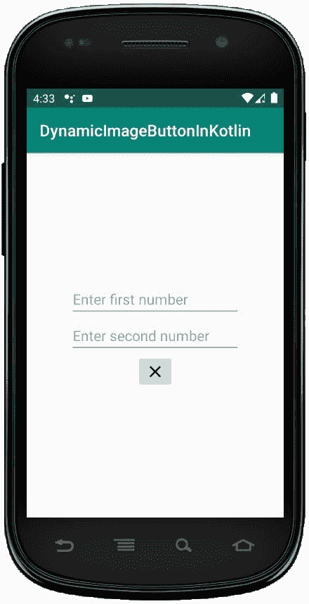
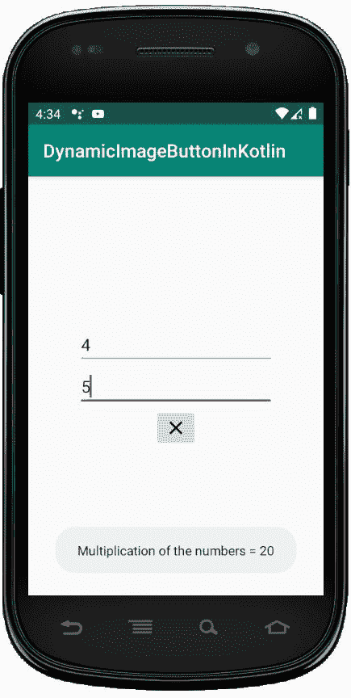

# 科特林

中的动态图像按钮

> 原文:[https://www . geesforgeks . org/dynamic-image button-in-kot Lin/](https://www.geeksforgeeks.org/dynamic-imagebutton-in-kotlin/)

安卓 **ImageButton** 是一个用户界面小部件，用来显示一个有图像的按钮，并且当我们点击它的时候执行完全一样的按钮，但是在这里，我们在 ImageButton 上添加了一个图像，而不是文本。安卓系统中有不同类型的按钮，如 ImageButton、ToggleButton 等。

我们可以简单地使用 activity_main.xml 文件中的<imagebutton>属性 **android:src** 或者使用 **setImageResource()** 方法给按钮添加一个图像。</imagebutton>

在安卓系统中，我们可以通过两种方式来创建 ImageButton 控件，可以是手动的，也可以是编程的。

首先我们按照以下步骤创建一个新项目:

1.  Click the file, and then **create a new** = > **new project** .
2.  After that, Kotlin support is included and click Next.
3.  Click **Next** button according to the convenience of selecting the minimum SDK.
4.  Then select **to clear** activity = > **Next** = > **to finish** .

在本文中，我们将以编程方式在 Kotlin 文件中创建 ImageButton。

## 在 activity_main.xml 文件中使用 linear layout

在这个文件中，我们将只添加 EditText，并为两者设置属性来访问 Kotlin 文件。

```kt
<?xml version="1.0" encoding="utf-8"?>
<LinearLayout xmlns:android="http://schemas.android.com/apk/res/android"
    android:orientation="vertical"
    android:layout_width="match_parent"
    android:layout_height="match_parent"
    android:id="@+id/linear_layout"
    android:gravity="center">

    <EditText
        android:id="@+id/Num1"
        android:layout_width="wrap_content"
        android:layout_height="wrap_content"
        android:ems="10"
        android:hint= "Enter first number"/>

    <EditText
        android:id="@+id/Num2"
        android:layout_width="wrap_content"
        android:layout_height="wrap_content"
        android:ems="10"
        android:hint= "Enter second number"/>

</LinearLayout>
```

**修改 *strings.xml* 文件写入应用程序的名称**

```kt
<resources>
    <string name="app_name">DynamicImageButtonInKotlin</string>
</resources>
```

## 在 MainActivity.kt 文件

中我们将声明一个变量 **imgBtn** 来创建 ImageButton。

```kt
 val imgBtn = ImageButton(this)
```

然后，使用

```kt
imgBtn.setImageResource(R.drawable.ic_clear_black_24dp)
```

为按钮设置图像资源最后，使用

```kt
val linearLayout = findViewById(R.id.linear_layout)
  // Adding ImageButton in LinearLayout
  linearLayout.addView(imgBtn) 
```

将按钮添加到线形布局中其他过程类似于在布局中手动添加图像按钮。

```kt
package com.geeksforgeeks.myfirstkotlinapp

import android.os.Bundle
import android.view.ViewGroup
import androidx.appcompat.app.AppCompatActivity
import android.widget.EditText
import android.widget.ImageButton
import android.widget.LinearLayout
import android.widget.Toast

class MainActivity : AppCompatActivity() {
    override fun onCreate(savedInstanceState: Bundle?) {
        super.onCreate(savedInstanceState)
        setContentView(R.layout.activity_main)
        val num1 = findViewById<EditText>(R.id.Num1)
        val num2 = findViewById<EditText>(R.id.Num2)
        val imgBtn = ImageButton(this)
        imgBtn.layoutParams = LinearLayout.LayoutParams(
            ViewGroup.LayoutParams.WRAP_CONTENT,
            ViewGroup.LayoutParams.WRAP_CONTENT)
        imgBtn.setImageResource(R.drawable.ic_clear_black_24dp)

        val linearLayout = findViewById<LinearLayout>(R.id.linear_layout)
        // Adding ImageButton in LinearLayout
        linearLayout.addView(imgBtn)

        imgBtn.setOnClickListener {
         if (num1.text.toString().isEmpty() || num2.text.toString().isEmpty()) {
              Toast.makeText(applicationContext,
                  "Enter both numbers", Toast.LENGTH_SHORT).show()
            }
            else {
                val num1 = Integer.parseInt(num1.text.toString())
                val num2 = Integer.parseInt(num2.text.toString())
                Toast.makeText(applicationContext,
                    "Multiplication of the numbers = " + (num1 * num2),
                    Toast.LENGTH_SHORT).show()
            }
        }
    }
}
```

## AnDroidManifest . XML 文件

```kt
<?xml version="1.0" encoding="utf-8"?>
<manifest xmlns:android="http://schemas.android.com/apk/res/android"
package="com.geeksforgeeks.myfirstkotlinapp">

<application
    android:allowBackup="true"
    android:icon="@mipmap/ic_launcher"
    android:label="@string/app_name"
    android:roundIcon="@mipmap/ic_launcher_round"
    android:supportsRtl="true"
    android:theme="@style/AppTheme">
    <activity android:name=".MainActivity">
        <intent-filter>
            <action android:name="android.intent.action.MAIN" />

            <category android:name="android.intent.category.LAUNCHER" />
        </intent-filter>
    </activity>
</application>

</manifest>
```

## 作为仿真器运行:

