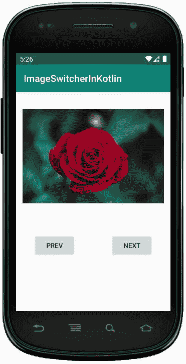
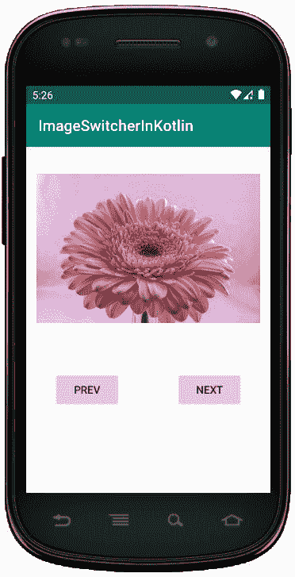

# 科特林动态影像切换器

> 原文:[https://www . geesforgeks . org/dynamic-imageswitcher-in-kot Lin/](https://www.geeksforgeeks.org/dynamic-imageswitcher-in-kotlin/)

安卓 **ImageSwitcher** 是一个用户界面小部件，它为图像提供平滑的过渡动画效果，同时在图像之间切换以在视图中显示。
ImageSwitcher 是 View Switcher 的子类，用于动画化一个图像并显示下一个图像。

这里，我们在 Kotlin 文件中以编程方式创建 ImageSwitcher**。**

**首先，我们按照以下步骤创建一个**新项目**:**

1.  **点击**文件**，然后**新建** = > **新建项目**。**
2.  **之后加入 Kotlin 支持，点击下一步。**
3.  **根据方便选择最小 SDK，点击下一步按钮。**
4.  **然后选择**清空**活动= > **下一个** = > **完成**。**

## **修改 activity_main.xml 文件**

**在这个文件中，我们使用约束布局与图像切换器和按钮。**

```kt
<?xml version="1.0" encoding="utf-8"?>
<androidx.constraintlayout.widget.ConstraintLayout
    xmlns:android="http://schemas.android.com/apk/res/android"
    xmlns:app="http://schemas.android.com/apk/res-auto"
    xmlns:tools="http://schemas.android.com/tools"
    android:layout_width="match_parent"
    android:layout_height="match_parent"
    android:orientation="vertical"
    android:id="@+id/constraint_layout">

    <Button
        android:id="@+id/prev"
        android:layout_width="wrap_content"
        android:layout_height="wrap_content"
        android:layout_marginStart="32dp"
        android:layout_marginTop="250dp"
        android:layout_marginEnd="32dp"
        android:text="@string/prev"
        app:layout_constraintEnd_toStartOf="@+id/next"
        app:layout_constraintStart_toStartOf="parent"
        app:layout_constraintTop_toTopOf="parent" />

    <Button
        android:id="@+id/next"
        android:layout_width="wrap_content"
        android:layout_height="wrap_content"
        android:layout_marginStart="32dp"
        android:layout_marginTop="250dp"
        android:layout_marginEnd="32dp"
        android:text="@string/next"
        app:layout_constraintEnd_toEndOf="parent"
        app:layout_constraintHorizontal_bias="1.0"
        app:layout_constraintStart_toEndOf="@+id/prev"
        app:layout_constraintTop_toTopOf="parent" />

</androidx.constraintlayout.widget.ConstraintLayout>
```

## **更新 strings.xml 文件**

**这里，我们使用字符串标签更新应用程序的名称。**

```kt
<resources>
   <string name="app_name">ImageSwitcherInKotlin</string>
   <string name="next">Next</string>
   <string name="prev">Prev</string>
</resources>
```

## **ImageSwitcher 小部件的不同方法**

| 方法 | 描述 |
| --- | --- |
| setimagedrawinable | 它用于在切换器中的下一个图像视图上设置新的可绘制对象。 |
| setImageResource | 它用于在 ImageSwitcher 上设置具有给定资源 id 的新图像。 |
| setImageURI | 它用于在带有给定 URI 的图像切换器上设置新图像。 |

## **在 MainActivity.kt 文件中创建 ImageSwitcher**

**首先，我们声明一个数组**花**，它包含用于 ImageView 的图像资源。**

```kt
private val flowers = intArrayOf(R.drawable.flower1,
       R.drawable.flower2, R.drawable.flower4) 
```

**然后，我们在 **MainActivity.kt** 文件中创建 **ImageSwitcher** ，并设置 ImageView 来显示图像。**

```kt
val imgSwitcher = ImageSwitcher(this)
imgSwitcher?.setFactory({
           val imgView = ImageView(applicationContext)
           imgView.scaleType = ImageView.ScaleType.FIT_CENTER
           imgView.setPadding(8, 8, 8, 8)
           imgView
           }) 
```

**此外，我们应该使用将 ImageSwitcher 添加到布局中。**

```kt
val c_Layout = findViewById<constraintlayout>(R.id.constraint_layout)
        //add ImageSwitcher in constraint layout
        c_Layout?.addView(imgSwitcher)</constraintlayout> 
```

```kt
package com.geeksforgeeks.myfirstkotlinapp

import androidx.appcompat.app.AppCompatActivity

import android.os.Bundle
import android.view.animation.AnimationUtils
import android.widget.Button
import android.widget.ImageSwitcher
import android.widget.ImageView
import androidx.constraintlayout.widget.ConstraintLayout

class MainActivity : AppCompatActivity() {

    private val flowers = intArrayOf(R.drawable.flower1, R.drawable.flower2,
                          R.drawable.flower4)
    private var index = 0

    override fun onCreate(savedInstanceState: Bundle?) {
        super.onCreate(savedInstanceState)
        setContentView(R.layout.activity_main)

        // create the ImageSwitcher
        val imgSwitcher = ImageSwitcher(this)

        imgSwitcher?.setFactory({
            val imgView = ImageView(applicationContext)
            imgView.scaleType = ImageView.ScaleType.FIT_CENTER
            imgView.setPadding(20, 20, 20, 20)
            imgView
        })

        val c_Layout = findViewById<ConstraintLayout>(R.id.constraint_layout)
        //add ImageSwitcher in constraint layout
        c_Layout?.addView(imgSwitcher)

        // set the method and pass array as a parameter
        imgSwitcher?.setImageResource(flowers[index])

        val imgIn = AnimationUtils.loadAnimation(
            this, android.R.anim.slide_in_left)
        imgSwitcher?.inAnimation = imgIn

        val imgOut = AnimationUtils.loadAnimation(
            this, android.R.anim.slide_out_right)
        imgSwitcher?.outAnimation = imgOut

        // previous button functionality
        val prev = findViewById<Button>(R.id.prev)
        prev.setOnClickListener {
            index = if (index - 1 >= 0) index - 1 else 1
            imgSwitcher?.setImageResource(flowers[index])
        }
        // next button functionality
        val next = findViewById<Button>(R.id.next)
        next.setOnClickListener {
            index = if (index + 1 < flowers.size) index +1 else 0
            imgSwitcher?.setImageResource(flowers[index])
        }
    }
}
```

## **AndroidManifest.xml 文件**

```kt
<?xml version="1.0" encoding="utf-8"?>
<manifest xmlns:android="http://schemas.android.com/apk/res/android"
package="com.geeksforgeeks.myfirstkotlinapp">

<application
    android:allowBackup="true"
    android:icon="@mipmap/ic_launcher"
    android:label="@string/app_name"
    android:roundIcon="@mipmap/ic_launcher_round"
    android:supportsRtl="true"
    android:theme="@style/AppTheme">
    <activity android:name=".MainActivity">
        <intent-filter>
            <action android:name="android.intent.action.MAIN" />

            <category android:name="android.intent.category.LAUNCHER" />
        </intent-filter>
    </activity>
</application>

</manifest>
```

## **作为模拟器运行:**

**点击**下一步**按钮，然后我们得到视图中的另一个动画图像。**

********