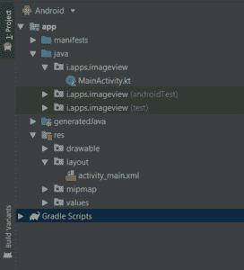

# 科特林动态影像视图

> 原文:[https://www.geeksforgeeks.org/dynamic-imageview-in-kotlin/](https://www.geeksforgeeks.org/dynamic-imageview-in-kotlin/)

顾名思义，一个**图像视图**用于在安卓应用程序中显示图像。在本文中，我们将讨论如何在 Kotlin 中以编程方式创建一个 ImageView。

第一步是在 Android Studio 中创建新项目。为此，请遵循以下步骤:

*   点击文件，然后**新建**，然后**新项目**，随便命名
*   然后，选择科特林语言支持，点击下一步按钮。
*   选择最小的软件开发工具包，无论你需要什么。
*   选择**清空** **活动**，然后点击**完成**。

这样做之后，在您的项目/gradle 完成加载之后，您会在左侧看到一些目录。应该是这样的:



之后，我们需要设计我们的布局。为此，我们需要处理 XML 文件。转到应用>资源>布局并粘贴以下代码:

### 修改 activity_main.xml 文件

## 可扩展标记语言

```kt
<?xml version="1.0" encoding="utf-8"?>
<RelativeLayout
        xmlns:android="http://schemas.android.com/apk/res/android"
        xmlns:tools="http://schemas.android.com/tools"
        xmlns:app="http://schemas.android.com/apk/res-auto"
        android:layout_width="match_parent"
        android:id="@+id/layout"
        android:layout_height="match_parent"
        tools:context=".MainActivity">

    <Button
            android:id="@+id/button"
            android:layout_width="wrap_content"
            android:layout_height="wrap_content"
            android:layout_marginBottom="20dp"
            android:text="Add Image"
            android:layout_centerInParent="true"/>

</RelativeLayout>
```

**添加图像**
我们将需要一个图像用于应用程序。您可以使用您喜欢的图像，但图像需要从我们的本地计算机路径复制到 app/res/drawable 文件夹。

### 在 MainActivity.kt 文件中创建 ImageView

打开 app/src/main/Java/your package name/main activity . kt 并进行以下更改:
像这样创建 ImageView 小部件:

```kt
 val imageView = ImageView(this)
        // setting height and width of imageview
        imageView.layoutParams = LinearLayout.LayoutParams(400, 400) 
        imageView.x = 20F //setting margin from left
        imageView.y = 20F //setting margin from top
```

然后使用以下命令在布局中添加小部件

```kt
        //accessing our relative layout from activity_main.xml
        val layout = findViewById(R.id.layout) 
        // Add ImageView to LinearLayout
        layout?.addView(imageView) //adding image to the layout
```

**MainActivity.kt**

## Java 语言(一种计算机语言，尤用于创建网站)

```kt
package com.geeksforgeeks.myfirstKotlinapp

import androidx.appcompat.app.AppCompatActivity
import android.os.Bundle
import android.widget.Button
import android.widget.ImageView
import android.widget.LinearLayout
import android.widget.RelativeLayout

class MainActivity : AppCompatActivity() {

    override fun onCreate(savedInstanceState: Bundle?)
    {
        super.onCreate(savedInstanceState)
        setContentView(R.layout.activity_main)

        val imageView = ImageView(this)
        // setting height and width of imageview
        imageView.layoutParams= LinearLayout.LayoutParams(400, 400)
        imageView.x= 20F // setting margin from left
        imageView.y= 20F // setting margin from top

        // accessing our custom image which we added in drawable folder
        val imgResId = R.drawable.img
        var resId = imgResId

        // button onClick listener
        val button = findViewById<Button>(R.id.button)
        button?.setOnClickListener{
            imageView.setImageResource(resId)
        }
        // accessing our relative layout from activity_main.xml
        val layout = findViewById<RelativeLayout>(R.id.layout)

        // Add ImageView to LinearLayout
        layout?.addView(imageView) // adding image to the layout
    }
}
```

### AndroidManifest.xml 文件

## 可扩展标记语言

```kt
<?xml version="1.0" encoding="utf-8"?>
<manifest xmlns:android="http://schemas.android.com/apk/res/android"
          package="i.apps.imageview">

    <application
            android:allowBackup="true"
            android:icon="@mipmap/ic_launcher"
            android:label="@string/app_name"
            android:roundIcon="@mipmap/ic_launcher_round"
            android:supportsRtl="true"
            android:theme="@style/AppTheme">
        <activity android:name=".MainActivity">
            <intent-filter>
                <action android:name="android.intent.action.MAIN"/>

                <category android:name="android.intent.category.LAUNCHER"/>
            </intent-filter>
        </activity>
    </application>

</manifest>
```

### 作为模拟器运行:

<video class="wp-video-shortcode" id="video-358870-1" width="640" height="360" preload="metadata" controls=""><source type="video/mp4" src="https://media.geeksforgeeks.org/wp-content/uploads/20191106210342/image.mp4?_=1">[https://media.geeksforgeeks.org/wp-content/uploads/20191106210342/image.mp4](https://media.geeksforgeeks.org/wp-content/uploads/20191106210342/image.mp4)</video>