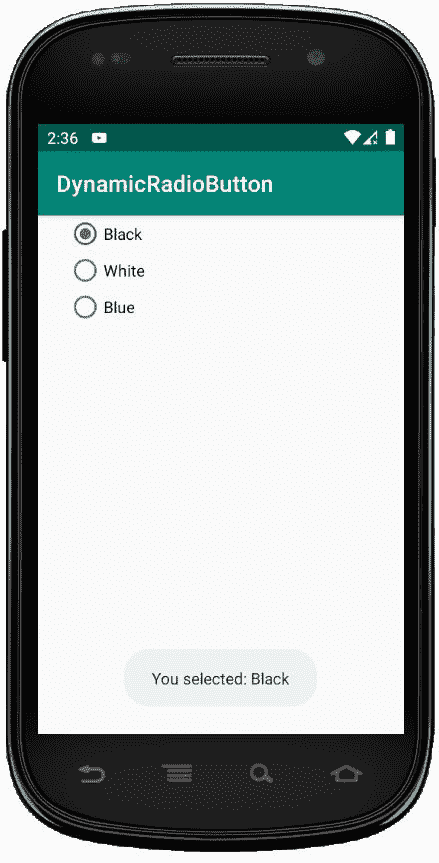
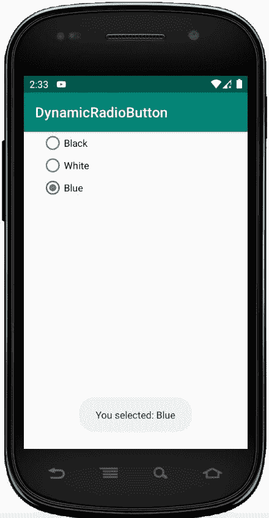

# 科特林动态单选按钮

> 原文:[https://www . geesforgeks . org/dynamic-radio button-in-kot Lin/](https://www.geeksforgeeks.org/dynamic-radiobutton-in-kotlin/)

安卓单选按钮是双态按钮，可以选中也可以不选中。此外，它的工作原理与 Checkbox 相同，只是单选按钮一旦被选中就不允许取消选中。

通常，我们使用单选按钮控件来允许用户从多个选项中选择一个选项。

默认情况下，单选按钮处于关闭(未选中)状态，但我们可以通过使用 android:checked 属性来更改单选按钮的默认状态。

为了创建单选按钮，首先我们需要创建一个项目。我们将其命名为**动态按钮**

*   点击文件，然后**新建** = > **新项目**
*   然后，勾选包含柯特林支持，点击下一步按钮。
*   选择最小的软件开发工具包，无论你需要什么。
*   选择**清空**活动，然后点击**完成**。

## 修改 activity_main.xml 文件

首先在 Linearlayout 中定义 RadioGroup，并访问 Kotlin 文件。

```
<?xml version="1.0" encoding="utf-8"?>
<LinearLayout
    xmlns:android="http://schemas.android.com/apk/res/android"
    xmlns:tools="http://schemas.android.com/tools"
    android:id="@+id/container"
    xmlns:app="http://schemas.android.com/apk/res-auto"
    android:layout_width="match_parent"
    android:layout_height="match_parent"
    tools:context=".MainActivity"
    android:orientation="vertical">

    <RadioGroup
        android:id="@+id/radioGroup"
        android:layout_width="match_parent"
        android:layout_height="wrap_content"
        android:paddingStart="25dp">
    </RadioGroup>
</LinearLayout>
```

上述代码仍会产生一些错误，要解决这些问题，请将以下代码片段添加到**app/RES/values/strings . XML**中

```
<resources>
    <string name="app_name">DynamicRadioButton</string>
    <string name="black">Black</string>
    <string name="white">White</string>
    <string name="blue">Blue</string>
    <string name="you_selected">You selected:</string>

</resources>
```

## MainActivity.kt 文件

这里，我们为颜色定义了三个单选按钮，并设置了它们的属性。

```
 val radioButton1 = RadioButton(this)
```

然后，使用代码将它们使用到 RadioGroup 中:

```
radioGroup.addView(radioButton1)
radioGroup.addView(radioButton2)
radioGroup.addView(radioButton3)

```

```
package com.geeksforgeeks.myfirstkotlinapp
import android.annotation.SuppressLint
import androidx.appcompat.app.AppCompatActivity
import android.os.Bundle
import android.view.ViewGroup
import android.widget.LinearLayout
import android.widget.RadioButton
import android.widget.RadioGroup
import android.widget.Toast

class MainActivity : AppCompatActivity() {

    @SuppressLint("ResourceType")
    override fun onCreate(savedInstanceState: Bundle?)
    {
        super.onCreate(savedInstanceState)
        setContentView(R.layout.activity_main)

        val linearLayout = findViewById<LinearLayout>(R.id.container)

        // Create RadioButton programmatically
        val radioButton1 = RadioButton(this)
        radioButton1.layoutParams= LinearLayout.LayoutParams(
            ViewGroup.LayoutParams.WRAP_CONTENT,
            ViewGroup.LayoutParams.WRAP_CONTENT)
            radioButton1.setText("Black")
        radioButton1.id = 1

        val radioButton2 = RadioButton(this)
        radioButton2.layoutParams = LinearLayout.LayoutParams(
            ViewGroup.LayoutParams.WRAP_CONTENT,
            ViewGroup.LayoutParams.WRAP_CONTENT)
            radioButton2.setText("White")
        radioButton2.id = 2

        val radioButton3 = RadioButton(this)
        radioButton3.layoutParams = LinearLayout.LayoutParams(
            ViewGroup.LayoutParams.WRAP_CONTENT,
            ViewGroup.LayoutParams.WRAP_CONTENT)
            radioButton3.setText("Blue")
        radioButton3.id = 3

        val radioGroup = findViewById<RadioGroup>(R.id.radioGroup)
        if (radioGroup != null)
        {
        radioGroup.addView(radioButton1)
        radioGroup.addView(radioButton2)
        radioGroup.addView(radioButton3)

            radioGroup.setOnCheckedChangeListener { group, checkedId ->
                var string = getString(R.string.you_selected)
                string += " " + getString(
                    if (checkedId == 1) R.string.black
                    else if(checkedId == 2 ) R.string.white
                    else R.string.blue )
            Toast.makeText(applicationContext, string, Toast.LENGTH_SHORT).show()
           }
        }
    }
}
```

## AndroidManifest.xml 文件

```
<?xml version="1.0" encoding="utf-8"?>
<manifest xmlns:android="http://schemas.android.com/apk/res/android"
package="com.geeksforgeeks.myfirstkotlinapp">

<application
    android:allowBackup="true"
    android:icon="@mipmap/ic_launcher"
    android:label="@string/app_name"
    android:roundIcon="@mipmap/ic_launcher_round"
    android:supportsRtl="true"
    android:theme="@style/AppTheme">
    <activity android:name=".MainActivity">
        <intent-filter>
            <action android:name="android.intent.action.MAIN" />

            <category android:name="android.intent.category.LAUNCHER" />
        </intent-filter>
    </activity>
</application>

</manifest>
```

## 作为输出模拟器运行:

