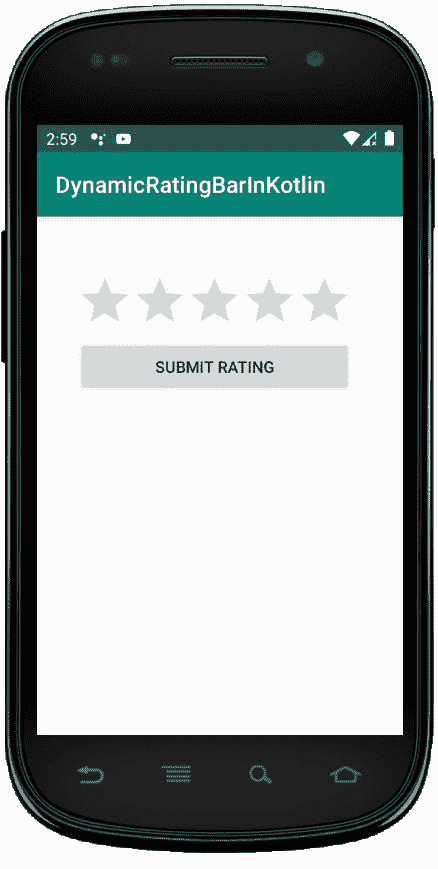
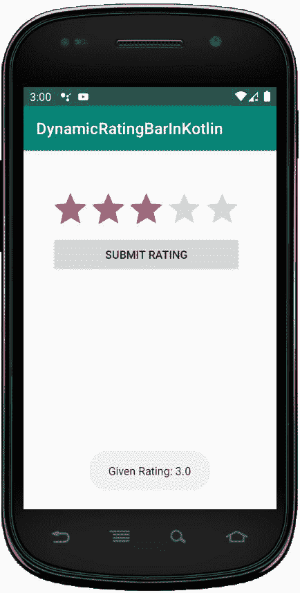

# 科特林动态评级栏

> 原文:[https://www.geeksforgeeks.org/dynamic-ratingbar-in-kotlin/](https://www.geeksforgeeks.org/dynamic-ratingbar-in-kotlin/)

安卓评级栏是一个用户界面小部件，用于获取客户或用户的评级。它是 SeekBar 和 ProgressBar 的扩展，显示星级，并允许用户通过点击星级给出评级。

在 RatingBar 中，我们可以使用 **android:stepSize** 设置步长，它总是会返回一个 1.0、2.0、2.5 等浮点数形式的评级值。通过使用，**安卓:numStars** 属性，我们可以在 RatingBar 中指定星星的数量。RatingBar 用于从用户或客户那里获得关于产品、电影或酒店体验等的评级。

RatingBar 可以手动或编程创建，但我们将讨论*编程*或*动态*。

首先，我们按照以下步骤创建一个新项目:

1.  点击**文件**，然后**新建** = > **新建项目**。
2.  之后加入 Kotlin 支持，点击下一步。
3.  根据方便选择最小 SDK，点击下一步按钮。
4.  然后选择**清空**活动= > **下一个** = > **完成**。

## 修改 activity_main.xml 文件

在这个文件中，我们使用 LinearLayout 并设置它的属性，如 id、填充等，它可以在 Kotlin 文件中使用 id 访问。

```
<?xml version="1.0" encoding="utf-8"?>
<LinearLayout
    xmlns:android="http://schemas.android.com/apk/res/android"
    xmlns:tools="http://schemas.android.com/tools"
    android:id="@+id/container"
    android:layout_width="wrap_content"
    android:layout_height="wrap_content"
    tools:context=".MainActivity"
    android:orientation="vertical"
    android:paddingLeft="35dp"
    android:paddingTop="50dp">

</LinearLayout>
```

**在 *strings.xml* 文件**
中添加应用程序名称在这里，我们可以将应用程序中可以使用的所有字符串放在任意文件中。因此，我们更新了 app_name，它可以在活动的顶部看到。

```
<resources>
    <string name="app_name">DynamicRatingBarInKotlin</string>
</resources>
```

## 在 MainActivity.kt 文件中创建 RatingBar

首先，我们声明变量 rBar 来创建 RatingBar，并使用它设置其属性。

```

val rBar = RatingBar(this)
        val layoutParams = LinearLayout.LayoutParams(
            ViewGroup.LayoutParams.MATCH_PARENT,
            ViewGroup.LayoutParams.WRAP_CONTENT)
        rBar.layoutParams = layoutParams
        rBar.stepSize = 1.0.toFloat()
        rBar.numStars = 5

```

然后，我们声明另一个变量来创建这样一个按钮

```
val button = Button(this)
        val layoutParams1 = LinearLayout.LayoutParams(
            ViewGroup.LayoutParams.MATCH_PARENT,
            ViewGroup.LayoutParams.WRAP_CONTENT)
        button.text="Submit Rating"

```

之后，使用语句将工具栏和按钮添加到线性布局中

```
linearLayout?.addView(rBar)
linearLayout?.addView(button)

```

```
package com.geeksforgeeks.myfirstkotlinapp

import androidx.appcompat.app.AppCompatActivity
import android.os.Bundle
import android.view.ViewGroup
import android.widget.Button
import android.widget.LinearLayout
import android.widget.RatingBar
import android.widget.Toast

class MainActivity : AppCompatActivity() {

    override fun onCreate(savedInstanceState: Bundle?) {
        super.onCreate(savedInstanceState)
        setContentView(R.layout.activity_main)

        // Create RatingBar
        val rBar = RatingBar(this)
        val layoutParams = LinearLayout.LayoutParams(
            ViewGroup.LayoutParams.MATCH_PARENT,
            ViewGroup.LayoutParams.WRAP_CONTENT)
        rBar.layoutParams = layoutParams
        rBar.stepSize = 1.0.toFloat()
        rBar.numStars = 5

        //create button
        val button = Button(this)
        val layoutParams1 = LinearLayout.LayoutParams(
            ViewGroup.LayoutParams.MATCH_PARENT,
            ViewGroup.LayoutParams.WRAP_CONTENT)
        button.text="Submit Rating"

        val linearLayout = findViewById<LinearLayout>(R.id.container)
        // Add RatingBar and button to LinearLayout
        linearLayout?.addView(rBar)
        linearLayout?.addView(button)

        button?.setOnClickListener {
            val msg = rBar.rating.toString()
            Toast.makeText(this@MainActivity, "Given Rating: "+msg,
                Toast.LENGTH_SHORT).show()
        }
    }
}
```

## AndroidManifest.xml 文件

```
<?xml version="1.0" encoding="utf-8"?>
<manifest xmlns:android="http://schemas.android.com/apk/res/android"
package="com.geeksforgeeks.myfirstkotlinapp">

<application
    android:allowBackup="true"
    android:icon="@mipmap/ic_launcher"
    android:label="@string/app_name"
    android:roundIcon="@mipmap/ic_launcher_round"
    android:supportsRtl="true"
    android:theme="@style/AppTheme">
    <activity android:name=".MainActivity">
        <intent-filter>
            <action android:name="android.intent.action.MAIN" />

            <category android:name="android.intent.category.LAUNCHER" />
        </intent-filter>
    </activity>
</application>

</manifest>
```

## 作为模拟器运行:

