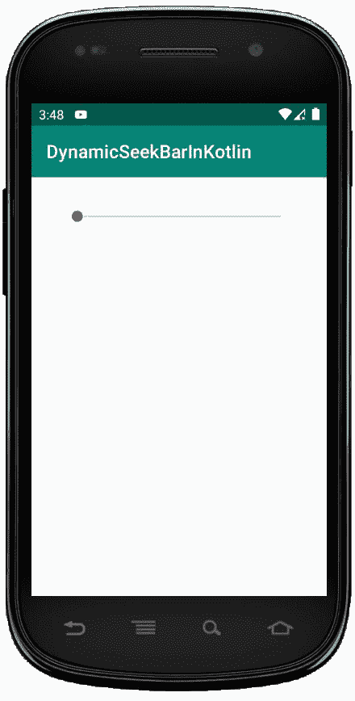
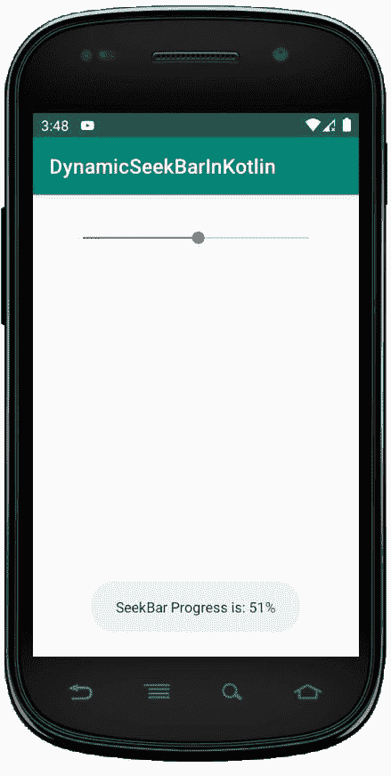

# 科特林动态 SeekBar

> 原文:[https://www.geeksforgeeks.org/dynamic-seekbar-in-kotlin/](https://www.geeksforgeeks.org/dynamic-seekbar-in-kotlin/)

安卓 seekBar 是 progressBar 的修改版本，它有可拖动的拇指，用户可以来回拖动拇指来设置当前进度值。我们可以在安卓设备中使用 seekbar，比如亮度控制、音量控制等。

它是重要的用户界面元素之一，提供了在定义的范围内选择整数值的选项，如 1 到 100。

通过在 SeekBar 中拖动拇指，我们可以来回滑动，在我们分别使用 android:min 和 android:max 属性定义的最小和最大整数值之间选择一个值。

首先，我们按照以下步骤创建一个新项目:

1.  点击**文件**，然后**新建** = > **新建项目**。
2.  之后加入 Kotlin 支持，点击下一步。
3.  根据方便选择最小 SDK，点击下一步按钮。
4.  然后选择**清空**活动= > **下一个** = > **完成**。

这里，我们在 Kotlin 文件中以编程方式创建 SeekBar。

## 使用 activity_main.xml 文件

首先，使用 LinearLayout 并设置它的属性，如 id、layout_width、上下文等。

```
<?xml version="1.0" encoding="utf-8"?>
<LinearLayout
xmlns:android="http://schemas.android.com/apk/res/android"
xmlns:tools="http://schemas.android.com/tools"
android:id="@+id/container"
android:layout_width="match_parent"
android:layout_height="match_parent"
tools:context=".MainActivity"
android:orientation="vertical">

</LinearLayout>
```

## 在 MainActivity.kt 文件中创建 SeekBar

在这里，我们需要声明 seek 来创建 SeekBar，如下所示:

```
 val seek = SeekBar(this)
```

然后，我们创建另一个变量 lParams，并为此设置属性。我们将为 LinearLayout 创建另一个变量，并使用 id 容器从 activity_main.xml 文件中调用。

```
val lLayout = findViewById(R.id.container)
        // Adding SeekBar to LinearLayout
        lLayout?.addView(seek) 
```

并将名为 seek 的 SeekBar 添加到线性布局中

```
lLayout?.addView(seek)
```

```
package com.geeksforgeeks.myfirstkotlinapp

import androidx.appcompat.app.AppCompatActivity
import android.os.Bundle
import android.view.ViewGroup
import android.widget.LinearLayout
import android.widget.SeekBar
import android.widget.Toast

class MainActivity : AppCompatActivity() {

    override fun onCreate(savedInstanceState: Bundle?) {
        super.onCreate(savedInstanceState)
        setContentView(R.layout.activity_main)
       // defining SeekBar
        val seek = SeekBar(this)
        val lParams = LinearLayout.LayoutParams(
            ViewGroup.LayoutParams.MATCH_PARENT,
            ViewGroup.LayoutParams.WRAP_CONTENT)
        lParams.setMargins(50, 50, 50, 50)
        seek.layoutParams = lParams

        val lLayout = findViewById<LinearLayout>(R.id.container)
        // Adding SeekBar to LinearLayout
        lLayout?.addView(seek)

        seek.setOnSeekBarChangeListener(
            object : SeekBar.OnSeekBarChangeListener {
            override fun onProgressChanged(
                seekBar: SeekBar, progress: Int, fromUser: Boolean) {
                // write custom code when progress is changed
            }

            override fun onStartTrackingTouch(seekBar: SeekBar) {
                // write custom code when touch is started.
            }

            override fun onStopTrackingTouch(seekBar: SeekBar) {
                // write custom code when touch is stopped
                Toast.makeText(this@MainActivity,
                    "SeekBar Progress is: " + seekBar.progress + "%",
                    Toast.LENGTH_SHORT).show()
            }
        })
    }
}
```

## AndroidManifest.xml 文件

```
<manifest xmlns:android="http://schemas.android.com/apk/res/android"
package="com.geeksforgeeks.myfirstkotlinapp">

<application
    android:allowBackup="true"
    android:icon="@mipmap/ic_launcher"
    android:label="@string/app_name"
    android:roundIcon="@mipmap/ic_launcher_round"
    android:supportsRtl="true"
    android:theme="@style/AppTheme">
    <activity android:name=".MainActivity">
        <intent-filter>
            <action android:name="android.intent.action.MAIN" />

            <category android:name="android.intent.category.LAUNCHER" />
        </intent-filter>
    </activity>
</application>

</manifest>
```

## 作为模拟器运行:

