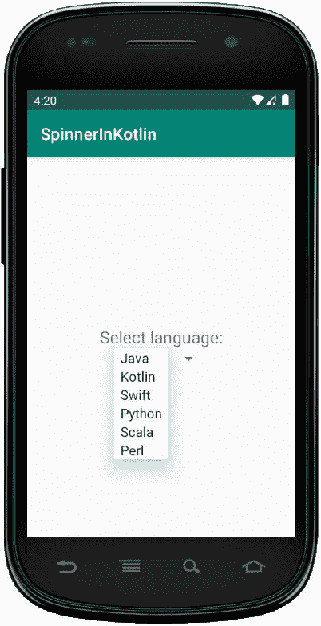
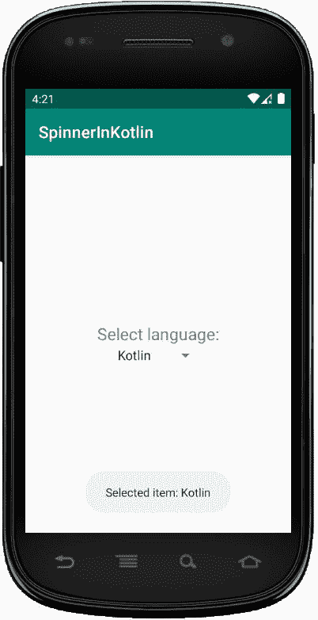

# 科特林动态微调器

> 原文:[https://www.geeksforgeeks.org/dynamic-spinner-in-kotlin/](https://www.geeksforgeeks.org/dynamic-spinner-in-kotlin/)

安卓**微调器**是一个类似下拉列表的视图，用于从选项列表中选择一个选项。它提供了一种从项目列表中选择一个项目的简单方法，当我们单击它时，它会显示所有值的下拉列表。

安卓微调器的默认值将是当前选择的值，通过使用**适配器**我们可以轻松地将项目绑定到微调器对象。
在这里，我们将以编程方式在柯特林文件中创建微调器**。**

**首先，我们按照以下步骤创建一个**新项目**:**

1.  **点击**文件**，然后**新建** = > **新建项目**。**
2.  **之后加入 Kotlin 支持，点击下一步。**
3.  **根据方便选择最小 SDK，点击下一步按钮。**
4.  **然后选择**清空**活动= > **下一个** = > **完成**。**

## **修改 activity_main.xml 文件**

**在这个文件中，我们使用了文本视图小部件，并设置了它的属性。**

```
<?xml version="1.0" encoding="utf-8"?>
<LinearLayout xmlns:android="http://schemas.android.com/apk/res/android"
    android:orientation="vertical"
    android:layout_width="match_parent"
    android:layout_height="match_parent"
    android:id="@+id/linear_layout"
    android:gravity = "center">

    <TextView
        android:id="@+id/txtView"
        android:layout_width="wrap_content"
        android:layout_height="wrap_content"
        android:text="Select language:"
        android:textSize = "20dp" />

</LinearLayout>
```

## **更新 strings.xml 文件**

**这里，我们使用字符串标签更新应用程序的名称。我们还创建了将在下拉菜单中使用的项目列表。**

```
<resources>
    <string name="app_name">SpinnerInKotlin</string>
    <string name="selected_item">Selected item:</string>

    <string-array name="Languages">
        <item>Java</item>
        <item>Kotlin</item>
        <item>Swift</item>
        <item>Python</item>
        <item>Scala</item>
        <item>Perl</item>
    </string-array>
</resources>
```

## **在 MainActivity.kt 文件中创建微调器**

**首先，我们声明一个变量**语言**来访问 strings.xmnl 文件中的字符串项。**

```
val languages = resources.getStringArray(R.array.Languages) 
```

**然后，我们可以使用**

```
val spinner = Spinner(this)
    spinner.layoutParams = LinearLayout.LayoutParams(
            ViewGroup.LayoutParams.WRAP_CONTENT,
            ViewGroup.LayoutParams.WRAP_CONTENT) 
```

**使用在线性布局中添加微调器**

```
val linearLayout = findViewById<LinearLayout>(R.id.linear_layout)
        //add spinner in linear layout
        linearLayout?.addView(spinner) 
```

```
package com.geeksforgeeks.myfirstkotlinapp

import androidx.appcompat.app.AppCompatActivity
import android.os.Bundle
import android.view.View
import android.view.ViewGroup
import android.widget.*

class MainActivity : AppCompatActivity() {

    override fun onCreate(savedInstanceState: Bundle?) {
        super.onCreate(savedInstanceState)
        setContentView(R.layout.activity_main)
        // access the items of the list
        val languages = resources.getStringArray(R.array.Languages)

        //create spinner programmatically
        val spinner = Spinner(this)
        spinner.layoutParams = LinearLayout.LayoutParams(
            ViewGroup.LayoutParams.WRAP_CONTENT,
            ViewGroup.LayoutParams.WRAP_CONTENT)

        val linearLayout = findViewById<LinearLayout>(R.id.linear_layout)
        //add spinner in linear layout
        linearLayout?.addView(spinner)

        if (spinner != null) {
            val adapter = ArrayAdapter(this,
                android.R.layout.simple_spinner_item, languages)
            spinner.adapter = adapter

         spinner.onItemSelectedListener = object :
           AdapterView.OnItemSelectedListener {
             override fun onItemSelected(parent: AdapterView<*>,
                                         view: View, position: Int, id: Long) {
                 Toast.makeText(this@MainActivity,
                    getString(R.string.selected_item) + " " +
                         "" + languages[position], Toast.LENGTH_SHORT).show()
                }

                override fun onNothingSelected(parent: AdapterView<*>) {
                    // write code to perform some action
                }
            }
        }
    }
}
```

## **AndroidManifest.xml 文件**

```
<?xml version="1.0" encoding="utf-8"?>
<manifest xmlns:android="http://schemas.android.com/apk/res/android"
package="com.geeksforgeeks.myfirstkotlinapp">

<application
    android:allowBackup="true"
    android:icon="@mipmap/ic_launcher"
    android:label="@string/app_name"
    android:roundIcon="@mipmap/ic_launcher_round"
    android:supportsRtl="true"
    android:theme="@style/AppTheme">
    <activity android:name=".MainActivity">
        <intent-filter>
            <action android:name="android.intent.action.MAIN" />

            <category android:name="android.intent.category.LAUNCHER" />
        </intent-filter>
    </activity>
</application>

</manifest>
```

## **作为模拟器运行:**

********