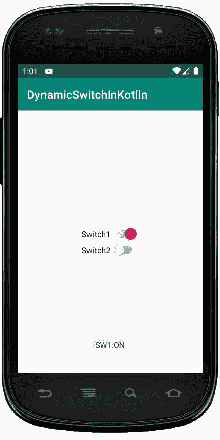
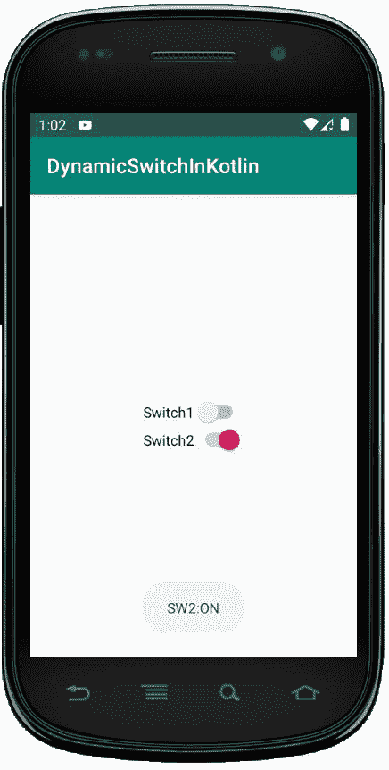

# 科特林动态开关

> 原文:[https://www.geeksforgeeks.org/dynamic-switch-in-kotlin/](https://www.geeksforgeeks.org/dynamic-switch-in-kotlin/)

安卓开关也是一个双态用户界面元素，用来作为按钮在开和关之间切换。通过触摸按钮，我们可以来回拖动来打开或关闭它。

当活动只需要两种状态选择开或关时，开关元件很有用。我们可以通过使用 Switch 对象将 Switch 添加到我们的应用程序布局中。默认情况下，安卓开关的状态是关闭状态。我们还可以通过在我们的 XML 布局文件中设置 android:checked = "true "来将 Switch 的状态更改为 ON。

在 android 中，我们可以通过两种方式创建 Switch 控件，要么在 XML 布局文件中使用 Switch，要么在 Kotlin 文件中动态创建。

首先，我们按照以下步骤创建一个新项目:

1.  点击文件，然后**新建** = > **新项目**。
2.  之后加入 Kotlin 支持，点击下一步。
3.  根据方便选择最小 SDK，点击下一步按钮。
4.  然后选择**清空**活动= > **下一个** = > **完成**。

## activity_main.xml 文件中的 LinearLayout

在这个文件中，我们使用线性布局，不能手动添加开关小部件，因为它将在 Kotlin 文件中动态创建。

```kt
<?xml version="1.0" encoding="utf-8"?>
<LinearLayout
    xmlns:android="http://schemas.android.com/apk/res/android"
    android:id="@+id/rootContainer"
    android:layout_width="match_parent"
    android:layout_height="match_parent"
    android:gravity="center"
    android:orientation="vertical">

</LinearLayout>
```

**在 strings.xml 文件中添加应用程序名称**
在这里，我们可以将应用程序中可以使用的所有字符串放在任何文件中。因此，我们更新了 app_name，它可以在活动的顶部看到。

```kt
<resources>
    <string name="app_name">DynamicSwitchInKotlin</string>
</resources>
```

## 在 MainActivity.kt 文件中以编程方式创建开关

在这里，我们初始化并定义了两个开关，并通过调用 linearLayout 进行动态添加。

```kt
linearLayout?.addView(switch1)
linearLayout?.addView(switch2)

```

然后，将两个开关上的**设置为 OnClickListener** ，以像这样切换按钮和吐司消息。

```kt
switch1.setOnCheckedChangeListener { buttonView, isChecked ->
            val msg = if (isChecked) "SW1:ON" else "SW1:OFF"
            Toast.makeText(this@MainActivity, msg,
                Toast.LENGTH_SHORT).show()
        }

```

科特林文件的完整代码如下。

```kt
package com.geeksforgeeks.myfirstkotlinapp
import androidx.appcompat.app.AppCompatActivity
import android.os.Bundle
import android.view.ViewGroup
import android.widget.LinearLayout
import android.widget.Switch
import android.widget.Toast

class MainActivity : AppCompatActivity() {

    override fun onCreate(savedInstanceState: Bundle?) {
        super.onCreate(savedInstanceState)
        setContentView(R.layout.activity_main)

        // Creating switch1 and switch2 programmatically
        val switch1 = Switch(this)
        val layoutParams = LinearLayout.LayoutParams(ViewGroup.
            LayoutParams.WRAP_CONTENT, ViewGroup.LayoutParams.WRAP_CONTENT)
        switch1.layoutParams = layoutParams
        switch1.text = "Switch1"

        val switch2 = Switch(this)
        val layoutParams2 = LinearLayout.LayoutParams(ViewGroup.
            LayoutParams.WRAP_CONTENT, ViewGroup.LayoutParams.WRAP_CONTENT)
        switch2.layoutParams = layoutParams2
        switch2.text = "Switch2"

        val linearLayout = findViewById<LinearLayout>(R.id.rootContainer)
        // Adding Switches to LinearLayout
        linearLayout?.addView(switch1)
        linearLayout?.addView(switch2)

        switch1.setOnCheckedChangeListener { buttonView, isChecked ->
            val msg = if (isChecked) "SW1:ON" else "SW1:OFF"
            Toast.makeText(this@MainActivity, msg,
                Toast.LENGTH_SHORT).show()
        }

        switch2.setOnCheckedChangeListener { buttonView, isChecked ->
            val msg = if (isChecked) "SW2:ON" else "SW2:OFF"
            Toast.makeText(this@MainActivity, msg,
                Toast.LENGTH_SHORT).show()
        }
    }
}
```

## AndroidManifest.xml 文件

```kt
<?xml version="1.0" encoding="utf-8"?>
<manifest xmlns:android="http://schemas.android.com/apk/res/android"
package="com.geeksforgeeks.myfirstkotlinapp">

<application
    android:allowBackup="true"
    android:icon="@mipmap/ic_launcher"
    android:label="@string/app_name"
    android:roundIcon="@mipmap/ic_launcher_round"
    android:supportsRtl="true"
    android:theme="@style/AppTheme">
    <activity android:name=".MainActivity">
        <intent-filter>
            <action android:name="android.intent.action.MAIN" />

            <category android:name="android.intent.category.LAUNCHER" />
        </intent-filter>
    </activity>
</application>

</manifest>
```

## 作为输出模拟器运行:

