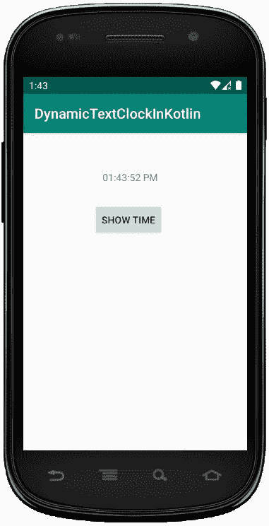
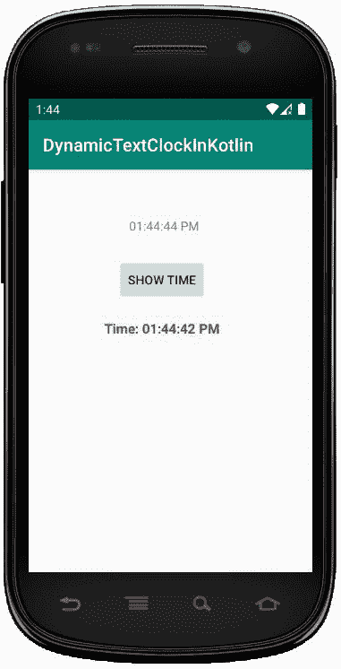

# 科特林动态文本时钟

> 原文:[https://www.geeksforgeeks.org/dynamic-textclock-in-kotlin/](https://www.geeksforgeeks.org/dynamic-textclock-in-kotlin/)

安卓**文本时钟**是一个用户界面控件，用于以字符串格式显示日期/时间。

它提供两种模式的时间，第一种是以 24 小时格式显示时间，另一种是以 12 小时格式显示时间。我们可以很容易地使用**is 24 小时模式 Enabled()** 方法，以 24 小时或 12 小时格式显示系统使用的文本时钟。

这里，我们将在 Kotlin 文件中以编程方式创建 text clock**。**

**首先，我们按照以下步骤创建一个**新项目**:**

1.  **点击**文件**，然后**新建** = > **新建项目**。**
2.  **之后加入 Kotlin 支持，点击下一步。**
3.  **根据方便选择最小 SDK，点击下一步按钮。**
4.  **然后选择**清空**活动= > **下一个** = > **完成**。**

## **修改 activity_main.xml 文件**

**在这个文件中，我们使用文本视图和按钮，并设置所有小部件的属性。**

```
<?xml version="1.0" encoding="utf-8"?>
<?xml version="1.0" encoding="utf-8"?>
<RelativeLayout xmlns:android="http://schemas.android.com/apk/res/android"
    xmlns:tools="http://schemas.android.com/tools"
    android:layout_width="wrap_content"
    android:layout_height="wrap_content"
    tools:context=".MainActivity">

    <LinearLayout xmlns:android="http://schemas.android.com/apk/res/android"
        android:id="@+id/linear_layout"
        android:layout_width="wrap_content"
        android:layout_height="wrap_content"
        android:gravity="center"
        android:orientation="vertical" />

    <Button
        android:id="@+id/btn"
        android:layout_width="wrap_content"
        android:layout_height="wrap_content"
        android:layout_marginLeft="100dp"
        android:layout_marginTop="100dp"
        android:text="Show Time" />

    <TextView
        android:id="@+id/textview"
        android:layout_width="wrap_content"
        android:layout_height="wrap_content"
        android:layout_below="@+id/btn"
        android:layout_marginLeft="85dp"
        android:layout_marginTop="20dp"
        android:textSize="15dp"
        android:textStyle="bold"
        android:textColor="#ff0012"/>
</RelativeLayout>
```

## **更新 strings.xml 文件**

**这里，我们使用字符串标签更新应用程序的名称。**

```
<resources>
    <string name="app_name">DynamicTextClockInKotlin</string>
</resources>
```

## **在 MainActivity.kt 文件中创建文本时钟**

**首先，我们使用一个变量来创建这样的文本时钟**

```
val textClock = TextClock(this)
```

**然后，在布局中设置时钟显示的格式。**

```
textClock.format12Hour = "hh:mm:ss a"
```

**我们必须在线性布局中添加文本块**

```
val linearLayout = findViewById<linearlayout>(R.id.linear_layout)
        //add textClock in Linear Layout
        linearLayout?.addView(textClock)</linearlayout> 
```

```
package com.geeksforgeeks.myfirstkotlinapp

import androidx.appcompat.app.AppCompatActivity

import android.os.Bundle
import android.view.ViewGroup
import android.widget.Button
import android.widget.LinearLayout
import android.widget.TextClock
import android.widget.TextView

class MainActivity : AppCompatActivity() {

    override fun onCreate(savedInstanceState: Bundle?) {
        super.onCreate(savedInstanceState)
        setContentView(R.layout.activity_main)

        //create TextClock programmatically
        val textClock = TextClock(this)
        val layoutParams = LinearLayout.LayoutParams(
            ViewGroup.LayoutParams.WRAP_CONTENT, 
            ViewGroup.LayoutParams.WRAP_CONTENT)
        layoutParams.setMargins(140, 80, 80, 80)
        textClock.layoutParams = layoutParams
        textClock.format12Hour = "hh:mm:ss a"

        val linearLayout = findViewById<LinearLayout>(R.id.linear_layout)
        //add textClock in Linear Layout
        linearLayout?.addView(textClock)

        val txtView = findViewById<TextView>(R.id.textview)

        val btn = findViewById<Button>(R.id.btn)
        // display time when click the button
        btn?.setOnClickListener {
            txtView?.text = "Time: " + textClock?.text
        }
    }
}
```

## **AndroidManifest.xml 文件**

```
<?xml version="1.0" encoding="utf-8"?>
<manifest xmlns:android="http://schemas.android.com/apk/res/android"
package="com.geeksforgeeks.myfirstkotlinapp">

<application
    android:allowBackup="true"
    android:icon="@mipmap/ic_launcher"
    android:label="@string/app_name"
    android:roundIcon="@mipmap/ic_launcher_round"
    android:supportsRtl="true"
    android:theme="@style/AppTheme">
    <activity android:name=".MainActivity">
        <intent-filter>
            <action android:name="android.intent.action.MAIN" />

            <category android:name="android.intent.category.LAUNCHER" />
        </intent-filter>
    </activity>
</application>

</manifest>
```

## **作为模拟器运行:**

********