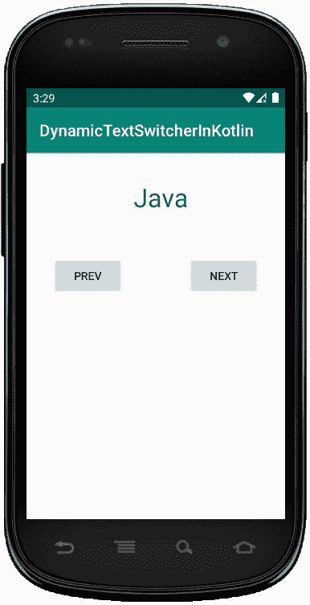
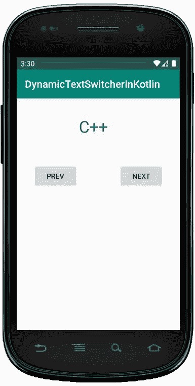

# 科特林动态文本切换器

> 原文:[https://www . geesforgeks . org/dynamic-textswitcher-in-kot Lin/](https://www.geeksforgeeks.org/dynamic-textswitcher-in-kotlin/)

安卓**文本切换器**是一个用户界面小部件，包含多个文本视图，一次显示一个。Textswitcher 是 View Switcher 的子类，用于动画显示一个文本并显示下一个文本。

这里，我们在 Kotlin 文件中以编程方式创建 TextSwitcher**。**

**首先，我们按照以下步骤创建一个**新项目**:**

1.  **点击**文件**，然后**新建** = > **新建项目**。**
2.  **之后加入 Kotlin 支持，点击下一步。**
3.  **根据方便选择最小 SDK，点击下一步按钮。**
4.  **然后选择**清空**活动= > **下一个** = > **完成**。**

## **修改 activity_main.xml 文件**

**在这个文件中，我们使用了文本切换器、按钮，并设置了它们的属性。**

```
<?xml version="1.0" encoding="utf-8"?>
<androidx.constraintlayout.widget.ConstraintLayout
    xmlns:android="http://schemas.android.com/apk/res/android"
    xmlns:app="http://schemas.android.com/apk/res-auto"
    xmlns:tools="http://schemas.android.com/tools"
    android:layout_width="match_parent"
    android:layout_height="match_parent"
    android:orientation="vertical"
    android:id="@+id/constraint_layout">

    <Button
        android:id="@+id/prev"
        android:layout_width="wrap_content"
        android:layout_height="wrap_content"
        android:layout_marginStart="32dp"
        android:layout_marginTop="128dp"
        android:text="@string/prev"
        app:layout_constraintRight_toLeftOf="@id/next"
        app:layout_constraintStart_toStartOf="parent"
        app:layout_constraintTop_toTopOf="parent" />

    <Button
        android:id="@+id/next"
        android:layout_width="wrap_content"
        android:layout_height="wrap_content"
        android:layout_marginEnd="32dp"
        android:text="@string/next"
        app:layout_constraintEnd_toEndOf="parent"
        app:layout_constraintHorizontal_bias="1.0"
        app:layout_constraintStart_toEndOf="@+id/prev"
        app:layout_constraintTop_toTopOf="@+id/prev" />

</androidx.constraintlayout.widget.ConstraintLayout>
```

## **更新 strings.xml 文件**

**这里，我们使用字符串标签更新应用程序的名称。**

```
<resources>
    <string name="app_name">DynamicTextSwitcherInKotlin</string>
    <string name="next">Next</string>
    <string name="prev">Prev</string>
</resources>
```

## **在 MainActivity.kt 文件中创建文本切换器**

**首先，我们声明一个数组**语言**，它包含用于文本视图的语言列表。**

```
private val textList = arrayOf("Java","Python","Kotlin","Scala","C++") 
```

**然后，我们创建**文本切换器**并为文本视图设置属性，如文本颜色、文本大小。**

```
val textSwitcher = findViewById<TextSwitcher>(R.id.textSwitcher) 
```

**使用此在布局中添加**文本切换器****

```
val c_Layout = findViewById<constraintlayout>(R.id.constraint_layout)
        //add textSwitcher in constraint layout
        c_Layout?.addView(textSwitcher)</constraintlayout> 
```

```
package com.geeksforgeeks.myfirstkotlinapp

import androidx.appcompat.app.AppCompatActivity

import android.os.Bundle
import android.view.Gravity
import android.view.animation.AnimationUtils
import android.widget.Button
import android.widget.TextSwitcher
import android.widget.TextView
import android.graphics.Color
import androidx.constraintlayout.widget.ConstraintLayout

class MainActivity : AppCompatActivity() {

    private val languages = arrayOf("Java","Python","Kotlin","Scala","C++")
    private var index = 0

    override fun onCreate(savedInstanceState: Bundle?) {
        super.onCreate(savedInstanceState)
        setContentView(R.layout.activity_main)

        val textSwitcher = TextSwitcher(this)

        textSwitcher.setFactory {
            val textView = TextView(this@MainActivity)
            textView.gravity = Gravity.TOP or Gravity.CENTER_HORIZONTAL
            textView.textSize = 32f
            textView.setPadding(175, 50, 100, 200)
            textView.setTextColor(Color.BLUE)
            textView
        }
        textSwitcher.setText(languages[index])

        val c_Layout = findViewById<ConstraintLayout>(R.id.constraint_layout)
        //add textSwitcher in constraint layout
        c_Layout?.addView(textSwitcher)

        val textIn = AnimationUtils.loadAnimation(
            this, android.R.anim.slide_in_left)
        textSwitcher.inAnimation = textIn

        val textOut = AnimationUtils.loadAnimation(
            this, android.R.anim.slide_out_right)
        textSwitcher.outAnimation = textOut

        // previous button functionality
        val prev = findViewById<Button>(R.id.prev)
        prev.setOnClickListener {
            index = if (index - 1 >= 0) index - 1 else 4
            textSwitcher.setText(languages[index])
        }
        // next button functionality
        val next = findViewById<Button>(R.id.next)
        next.setOnClickListener {
            index = if (index + 1 < languages.size) index + 1 else 0
            textSwitcher.setText(languages[index])
        }
    }
}
```

## **AndroidManifest.xml 文件**

```
<?xml version="1.0" encoding="utf-8"?>
<manifest xmlns:android="http://schemas.android.com/apk/res/android"
package="com.geeksforgeeks.myfirstkotlinapp">

<application
    android:allowBackup="true"
    android:icon="@mipmap/ic_launcher"
    android:label="@string/app_name"
    android:roundIcon="@mipmap/ic_launcher_round"
    android:supportsRtl="true"
    android:theme="@style/AppTheme">
    <activity android:name=".MainActivity">
        <intent-filter>
            <action android:name="android.intent.action.MAIN" />

            <category android:name="android.intent.category.LAUNCHER" />
        </intent-filter>
    </activity>
</application>

</manifest>
```

## **作为模拟器运行:**

**单击**上一步**按钮，然后我们在文本视图中获得其他文本。**

********