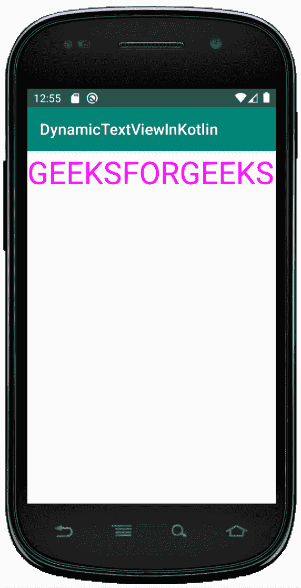

# 科特林动态文本视图

> 原文:[https://www.geeksforgeeks.org/dynamic-textview-in-kotlin/](https://www.geeksforgeeks.org/dynamic-textview-in-kotlin/)

安卓**文本视图**是一个用户界面，用于向用户显示一些文本。

在本文中，我们将讨论如何在 Kotlin 中以编程方式创建一个 TextView。

让我们首先在安卓工作室创建一个项目。为此，请遵循以下说明:

*   点击**文件**，然后**新建**然后新建项目，随便命名
*   然后，选择科特林语言支持，点击下一步按钮。
*   选择最小的软件开发工具包，无论你需要什么。
*   选择**清空**活动，然后点击完成。

## 修改 activity_main.xml 文件

第二步是设计我们的布局页面。在这里，我们将使用 RelativeLayout 从 Kotlin 文件中获取 TextView。

```
<?xml version="1.0" encoding="utf-8"?>
<RelativeLayout
        xmlns:android="http://schemas.android.com/apk/res/android"
        xmlns:tools="http://schemas.android.com/tools"
        xmlns:app="http://schemas.android.com/apk/res-auto"
        android:layout_width="match_parent"
        android:layout_height="match_parent"
        android:id="@+id/root"
        tools:context=".MainActivity">

</RelativeLayout>
```

## 在 MainActivity.kt 文件中创建文本视图

打开 app/src/main/Java/your package name/main activity . kt .在这个文件中，我们声明了一个变量 TextView 来创建 TextView 小部件，如下所示:

```
     val textView = TextView(this)
     //setting height and width
    textView.layoutParams = LinearLayout.LayoutParams(ViewGroup.LayoutParams.WRAP_CONTENT, ViewGroup.LayoutParams.WRAP_CONTENT)

```

然后使用以下命令在布局中添加小部件:

```

        // Add TextView to LinearLayout
        layout?.addView(textView)

```

```
package com.geeksforgeeks.myfirstKotlinapp

import android.graphics.Color
import androidx.appcompat.app.AppCompatActivity
import android.os.Bundle
import android.util.TypedValue
import android.view.ViewGroup
import android.widget.RelativeLayout
import android.widget.TextView
import android.widget.Toast

class MainActivity : AppCompatActivity() {

    override fun onCreate(savedInstanceState: Bundle?)
    {
        super.onCreate(savedInstanceState)
        setContentView(R.layout.activity_main)

        val layout = findViewById<RelativeLayout>(R.id.root)

        // Create TextView programmatically.
        val textView = TextView(this)

        // setting height and width
        textView.layoutParams= RelativeLayout.LayoutParams(
            ViewGroup.LayoutParams.WRAP_CONTENT, 
            ViewGroup.LayoutParams.WRAP_CONTENT)
        // setting text
        textView.setText("GEEKSFORGEEKS")
        textView.setTextSize(TypedValue.COMPLEX_UNIT_SP, 40f)
        textView.setTextColor(Color.MAGENTA)
        // onClick the text a message will be displayed "HELLO GEEK"
        textView.setOnClickListener()
        {
            Toast.makeText(this@MainActivity, "HELLO GEEK", 
                Toast.LENGTH_LONG).show()
        }

        // Add TextView to LinearLayout
        layout ?.addView(textView)
    }
}
```

## AndroidManifest.xml 文件

```
<?xml version="1.0" encoding="utf-8"?>
<manifest xmlns:android="http://schemas.android.com/apk/res/android"
          package="i.apps.textview">

    <application
            android:allowBackup="true"
            android:icon="@mipmap/ic_launcher"
            android:label="@string/app_name"
            android:roundIcon="@mipmap/ic_launcher_round"
            android:supportsRtl="true"
            android:theme="@style/AppTheme">
        <activity android:name=".MainActivity">
            <intent-filter>
                <action android:name="android.intent.action.MAIN"/>

                <category android:name="android.intent.category.LAUNCHER"/>
            </intent-filter>
        </activity>
    </application>

</manifest>
```

## 作为模拟器运行:

