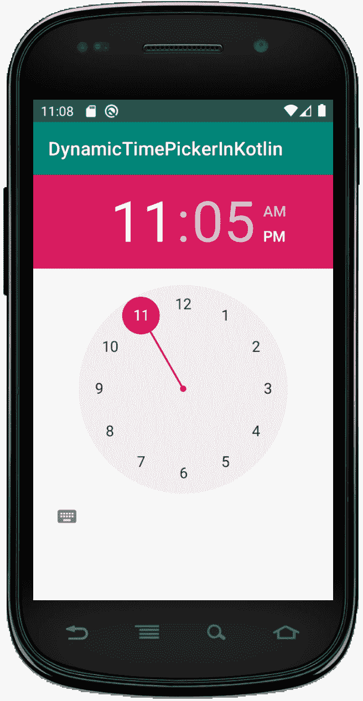
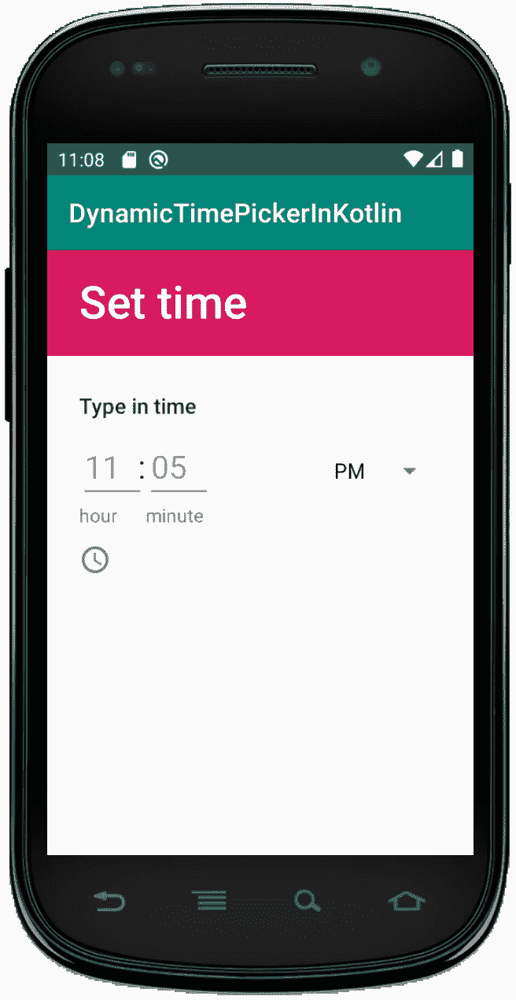

# 科特林动态时间选择器

> 原文:[https://www.geeksforgeeks.org/dynamic-timepicker-in-kotlin/](https://www.geeksforgeeks.org/dynamic-timepicker-in-kotlin/)

安卓**时间选择器**是一个用户界面控件，用于选择 24 小时格式或上午/下午模式的时间。它用于确保用户在我们的应用程序中选择一天中的有效时间。

在安卓系统中，TimePicker 有两种模式，第一种是时钟模式，另一种是微调模式。在本文中，我们应该在 Kotlin 文件中以编程方式创建 TimePicker 小部件。

首先，我们按照以下步骤创建一个**新项目**:

1.  点击**文件**，然后**新建** = > **新建项目**。
2.  之后加入 Kotlin 支持，点击下一步。
3.  根据方便选择最小 SDK，点击下一步按钮。
4.  然后选择**清空**活动= > **下一个** = > **完成**。

## 修改 activity_main.xml 文件

在这个文件中，我们使用了 RelativeLayout 内部的 LinearLayout，它将在 Kotlin 文件中被访问。还可以设置布局的属性，如标识、方向等。

```kt
<?xml version="1.0" encoding="utf-8"?>
<RelativeLayout
    xmlns:android="http://schemas.android.com/apk/res/android"
    xmlns:tools="http://schemas.android.com/tools"
    android:layout_width="match_parent"
    android:layout_height="match_parent"
    tools:context=".MainActivity">

    <LinearLayout
        android:id="@+id/linear_layout"
        android:layout_width="match_parent"
        android:layout_height="wrap_content"
        android:orientation="vertical">

    </LinearLayout>

</RelativeLayout>
```

## 更新 strings.xml 文件

这里，我们使用字符串标签更新应用程序的名称。

```kt
<resources>
    <string name="app_name">DynamicTimePickerInKotlin</string>
</resources>
```

## 在 MainActivity.kt 文件中创建时间选择器

首先，我们声明两个变量 **txtView** 和 **timePicker** 来创建小部件。

```kt
val txtView = TextView(this)
val timePicker = TimePicker(this)

```

然后，我们应该使用将它们添加到 Linearlayout 中

```kt
val linearLayout = findViewById(R.id.linear_layout)
        linearLayout?.addView(timePicker)
        linearLayout?.addView(txtView) 
```

如何显示时间及其逻辑已经在前一个主题中介绍过了。

```kt
package com.geeksforgeeks.myfirstKotlinapp

import androidx.appcompat.app.AppCompatActivity
import android.os.Bundle
import android.view.ViewGroup
import android.widget.LinearLayout
import android.widget.TextView
import android.widget.TimePicker

class MainActivity : AppCompatActivity() {

    override fun onCreate(savedInstanceState: Bundle?) {
        super.onCreate(savedInstanceState)
        setContentView(R.layout.activity_main)

        //create textView from XML file
        val txtView = TextView(this)
        // create TimePicker programmatically
        val timePicker = TimePicker(this)

        val layoutParams = LinearLayout.LayoutParams(
            ViewGroup.LayoutParams.WRAP_CONTENT,
            ViewGroup.LayoutParams.WRAP_CONTENT)

        timePicker.layoutParams = layoutParams
        timePicker.setOnTimeChangedListener { _, hour, minute ->
            var hour = hour
            var am_pm = ""

            // AM_PM decider logic
            when {hour == 0 -> { hour += 12
                am_pm = "AM"
            }
                hour == 12 -> am_pm = "PM"
                hour > 12 -> { hour -= 12
                    am_pm = "PM"
                }
                else -> am_pm = "AM"
            }
            if (txtView != null) {
                val hour = if (hour < 10) "0$hour" else hour
                val min = if (minute < 10) "0$minute" else minute
                // display format of time
                val msg = "Time is: $hour : $min $am_pm"
                txtView.text = msg
                txtView.visibility = ViewGroup.VISIBLE
            }
        }
        val linearLayout = findViewById<LinearLayout>(R.id.linear_layout)
        linearLayout?.addView(timePicker)
        linearLayout?.addView(txtView)
    }
}
```

## AndroidManifest.xml 文件

```kt
<?xml version="1.0" encoding="utf-8"?>
<manifest xmlns:android="http://schemas.android.com/apk/res/android"
    package="com.geeksforgeeks.myfirstKotlinapp">

    <application
        android:allowBackup="true"
        android:icon="@mipmap/ic_launcher"
        android:label="@string/app_name"
        android:roundIcon="@mipmap/ic_launcher_round"
        android:supportsRtl="true"
        android:theme="@style/AppTheme">
        <activity android:name=".MainActivity">
            <intent-filter>
                <action android:name="android.intent.action.MAIN" />

                <category android:name="android.intent.category.LAUNCHER" />
            </intent-filter>
        </activity>
    </application>

</manifest>
```

## 作为模拟器运行:

我们可以通过点击左下方的图标来更改视图。要使用文本时间选择器，请单击键盘图标，要使用时钟，我们应该单击时钟图标。

