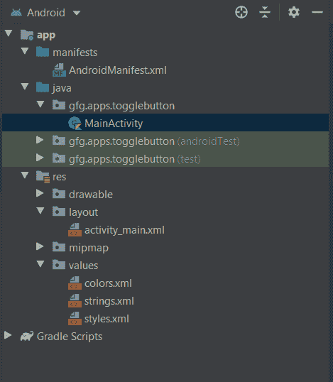

# 科特林动态切换按钮

> 原文:[https://www . geesforgeks . org/dynamic-togglebutton-in-kot Lin/](https://www.geeksforgeeks.org/dynamic-togglebutton-in-kotlin/)

在[安卓](https://www.geeksforgeeks.org/introduction-to-android-development/)中， **ToggleButton** 就像一个包含两种状态的开关，或者 **ON** 或者 **OFF** ，分别用布尔值 true 和 false 来表示。ToggleButton 与 switch 不同，它没有滑动界面，也就是说我们不能滑动来改变状态。它就像一个按钮。在本文中，我们将讨论如何在 Kotlin 中动态创建 ToggleButton。

> **注意:** ToggleButton 继承了安卓的[按钮类。因此，按钮的所有属性也适用于此。](https://www.geeksforgeeks.org/button-in-kotlin/)

下面是 ToggleButton 提供的一些附加重要属性

<figure class="table">

| 属性 | 描述 |
| --- | --- |
| android:disabledAlpha | 它用于在按钮被禁用时调整按钮的 alpha 值 |
| Android:textin | 按钮打开或选中时显示的文本 |
| Android:text ff | 当按钮关闭或未选中时显示的文本 |

</figure>

### 在安卓工作室创建一个新项目

要在 Android Studio 中创建新项目，请按照以下步骤操作:

1.  单击文件，然后单击新建，然后单击新建项目，并给出您喜欢的名称。
2.  为项目模板选择“空活动”。
3.  然后，选择 Kotlin 语言支持，并单击下一步按钮。
4.  选择最小 SDK，无论您需要什么

您的项目目录应该是这样的:



### 修改 activity_main.xml 文件

## 可扩展标记语言

```kt
<?xml version="1.0" encoding="utf-8"?>
<LinearLayout
    android:id="@+id/layout"
    xmlns:android="http://schemas.android.com/apk/res/android"
    android:layout_width="match_parent"
    android:layout_height="match_parent"
    android:gravity="center"
    android:orientation="vertical">
</LinearLayout>
```

### 在 MainActivity.kt 文件中创建 ToogleButton

在您的 **MainActivity.kt** 中插入以下代码。

## Java 语言(一种计算机语言，尤用于创建网站)

```kt
package gfg.apps.togglebutton

import androidx.appcompat.app.AppCompatActivity
import android.os.Bundle
import android.view.ViewGroup
import android.widget.LinearLayout
import android.widget.Toast
import android.widget.ToggleButton

class MainActivity : AppCompatActivity() {

    override fun onCreate(savedInstanceState: Bundle?) {
        super.onCreate(savedInstanceState)
        setContentView(R.layout.activity_main)

        // accessing the layout
        val linearLayout = findViewById<LinearLayout>(R.id.layout)

        // Create ToggleButton Dynamically
        val toggleButton = ToggleButton(this)
        toggleButton.layoutParams = LinearLayout.LayoutParams(ViewGroup.LayoutParams.WRAP_CONTENT, ViewGroup.LayoutParams.WRAP_CONTENT)

        // checking the state of button and printing toast accordingly
        toggleButton.setOnCheckedChangeListener { buttonView, isChecked ->
            val msg = "GFG SALE is " + if (isChecked) "ON" else "OFF"
            Toast.makeText(this@MainActivity, msg, Toast.LENGTH_SHORT).show()
        }

        // Add ToggleButton to LinearLayout
        linearLayout?.addView(toggleButton)
    }
}
```

### AndroidManifest.xml 文件

## 可扩展标记语言

```kt
<?xml version="1.0" encoding="utf-8"?>
<manifest xmlns:android="http://schemas.android.com/apk/res/android"
    package="gfg.apps.togglebutton">

    <application
        android:allowBackup="true"
        android:icon="@mipmap/ic_launcher"
        android:label="@string/app_name"
        android:roundIcon="@mipmap/ic_launcher_round"
        android:supportsRtl="true"
        android:theme="@style/AppTheme">
        <activity android:name=".MainActivity">
            <intent-filter>
                <action android:name="android.intent.action.MAIN" />

                <category android:name="android.intent.category.LAUNCHER" />
            </intent-filter>
        </activity>
    </application>

</manifest>
```

### 在模拟器上运行

<video class="wp-video-shortcode" id="video-439394-1" width="640" height="360" preload="metadata" controls=""><source type="video/mp4" src="https://media.geeksforgeeks.org/wp-content/uploads/20200610001950/TOGGLEBUTTON.mp4?_=1">[https://media.geeksforgeeks.org/wp-content/uploads/20200610001950/TOGGLEBUTTON.mp4](https://media.geeksforgeeks.org/wp-content/uploads/20200610001950/TOGGLEBUTTON.mp4)</video>