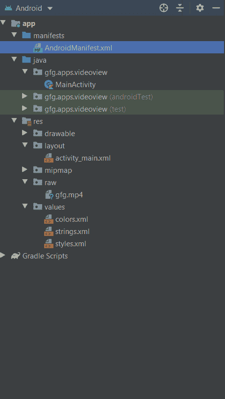

# 科特林动态视频视图

> 原文:[https://www.geeksforgeeks.org/dynamic-videoview-in-kotlin/](https://www.geeksforgeeks.org/dynamic-videoview-in-kotlin/)

在[安卓](https://www.geeksforgeeks.org/introduction-to-android-development/)中，**视频查看**用于加载视频文件。我们可以依靠任何外部资源、网址或本地数据来获取视频内容。在本文中，我们将讨论如何在 Kotlin 中动态创建视频视图。

> **注意:**如果我们在后台使用视频视图或者刚从一个当前的视频会话返回，旧的视频位置没有保存，也就是我们上次离开视频的旧状态没有保存。为了实现它，我们需要利用一些外部数据库来存储状态。

为了简化整个过程，视频视图类提供了以下方法:

| 方法 | 描述 |
| --- | --- |
| 公共无效开始() | 它用于启动视频视图 |
| 公共无效暂停() | 暂停视频 |
| 公开作废简历() | 恢复视频 |
| 公共 void stopPlayback() | 停止视频 |
| public void setVideoURI (Uri) | 用于设置需要访问的视频文件的路径。它可以是 url，也可以是本地路径 |
| 公共无效 seekTo(整数毫秒) | 跳到特定的时间间隔 |
| 公共空间设置媒体控制器(媒体控制器控制器) | 这用于设置视频视图的控制器(播放、暂停、快进，就像您在视频中看到的按钮一样) |
| public void getDuration() | 它用于获取视频的总时长 |
| public void getCurrentPosition() | 它用于获取视频的当前时间间隔或位置 |
| 公共 void isPlaying() | 它根据视频是否正在播放返回一个布尔值 |
| public void setonpreparedlistener(媒体播放器)。OnPreparedListener) | 当视频刚刚准备好开始时，它是一个监听器 |
| public void setonerrorlistener(媒体播放程式. oner error list) | 当播放视频时发生错误时，它是一个监听器 |
| public void setOnCompletionListener(MediaPlayer。完整的侦听器) | 当视频结束时，它是一个听众 |
| 公共空集合锚视图(视图视图) | 它设置媒体控制器控件在屏幕上的位置 |

### 在安卓工作室创建一个新项目

要在安卓工作室中创建新项目，请执行以下步骤:

1.  单击文件，然后单击新建，然后单击新建项目，并给出您喜欢的名称。
2.  为项目模板选择“空活动”。
3.  然后，选择 Kotlin 语言支持，并单击下一步按钮。
4.  选择最小 SDK，无论您需要什么

项目目录应该是这样的:



### 修改 activity_main.xml 文件

## 可扩展标记语言

```kt
<?xml version="1.0" encoding="utf-8"?>
<LinearLayout
    android:id="@+id/layout"
    xmlns:android="http://schemas.android.com/apk/res/android"
    android:layout_width="match_parent"
    android:layout_height="match_parent"
    android:gravity="center"
    android:orientation="vertical">
</LinearLayout>
```

### 添加视频

现在，我们需要添加视频。为此，我们有两个选择:

1.  **我们可以在本地系统上存储一个视频文件:**
    在 res 文件夹中创建一个名为“ **Raw** 的文件夹。在其中添加视频文件，并使用以下代码片段。

    ```kt
    // val path = "android.resource://" + packageName + "/" + R.raw.your_videoFile_name
    // videoView.setVideoURI(Uri.parse(path)) 

    ```

2.  **我们可以使用任何网络资源的视频文件:**

    ```kt
    // Uri uri = Uri.parse("your_custom_URL");
    // videoView.setVideoURI(uri) 

    ```

### 在 MainActivity.kt 文件中创建 VideoView

在您的`**MainActivity.kt**`中插入以下代码。

## Java 语言(一种计算机语言，尤用于创建网站)

```kt
package gfg.apps.videoview

import android.net.Uri
import androidx.appcompat.app.AppCompatActivity
import android.os.Bundle
import android.view.ViewGroup
import android.widget.*

class MainActivity : AppCompatActivity() {

    override fun onCreate(savedInstanceState: Bundle?) {
        super.onCreate(savedInstanceState)
        setContentView(R.layout.activity_main)

        // creating a VideoView
        val videoView = VideoView(this)

        // setting height and width of the VideoView in our linear layout
        val layoutParams = LinearLayout.LayoutParams(ViewGroup.LayoutParams.MATCH_PARENT, ViewGroup.LayoutParams.MATCH_PARENT)
        layoutParams.setMargins(10, 10, 10, 10)
        videoView.layoutParams = layoutParams

        // accessing the media controller
        val mediaController = MediaController(this)
        mediaController.setAnchorView(videoView)
        videoView.setMediaController(mediaController)

        // setting the video access path
        val path = "android.resource://" + packageName + "/" + R.raw.gfg
        videoView.setVideoURI(Uri.parse(path))

        val linearLayout = findViewById<LinearLayout>(R.id.layout)
        // Add VideoView to LinearLayout
        linearLayout?.addView(videoView)
    }
}
```

### AndroidManifest.xml 文件

## 可扩展标记语言

```kt
<?xml version="1.0" encoding="utf-8"?>
<manifest xmlns:android="http://schemas.android.com/apk/res/android"
    package="gfg.apps.videoview">

    <application
        android:allowBackup="true"
        android:icon="@mipmap/ic_launcher"
        android:label="@string/app_name"
        android:roundIcon="@mipmap/ic_launcher_round"
        android:supportsRtl="true"
        android:theme="@style/AppTheme">
        <activity android:name=".MainActivity">
            <intent-filter>
                <action android:name="android.intent.action.MAIN" />

                <category android:name="android.intent.category.LAUNCHER" />
            </intent-filter>
        </activity>
    </application>

</manifest>
```

### 在模拟器上运行

<video class="wp-video-shortcode" id="video-439412-1" width="300" height="500" preload="metadata" controls=""><source type="video/mp4" src="https://media.geeksforgeeks.org/wp-content/uploads/20200608224655/video2.mp4?_=1">[https://media.geeksforgeeks.org/wp-content/uploads/20200608224655/video2.mp4](https://media.geeksforgeeks.org/wp-content/uploads/20200608224655/video2.mp4)</video>