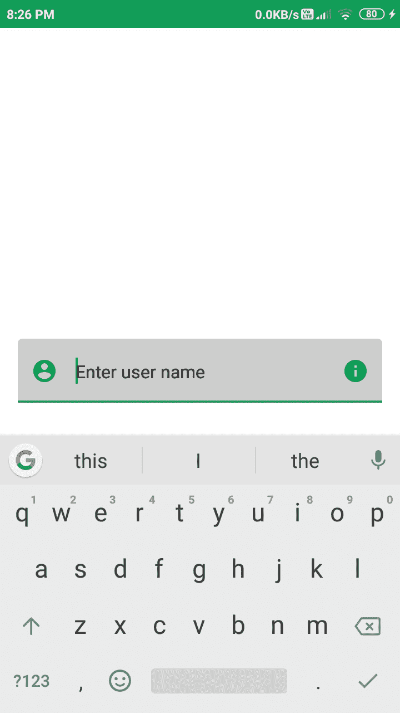

# 使用 Jetpack Compose 在安卓中编辑文本

> 原文:[https://www . geesforgeks . org/edit text-in-Android-using-jet pack-compose/](https://www.geeksforgeeks.org/edittext-in-android-using-jetpack-compose/)

[编辑文本](https://www.geeksforgeeks.org/edittext-widget-in-android-using-java-with-examples/)是大多数应用程序中最重要的小部件之一。这个小部件通常用于从用户那里获取数据。用户可以使用这个小部件直接与应用程序通信。这个小部件用于以数字、文本或任何其他文本的形式从用户那里获取数据。在本文中，我们将使用[喷气背包合成](https://www.geeksforgeeks.org/basics-of-jetpack-compose-in-android/)来看看**编辑文本**小部件在安卓系统中的实现。

### **编辑文本小部件的属性**

<figure class="table">

| 

属性

 | 

描述

 |
| --- | --- |
| 价值 | value 用于从文本字段中获取用户输入的值。 |
| 占位符 | 如果文本字段是空的，我们将向用户显示一个提示

必须在文本字段中输入。 |
| 键盘选项 | 键盘选项用于在输入的数据中添加大写字母用户在文本字段中，我们也可以在此指定自动校正选项。我们可以具体说明我们必须显示的键盘类型，例如(电话、文本)和显示可以从键盘本身执行的操作。 |
| 文本风格 | 为用户输入的文本添加样式。它用于为我们的文本添加字体系列、字体大小和样式。 |
| 最大线性 | 为文本输入字段添加最大行数。 |
| 活动颜色 | 活动颜色用于当用户点击编辑文本或文本字段被聚焦时在文本字段中输入一些数据。 |
| 单身吗 | 在这种情况下，我们必须指定一个布尔值，以避免将用户输入移动到多行中。 |
| 不活动颜色 | 当用户不关注文本输入字段时，指定非活动颜色。 |
| 背景颜色 | 为文本输入字段指定背景颜色。 |
| 领导会议 | 这个方法用于在文本输入字段中添加前导图标。用这种方法

我们还可以为图标指定颜色(色调)。 |
| 培训 con | 这个方法用于在文本输入字段中添加尾部图标。用这种方法我们还可以为图标指定颜色(色调)。 |

</figure>

### **分步实施**

**第一步:创建新项目**

要在安卓工作室金丝雀版本中创建新项目，请参考[如何使用 Jetpack Compose 在安卓工作室金丝雀版本中创建新项目。](https://www.geeksforgeeks.org/how-to-create-a-new-project-in-android-studio-canary-version-with-jetpack-compose/)

**第二步:在 MainActivity.kt 文件**中添加 EditText

导航到**应用程序> java >你的应用程序的包名，打开 MainActivity.kt 文件**。在该文件中添加下面的代码。代码中添加了注释，以更详细地理解代码。

## 我的锅

```
package com.example.gfgapp

import android.graphics.drawable.shapes.Shape
import android.media.Image
import android.os.Bundle
import android.widget.Toast
import androidx.appcompat.app.AppCompatActivity
import androidx.compose.foundation.BorderStroke
import androidx.compose.foundation.Image
import androidx.compose.foundation.Text
import androidx.compose.foundation.layout.*
import androidx.compose.foundation.shape.RoundedCornerShape
import androidx.compose.foundation.text.KeyboardOptions
import androidx.compose.material.*
import androidx.compose.material.icons.Icons
import androidx.compose.material.icons.filled.AccountCircle
import androidx.compose.material.icons.filled.Info
import androidx.compose.material.icons.filled.Phone
import androidx.compose.runtime.*
import androidx.compose.runtime.savedinstancestate.savedInstanceState
import androidx.compose.ui.Alignment
import androidx.compose.ui.layout.ContentScale
import androidx.compose.ui.platform.setContent
import androidx.compose.ui.res.imageResource
import androidx.compose.ui.tooling.preview.Preview
import androidx.compose.ui.unit.dp
import com.example.gfgapp.ui.GFGAppTheme
import androidx.compose.ui.Modifier
import androidx.compose.ui.draw.clip
import androidx.compose.ui.graphics.Color
import androidx.compose.ui.graphics.SolidColor
import androidx.compose.ui.platform.ContextAmbient
import androidx.compose.ui.res.colorResource
import androidx.compose.ui.text.TextStyle
import androidx.compose.ui.text.font.FontFamily
import androidx.compose.ui.text.input.*
import androidx.compose.ui.unit.Dp
import androidx.compose.ui.unit.TextUnit

class MainActivity : AppCompatActivity() {
    override fun onCreate(savedInstanceState: Bundle?) {
        super.onCreate(savedInstanceState)
        setContent {
            GFGAppTheme {
                // A surface container using the 
                  // 'background' color from the theme
                Surface(color = MaterialTheme.colors.background) {
                    // at below line we are calling 
                      // our function for text field.
                    TxtField();
                }
            }
        }
    }
}

@Composable
fun TxtField() {
    // we are creating a variable for
    // getting a value of our text field.
    val inputvalue = remember { mutableStateOf(TextFieldValue()) }
    Column(
            // we are using column to align our 
            // imageview to center of the screen.
            modifier = Modifier.fillMaxWidth().fillMaxHeight(),

            // below line is used for specifying
            // vertical arrangement.
            verticalArrangement = Arrangement.Center,

            // below line is used for specifying 
            // horizontal arrangement.
            horizontalAlignment = Alignment.CenterHorizontally,
    )
    {
        TextField(
                // below line is used to get 
                // value of text field,
                value = inputvalue.value,

                // below line is used to get value in text field
                // on value change in text field.
                onValueChange = { inputvalue.value = it },

                // below line is used to add placeholder 
                // for our text field.
                placeholder = { Text(text = "Enter user name") },

                // modifier is use to add padding 
                // to our text field.
                modifier = Modifier.padding(all = 16.dp).fillMaxWidth(),

                // keyboard options is used to modify 
                // the keyboard for text field.
                keyboardOptions = KeyboardOptions(
                        // below line is use for capitalization 
                        // inside our text field.
                        capitalization = KeyboardCapitalization.None,

                        // below line is to enable auto 
                        // correct in our keyboard.
                        autoCorrect = true,

                        // below line is used to specify our 
                        // type of keyboard such as text, number, phone.
                        keyboardType = KeyboardType.Text,
                ),

                // below line is use to specify 
                // styling for our text field value.
                textStyle = TextStyle(color = Color.Black,
                        // below line is used to add font 
                        // size for our text field
                        fontSize = TextUnit.Companion.Sp(value = 15),

                        // below line is use to change font family.
                        fontFamily = FontFamily.SansSerif),

                // below line is use to give
                // max lines for our text field.
                maxLines = 2,

                // active color is use to change 
                // color when text field is focused.
                activeColor = colorResource(id = R.color.purple_200),

                // single line boolean is use to avoid 
                // textfield entering in multiple lines.
                singleLine = true,

                // inactive color is use to change 
                // color when text field is not focused.
                inactiveColor = Color.Gray,

                // below line is use to specify background
                // color for our text field.
                backgroundColor = Color.LightGray,

                // leading icon is use to add icon 
                // at the start of text field.
                leadingIcon = {
                    // In this method we are specifying 
                    // our leading icon and its color.
                    Icon(Icons.Filled.AccountCircle, tint = colorResource(id = R.color.purple_200))
                },
                // trailing icons is use to add 
                // icon to the end of tet field.
                trailingIcon = {
                    Icon(Icons.Filled.Info, tint = colorResource(id = R.color.purple_200))
                },
                )
    }
}

// @Preview function is use to see preview
// for our composable function in preview section
@Preview(showBackground = true)
@Composable
fun DefaultPreview() {
    GFGAppTheme {
        TxtField()
    }
}
```

### 输出:

