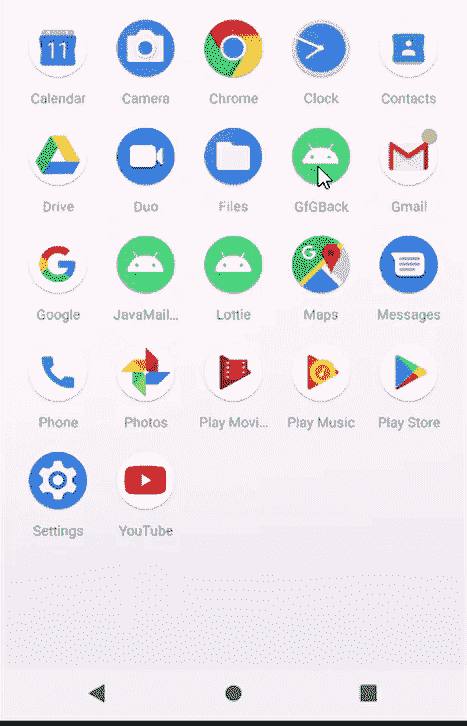

# 使用 Kotlin 在安卓中双击后退按钮退出应用

> 原文:[https://www . geesforgeks . org/app-on-exit-双击-back-button-in-Android-using-kot Lin/](https://www.geeksforgeeks.org/exit-from-app-on-double-click-of-back-button-in-android-using-kotlin/)

“后退”按钮在许多不同的安卓应用中有许多不同的用途。虽然一些应用程序开发人员使用它来关闭他们的应用程序，但一些人使用它来遍历回应用程序以前的活动。许多应用程序要求用户在一个时间间隔内按两次“后退”按钮才能成功关闭应用程序，这被认为是最佳做法。因此，双击后退按钮退出应用程序是一个很好的做法。因为有时用户会误按后退按钮。所以，为了确保用户是否真的想退出应用，我们实现了这个功能。



因此，在本文中，我们将学习如何在应用程序中双击后退按钮来实现退出功能。我们将使用 **kotlin** 在我们的应用程序中实现该功能。

> **注**:用 Java 实现参考本文:[如何在安卓中实现再次按 Back 退出？](https://www.geeksforgeeks.org/how-to-implement-press-back-again-to-exit-in-android/)

### **分步实施**

**第一步:** [在科特林](https://www.geeksforgeeks.org/how-to-create-project-in-android-studio-using-kotlin/)新建一个安卓项目。

**第二步**:活动的 XML 布局，在这个项目中我们只有一个活动。而且 XML 布局设计也会非常简单。

## 可扩展标记语言

```
<?xml version="1.0" encoding="utf-8"?>
<androidx.constraintlayout.widget.ConstraintLayout 
    xmlns:android="http://schemas.android.com/apk/res/android"
    xmlns:app="http://schemas.android.com/apk/res-auto"
    xmlns:tools="http://schemas.android.com/tools"
    android:layout_width="match_parent"
    android:layout_height="match_parent"
    tools:context=".MainActivity">

    <ImageView
        android:layout_width="80dp"
        android:layout_height="80dp"     
        android:src="@drawable/ic_geeksforgeeks"
        app:layout_constraintBottom_toTopOf="@+id/textView"
        app:layout_constraintEnd_toEndOf="parent"
        app:layout_constraintStart_toStartOf="parent"
        app:layout_constraintTop_toTopOf="parent" />

    <TextView
        android:id="@+id/textView"
        android:layout_width="wrap_content"
        android:layout_height="wrap_content"
        android:text="Welcome to GeeksForGeeks"
        android:textColor="#7CB342"
        android:textSize="20dp"
        android:textStyle="bold"
        app:layout_constraintBottom_toBottomOf="parent"
        app:layout_constraintLeft_toLeftOf="parent"
        app:layout_constraintRight_toRightOf="parent"
        app:layout_constraintTop_toTopOf="parent"
        app:layout_constraintVertical_bias="0.303" />

</androidx.constraintlayout.widget.ConstraintLayout>
```

您可以自定义布局。

**步骤 3:** 现在在 mainActivity 中，我们将覆盖 onBackPressed()方法。第一次按下后退按钮，我们将存储当前系统时间，并显示一个祝酒词。如果用户在 3 秒内再次按下后退按钮，我们将调用 finish()方法。

## 我的锅

```
package com.ayush.gfg_exit

import androidx.appcompat.app.AppCompatActivity
import android.os.Bundle
import android.widget.Toast
import kotlin.properties.Delegates

class MainActivity : AppCompatActivity() {
    var backPressedTime: Long = 0
    override fun onCreate(savedInstanceState: Bundle?) {
        super.onCreate(savedInstanceState)
        setContentView(R.layout.activity_main)
    }

    override fun onBackPressed() {
        if (backPressedTime + 3000 > System.currentTimeMillis()) {
            super.onBackPressed()
            finish()
        } else {
            Toast.makeText(this, "Press back again to leave the app.", Toast.LENGTH_LONG).show()
        }
        backPressedTime = System.currentTimeMillis()
    }
}
```

所以我们的应用已经准备好了。

**输出:**

<video class="wp-video-shortcode" id="video-727181-1" width="640" height="360" preload="metadata" controls=""><source type="video/mp4" src="https://media.geeksforgeeks.org/wp-content/uploads/20211201221015/video_2021-12-01_22-08-02.mp4?_=1">[https://media.geeksforgeeks.org/wp-content/uploads/20211201221015/video_2021-12-01_22-08-02.mp4](https://media.geeksforgeeks.org/wp-content/uploads/20211201221015/video_2021-12-01_22-08-02.mp4)</video>