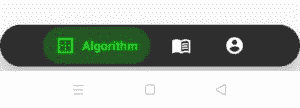

# 安卓中可扩展的 Bottombar

> 原文:[https://www . geeksforgeeks . org/expandablelebottombar-in-Android/](https://www.geeksforgeeks.org/expandablebottombar-in-android/)

在本文中，**expandablelebottombar**是使用 Kotlin 在安卓中添加的。它是 [**【底部导航视图】**](https://developer.android.com/reference/com/google/android/material/bottomnavigation/BottomNavigationView) 的替代品。**bottom navigationview**让用户只需轻轻一点，即可轻松浏览和切换顶级视图。当应用程序有三到五个顶级目的地时，应该使用它们。ExpandableBottomBar 也有不同的选项，但它们在单击时会展开。所以可以容纳更多的选项，给用户更好的体验。假设开发者想创建一个音乐播放器应用，并在应用中添加专辑、歌曲、歌手、和播放列表选项。在这种情况下、都可以使用。



**优势:**

*   它是顶级目的地，可以从应用程序的任何地方访问。
*   它是材料设计组件(底部导航视图)的扩展。
*   易于使用。

**缺点:**

*   它仅在只有三到五个目的地时使用。
*   只能用于手机和平板电脑。
*   文本标签的长度应该更短。
*   当用户 90%以上的时间都在同一个窗口的一个应用中时，就应该使用它。

### 方法:

**第一步:**在 [**build.gradle**](https://www.geeksforgeeks.org/android-build-gradle/) 文件中添加支持库，并在依赖项部分添加依赖项。它允许开发人员在 XML 文件中直接使用 ExpandableBottomBar。

## 可扩展标记语言

```
dependencies {         
        implementation 'com.github.st235:expandablebottombar:1.1.8'     
}
```

**步骤 2:** 现在在 **string.xml** 文件中添加以下代码。在这个文件中，添加所有要在**扩展工具栏**中显示的字段名称。

## 可扩展标记语言

```
<resources>
    <string name="algo">Algorithm</string>
    <string name="course">Course</string>
    <string name="profile">Profile</string>
</resources>
```

**步骤 3:** 通过右键单击 java 包创建一个**算法片段**，选择新建- > **片段(空白)。**

**第 4 步:**按照上述步骤进行**课程片段**和**逻辑片段**。

**步骤 5:** 现在在 **fragment_algorithm.xml** 文件中添加以下代码。这里，布局中添加了一个文本视图。

## 片段 _ 算法. xml

```
<?xml version="1.0" encoding="utf-8"?>
<FrameLayout
    xmlns:android="http://schemas.android.com/apk/res/android"
    xmlns:tools="http://schemas.android.com/tools"
    android:layout_width="match_parent"
    android:layout_height="match_parent"
    android:id="@+id/fragment_algo"
    tools:context=".AlgorithmFragment">

    <TextView
        android:textSize="30sp"
        android:gravity="center"
        android:layout_width="match_parent"
        android:layout_height="match_parent"
        android:text="Algorithm" />

</FrameLayout>
```

**第 6 步:**现在在 **fragment_course.xml** 文件中添加以下代码。这里，布局中添加了一个文本视图。

## fragment_course.xml

```
<?xml version="1.0" encoding="utf-8"?>
<FrameLayout xmlns:android="http://schemas.android.com/apk/res/android"
    xmlns:tools="http://schemas.android.com/tools"
    android:layout_width="match_parent"
    android:layout_height="match_parent"
    android:id="@+id/fragment_course"
    tools:context=".CourseFragment">

    <TextView
        android:textSize="30sp"
        android:gravity="center"
        android:layout_width="match_parent"
        android:layout_height="match_parent"
        android:text="Course" />

</FrameLayout>
```

**第 7 步:**现在在 **fragment_profile.xml** 文件中添加以下代码。这里，布局中添加了一个文本视图。

## fragment_profile.xml

```
<?xml version="1.0" encoding="utf-8"?>
<FrameLayout xmlns:android="http://schemas.android.com/apk/res/android"
    xmlns:tools="http://schemas.android.com/tools"
    android:layout_width="match_parent"
    android:layout_height="match_parent"
    android:id="@+id/fragment_profile"
    tools:context=".ProfileFragment">

    <TextView
        android:textSize="30sp"
        android:gravity="center"
        android:layout_width="match_parent"
        android:layout_height="match_parent"
        android:text="Profile" />

</FrameLayout>
```

**第 8 步:**现在在 **activity_main.xml** 文件中添加以下代码。在这个文件中，将**扩展工具栏**添加到我们的布局中。

## activity_main.xml

```
<?xml version="1.0" encoding="utf-8"?>
<androidx.constraintlayout.widget.ConstraintLayout
    xmlns:android="http://schemas.android.com/apk/res/android"
    xmlns:app="http://schemas.android.com/apk/res-auto"
    xmlns:tools="http://schemas.android.com/tools"
    android:layout_width="match_parent"
    android:layout_height="match_parent"
    tools:context=".MainActivity">

    <FrameLayout
        android:layout_width="match_parent"
        android:layout_height="match_parent"
        android:id="@+id/layout"/>

    <github.com.st235.lib_expandablebottombar.ExpandableBottomBar
        android:id="@+id/expandable_bottom_bar"
        android:layout_width="match_parent"
        android:layout_height="50dp"
        app:exb_backgroundColor="#2e2e2e"
        app:exb_backgroundCornerRadius="25dp"
        app:exb_itemInactiveColor="#fff"
        app:layout_constraintBottom_toBottomOf="parent"
        app:layout_constraintEnd_toEndOf="parent"
        app:layout_constraintHorizontal_bias="1.0"
        app:layout_constraintStart_toStartOf="parent"
        app:layout_constraintTop_toTopOf="parent"
        app:layout_constraintVertical_bias="0.991" />

</androidx.constraintlayout.widget.ConstraintLayout>
```

**第 9 步:**现在在 **MainActivity.kt** 文件中添加以下代码。在这个文件中，添加**帮助在片段之间导航的 Onomselected Listener**。当用户点击图标时，它将切换片段。这里 **addItem** 方法是明确用来给**expandablelebottombar**添加项目的，但是也可以通过在**菜单**文件夹中添加项目来完成。

## MainActivity.kt 公司

```
package org.geeksforgeeks.expandablebottombar

import android.graphics.Color
import androidx.appcompat.app.AppCompatActivity
import android.os.Bundle
import github.com.st235.lib_expandablebottomba
                            .ExpandableBottomBar
import github.com.st235.lib_expandablebottombar
                            .ExpandableBottomBarMenuItem

class MainActivity : AppCompatActivity() {
    override fun onCreate(savedInstanceState: Bundle?) {
        super.onCreate(savedInstanceState)
        setContentView(R.layout.activity_main)

        val bottomBar: ExpandableBottomBar = 
                       findViewById(R.id.expandable_bottom_bar)

        //set up the base fragment
        supportFragmentManager.beginTransaction()
                              .add(R.id.layout, AlgorithmFragment())
                              .commit()

        //addItem function is used to set items in ExpandableBottomBar
        bottomBar.addItems(
            ExpandableBottomBarMenuItem.Builder(context = this)
                .addItem(R.id.fragment_algo, R.drawable.ic_algorithm,
                         R.string.algo, Color.GREEN)
                .addItem(R.id.fragment_course, R.drawable.ic_course,
                         R.string.course, Color.YELLOW)
                .addItem(R.id.fragment_profile, R.drawable.ic_account,
                         R.string.profile, Color.MAGENTA)
                .build()
        )

        //It will help the user to switch between different fragment.
        bottomBar.onItemSelectedListener = { view, menuItem ->
            when(menuItem.itemId){
                R.id.fragment_algo ->
                    supportFragmentManager.beginTransaction()
                        .replace(R.id.layout, AlgorithmFragment())
                        .commit()
                R.id.fragment_course ->
                    supportFragmentManager.beginTransaction()
                        .replace(R.id.layout, CourseFragment())
                        .commit()
                R.id.fragment_profile ->
                    supportFragmentManager.beginTransaction()
                        .replace(R.id.layout, ProfileFragment())
                        .commit()
            }
        }

    }
}
```

**输出:**

<video class="wp-video-shortcode" id="video-455048-1" width="640" height="360" preload="metadata" controls=""><source type="video/mp4" src="https://media.geeksforgeeks.org/wp-content/uploads/20200714231608/Record_2020-07-14-23-14-03_24e06ec8d2632a08910c32e97cf528f61.mp4?_=1">[https://media.geeksforgeeks.org/wp-content/uploads/20200714231608/Record_2020-07-14-23-14-03_24e06ec8d2632a08910c32e97cf528f61.mp4](https://media.geeksforgeeks.org/wp-content/uploads/20200714231608/Record_2020-07-14-23-14-03_24e06ec8d2632a08910c32e97cf528f61.mp4)</video>

参考链接:[https://github.com/st235/ExpandableBottomBar](https://github.com/st235/ExpandableBottomBar)T2】