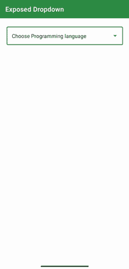

# 安卓中暴露的下拉菜单

> 原文:[https://www . geesforgeks . org/exposed-下拉菜单-in-android/](https://www.geeksforgeeks.org/exposed-drop-down-menu-in-android/)

暴露下拉菜单是安卓系统中 Spinner 的替代品，因为 Spinner 不像新的暴露下拉菜单那样可定制。下面是示例 GIF，让我们了解我们将构建什么。请注意，我们将使用 Kotlin 语言实现这个项目。



### **分步实施**

**第一步:创建新项目**

要在安卓工作室创建新项目，请参考[如何在安卓工作室创建/启动新项目](https://www.geeksforgeeks.org/android-how-to-create-start-a-new-project-in-android-studio/)。注意选择**科特林**作为编程语言。

**步骤 2:使用 activity_main.xml 文件**

转到 **activity_main.xml** 文件，参考以下代码。下面是 activity_main.xml 文件的代码。

## 可扩展标记语言

```
<?xml version="1.0" encoding="utf-8"?>
<androidx.constraintlayout.widget.ConstraintLayout 
    xmlns:android="http://schemas.android.com/apk/res/android"
    xmlns:app="http://schemas.android.com/apk/res-auto"
    xmlns:tools="http://schemas.android.com/tools"
    android:layout_width="match_parent"
    android:layout_height="match_parent"
    tools:context=".MainActivity">

    <!--Create a TextInputLayout and choose the style,
        for now we are choosing the OutlinedBox ExposedDropdownMenu   -->
    <com.google.android.material.textfield.TextInputLayout
        style="@style/Widget.MaterialComponents.TextInputLayout.OutlinedBox.ExposedDropdownMenu"
        android:layout_width="match_parent"
        android:layout_height="wrap_content"
        android:layout_margin="20dp"
        app:layout_constraintLeft_toLeftOf="parent"
        app:layout_constraintRight_toRightOf="parent"
        app:layout_constraintTop_toTopOf="parent">

        <!-- Inside text input layout add
              an auto complete text view
                and make its input type to none-->
        <AutoCompleteTextView
            android:id="@+id/autoCompleteTextView"
            android:layout_width="match_parent"
            android:layout_height="match_parent"
            android:layout_weight="1"
            android:inputType="none"
            android:text="Choose Programming language"
            />

    </com.google.android.material.textfield.TextInputLayout>

</androidx.constraintlayout.widget.ConstraintLayout>
```

**第三步:向 string.xml 文件中添加字符串数组项。我们将使用这些数据来膨胀下拉项目**

## 可扩展标记语言

```
<string-array name="programming_languages">
      <item>Java</item>
      <item>Kotlin</item>
      <item>Python</item>
      <item>CPP</item>
</string-array>
```

**第 4 步:创建一个新的布局文件，并将其命名为 dropdown_item.xml 文件**

转到 **dropdown_item.xml** 文件，参考以下代码。下面是**文件的代码。这是一个单文本视图，我们将把它作为下拉列表中的一个项目。**

## 可扩展标记语言

```
<TextView 
    xmlns:android="http://schemas.android.com/apk/res/android"
    android:id="@+id/textView"
    android:layout_width="match_parent"
    android:textColor="@color/black"
    android:textStyle="bold"
    android:padding="14dp"
    android:layout_height="wrap_content"
    android:text="TextView" />
```

**第五步:使用 MainActivity.kt**

转到 **MainActivity.kt** 文件，参考以下代码。下面是 **MainActivity.kt** 文件的代码。代码中添加了注释，以更详细地理解代码。

## 我的锅

```
import androidx.appcompat.app.AppCompatActivity
import android.os.Bundle
import android.widget.ArrayAdapter
import android.widget.AutoCompleteTextView

class MainActivity : AppCompatActivity() {
    override fun onCreate(savedInstanceState: Bundle?) {
        super.onCreate(savedInstanceState)
        setContentView(R.layout.activity_main)

        // get reference to the string array that we just created
        val languages = resources.getStringArray(R.array.programming_languages)
        // create an array adapter and pass the required parameter
        // in our case pass the context, drop down layout , and array.
        val arrayAdapter = ArrayAdapter(this, R.layout.dropdown_menu, languages)
        // get reference to the autocomplete text view
        val autocompleteTV = findViewById<AutoCompleteTextView>(R.id.autoCompleteTextView)
        // set adapter to the autocomplete tv to the arrayAdapter
        autocompleteTV.setAdapter(arrayAdapter)
    }
}
```

**输出:**

<video class="wp-video-shortcode" id="video-627479-1" width="640" height="360" preload="metadata" controls=""><source type="video/mp4" src="https://media.geeksforgeeks.org/wp-content/uploads/20210616232447/exposed_drop_down_gfg.mp4?_=1">[https://media.geeksforgeeks.org/wp-content/uploads/20210616232447/exposed_drop_down_gfg.mp4](https://media.geeksforgeeks.org/wp-content/uploads/20210616232447/exposed_drop_down_gfg.mp4)</video>