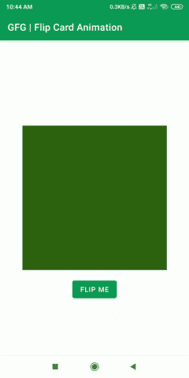
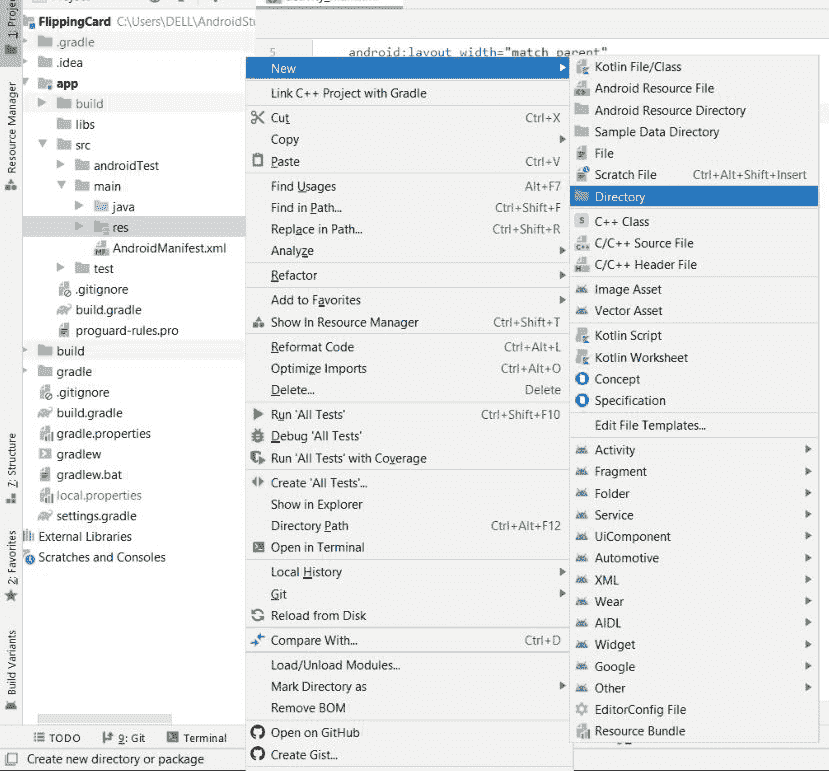
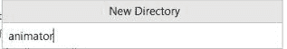
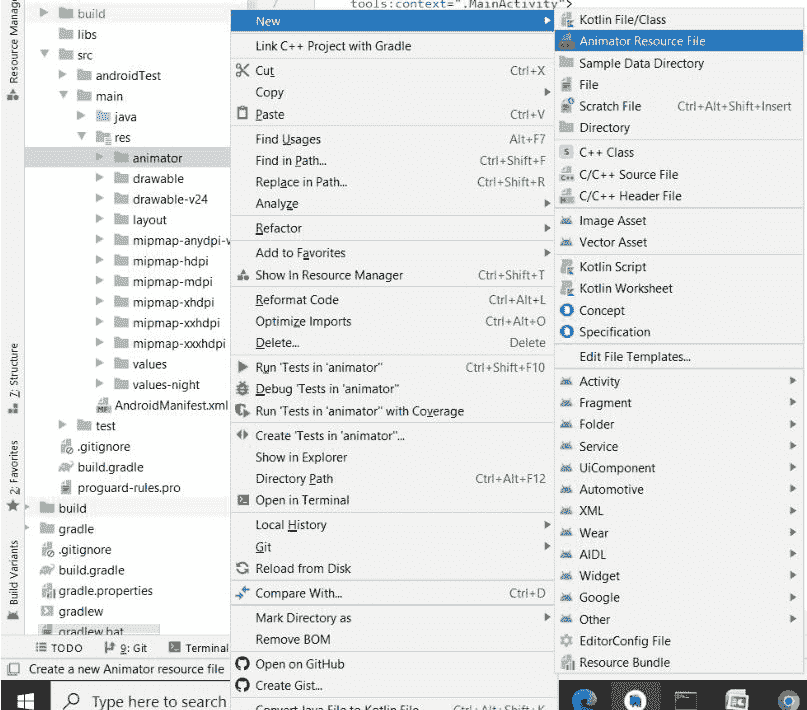
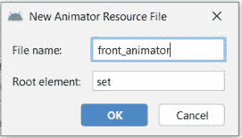

# 安卓中的翻牌动画

> 原文:[https://www . geesforgeks . org/flip-card-animation-in-Android/](https://www.geeksforgeeks.org/flip-card-animation-in-android/)

在这篇文章中，我们将看到如何在安卓工作室中构建一个**翻转卡动画**应用。动画使我们的应用程序更具吸引力、说服力和用户友好性。下面给出了一个示例 **GIF** 来了解我们在本文中要做什么。请注意，我们将使用**柯特林**作为编程语言。



### **分步实施**

**第一步:创建新项目**

要在安卓工作室创建新项目，请参考[如何在安卓工作室创建/启动新项目](https://www.geeksforgeeks.org/android-how-to-create-start-a-new-project-in-android-studio/)。注意选择 **Java** 作为编程语言。

**步骤 2:使用 activity_main.xml 文件**

转到 **res >布局> activity_main.xml** 文件，并将下面的代码添加到该文件中。下面是 activity_main.xml 文件的代码。代码中添加了注释，以更详细地理解代码。

## 可扩展标记语言

```kt
<?xml version="1.0" encoding="utf-8"?>
<!--We are going to use Constraintlayout-->
<androidx.constraintlayout.widget.ConstraintLayout 
    xmlns:android="http://schemas.android.com/apk/res/android"
    xmlns:app="http://schemas.android.com/apk/res-auto"
    xmlns:tools="http://schemas.android.com/tools"
    android:layout_width="match_parent"
    android:layout_height="match_parent"
    tools:context=".MainActivity">

      <!--Add a textView for front part of the card-->
    <TextView
        android:id="@+id/card_back"
        android:layout_width="300dp"
        android:layout_height="300dp"
        android:textAlignment="center"
        android:gravity="center"
        android:text="Back Card"
        android:textSize="22sp"
        android:background="#BF3030"
        app:layout_constraintBottom_toBottomOf="parent"
        app:layout_constraintLeft_toLeftOf="parent"
        app:layout_constraintRight_toRightOf="parent"
        app:layout_constraintTop_toTopOf="parent" />

    <!--Add a textview for back part of the card-->
    <TextView
        android:id="@+id/card_front"
        android:layout_width="300dp"
        android:layout_height="300dp"
        android:textAlignment="center"
        android:gravity="center"
        android:text="Front Card"
        android:textSize="22sp"
        android:background="#326314"
        app:layout_constraintBottom_toBottomOf="parent"
        app:layout_constraintLeft_toLeftOf="parent"
        app:layout_constraintRight_toRightOf="parent"
        app:layout_constraintTop_toTopOf="parent" />

    <!--Add a Button that will apply flip on the card-->
    <Button
        android:id="@+id/flip_btn"
        android:layout_width="wrap_content"
        android:layout_height="wrap_content"
        android:text="Flip Me"
        tools:ignore="MissingConstraints"
        android:layout_marginTop="380dp"
        tools:layout_editor_absoluteX="142dp"
        tools:layout_editor_absoluteY="559dp"
        app:layout_constraintBottom_toBottomOf="parent"
        app:layout_constraintLeft_toLeftOf="parent"
        app:layout_constraintRight_toRightOf="parent"
        app:layout_constraintTop_toTopOf="parent"/>

</androidx.constraintlayout.widget.ConstraintLayout>
```

**步骤 3:创建新目录**

创建一个名为**动画师**的新目录，我们将在这里处理卡片的前后动画部分。要创建一个新目录，请遵循下面给出的图片。

 

**第四步:新建动画师资源文件**

创建一个名为**的新**动画师资源文件**，它将处理翻转卡的正面动画。要创建一个新的动画师资源文件，遵循下面给出的图像。**

 

**第五步:使用 front_animator.xml 文件**

导航到**RES>animator>front _ animator . XML**并将下面的代码添加到该文件中。在这里，我们将使用**对象动画器**标签来制作翻转卡片前部的动画。下面是 **front_animator.xml** 文件的代码。

## 可扩展标记语言

```kt
<?xml version="1.0" encoding="utf-8"?>
<set xmlns:android="http://schemas.android.com/apk/res/android">
    <objectAnimator
        android:valueFrom="0"
        android:valueTo="180"
        android:propertyName="rotationY"
        android:duration="1000"
        />
    <objectAnimator
        android:valueFrom="1.0"
        android:valueTo="0.0"
        android:propertyName="alpha"
        android:startOffset="500"
        android:duration="1"
        />
</set>
```

**第六步:再次创建新的动画师资源文件**

再次创建一个名为 **back_animator.xml** 的新**动画师资源文件**，该文件将处理翻转卡后部的动画。要创建一个新的动画师资源文件，请遵循前面显示的创建 **front_animator.xml** 文件的相同图像。

**第七步:使用 back_animator.xml 文件**

导航到 **res >动画师> back_animator.xm** l，并将下面的代码添加到该文件中。这里，我们将使用 objectAnimator 标签来制作翻转卡片前部的动画。下面是 **back_animator.xml** 文件的代码。

## 可扩展标记语言

```kt
<?xml version="1.0" encoding="utf-8"?>
<set xmlns:android="http://schemas.android.com/apk/res/android">
    <objectAnimator
        android:valueFrom="1.0"
        android:valueTo="0.0"
        android:propertyName="alpha"
        android:duration="0"
        />
    <objectAnimator
        android:valueFrom="180"
        android:valueTo="0"
        android:propertyName="rotationY"
        android:repeatMode="reverse"
        android:duration="1000"
        />

    <objectAnimator
        android:valueFrom="0.0"
        android:valueTo="1.0"
        android:propertyName="alpha"
        android:startOffset="500"
        android:duration="0"
        />

</set>
```

**步骤 8:使用 MainActivity.kt 文件**

转到 **MainActivity.kt** 文件，并将下面的代码添加到该文件中。下面是 **MainActivity.kt** 文件的代码。这里我们将看到如何操作翻转卡的前后动画部分。代码中添加了注释，以更详细地理解代码。

## 我的锅

```kt
package com.example.flippingcard

import android.animation.AnimatorInflater
import android.animation.AnimatorSet
import androidx.appcompat.app.AppCompatActivity
import android.os.Bundle
import android.widget.Button
import android.widget.TextView

class MainActivity : AppCompatActivity() {

    lateinit var front_anim:AnimatorSet
    lateinit var back_anim: AnimatorSet
    var isFront =true

    override fun onCreate(savedInstanceState: Bundle?) {
        super.onCreate(savedInstanceState)
        setContentView(R.layout.activity_main)

        // Now Create Animator Object
        // For this we add animator folder inside res
        // Now we will add the animator to our card
        // we now need to modify the camera scale
        var scale = applicationContext.resources.displayMetrics.density

        val front = findViewById<TextView>(R.id.card_front) as TextView
        val back =findViewById<TextView>(R.id.card_back) as TextView
        val flip = findViewById<Button>(R.id.flip_btn) as Button

        front.cameraDistance = 8000 * scale
        back.cameraDistance = 8000 * scale

        // Now we will set the front animation
        front_animation = AnimatorInflater.loadAnimator(applicationContext, R.animator.front_animator) as AnimatorSet
        back_animation = AnimatorInflater.loadAnimator(applicationContext, R.animator.back_animator) as AnimatorSet

        // Now we will set the event listener
        flip.setOnClickListener{
            if(isFront)
            {
                front_animation.setTarget(front);
                back_animation.setTarget(back);
                front_animation.start()
                back_animation.start()
                isFront = false

            }
            else
            {
                front_animation.setTarget(back)
                back_animation.setTarget(front)
                back_animation.start()
                front_animation.start()
                isFront =true

            }
        }
    }
}
```

**输出:**

<video class="wp-video-shortcode" id="video-668068-1" width="640" height="360" preload="metadata" controls=""><source type="video/mp4" src="https://media.geeksforgeeks.org/wp-content/uploads/20210419104636/WhatsApp-Video-2021-04-19-at-10.44.58-AM.mp4?_=1">[https://media.geeksforgeeks.org/wp-content/uploads/20210419104636/WhatsApp-Video-2021-04-19-at-10.44.58-AM.mp4](https://media.geeksforgeeks.org/wp-content/uploads/20210419104636/WhatsApp-Video-2021-04-19-at-10.44.58-AM.mp4)</video>

你可以从这个链接获取项目的源代码:[点击这里](https://media.geeksforgeeks.org/wp-content/cdn-uploads/20210812125508/FlippingCard-master.zip)