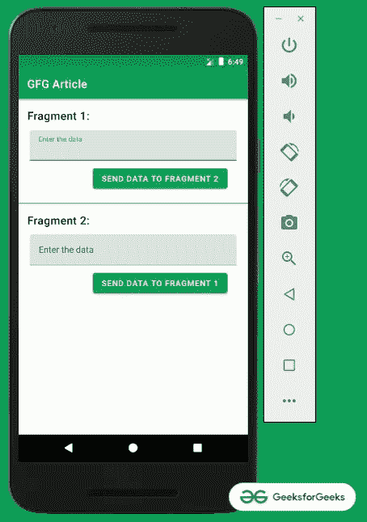
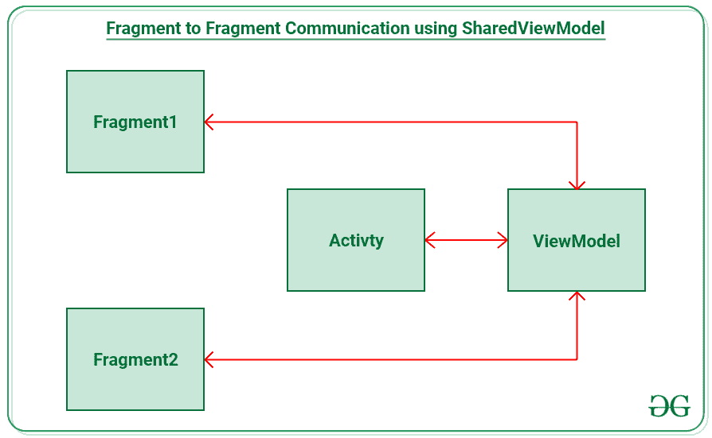
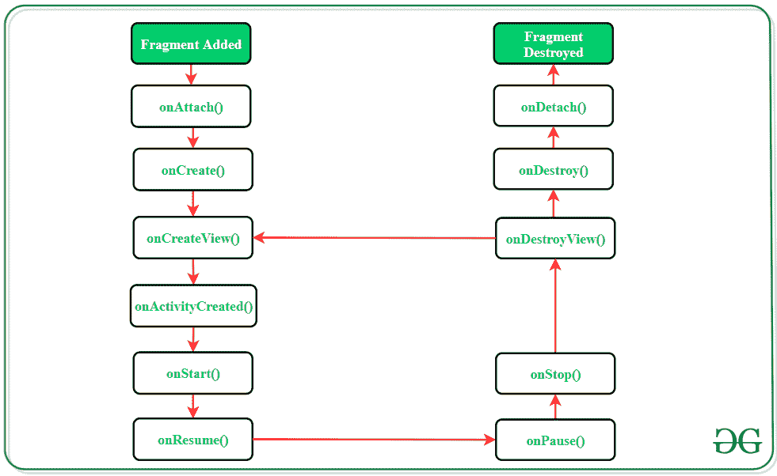

# 使用共享视图模型

在安卓系统中进行片段到片段的通信

> 原文:[https://www . geeksforgeeks . org/碎片对碎片通信在安卓系统中使用共享视图模型/](https://www.geeksforgeeks.org/fragment-to-fragment-communication-in-android-using-shared-viewmodel/)

如果一个活动中有两个或多个片段，它们需要在它们之间进行通信和共享数据。在两个片段之间共享数据的传统方式是使用一个接口实现回调，这个接口很麻烦，可能会抛出异常。但是现代的方法是使用共享视图模型。因此，在本文中，已经演示了如何使用共享视图模型在片段之间进行通信。请看下图，了解讨论概况。



> **注:**此讨论用 **Kotlin** 编程语言实现。

**先决条件**

*   [安卓中的碎片生命周期](https://www.geeksforgeeks.org/fragment-lifecycle-in-android/)
*   [安卓架构组件中的视图模型](https://www.geeksforgeeks.org/viewmodel-in-android-architecture-components/)

### **实现片段间通信的步骤**

**第一步:创建一个空的活动项目**

创建一个空的活动 Android Studio 项目，并选择 Kotlin 作为编程语言。参考[安卓|如何在安卓工作室创建/启动新项目？](https://www.geeksforgeeks.org/android-how-to-create-start-a-new-project-in-android-studio/)。

**步骤 2:添加所需的依赖关系**

依赖项包括视图模型和实时数据。因此，在应用程序级的 Gradle 文件中添加以下依赖项并同步项目。

> // lifecycle_version 和架构版本可能会有所不同
> def lifecycle_version = "2.3.1 "
> 
> def arch_version = "2.1.0 "
> 
> // ViewModel
> 
> 实现“androidx . life cycle:life cycle-view model-ktx:$ life cycle _ version”
> 
> 实时数据
> 
> 实现“androidx . life cycle:life cycle-live data-ktx:$ life cycle _ version”
> 
> //仅生命周期(无视图模型或实时数据)
> 
> 实现“androidx . life cycle:life cycle-runtime-ktx:$ life cycle _ version”
> 
> //架构生命周期扩展
> 
> 实现“androidx . life cycle:life cycle-extensions:$ arch _ version”

**第三步:使用 activity_main.xml 文件**

应用程序的主布局包含两个[框架布局](https://www.geeksforgeeks.org/android-framelayout-in-kotlin/)，它们包含两个片段。为了实现相同的功能，在 **activity_main.xml** 文件中调用以下代码。

## 可扩展标记语言

```kt
<?xml version="1.0" encoding="utf-8"?>
<androidx.constraintlayout.widget.ConstraintLayout 
    xmlns:android="http://schemas.android.com/apk/res/android"
    xmlns:app="http://schemas.android.com/apk/res-auto"
    xmlns:tools="http://schemas.android.com/tools"
    android:layout_width="match_parent"
    android:layout_height="match_parent"
    tools:context=".MainActivity"
    tools:ignore="HardcodedText">

    <TextView
        android:id="@+id/textView"
        style="@style/TextAppearance.MaterialComponents.Headline6"
        android:layout_width="wrap_content"
        android:layout_height="wrap_content"
        android:layout_marginStart="16dp"
        android:layout_marginTop="16dp"
        android:text="Fragment 1:"
        app:layout_constraintStart_toStartOf="parent"
        app:layout_constraintTop_toTopOf="parent" />

    <FrameLayout
        android:id="@+id/fragment_1_holder"
        android:layout_width="match_parent"
        android:layout_height="wrap_content"
        android:layout_marginStart="16dp"
        android:layout_marginTop="8dp"
        android:layout_marginEnd="16dp"
        app:layout_constraintEnd_toEndOf="parent"
        app:layout_constraintHorizontal_bias="0.0"
        app:layout_constraintStart_toStartOf="parent"
        app:layout_constraintTop_toBottomOf="@+id/textView" />

    <View
        android:id="@+id/view"
        android:layout_width="match_parent"
        android:layout_height="1dp"
        android:layout_marginTop="16dp"
        android:background="@color/green_700"
        app:layout_constraintEnd_toEndOf="parent"
        app:layout_constraintStart_toStartOf="parent"
        app:layout_constraintTop_toBottomOf="@+id/fragment_1_holder" />

    <TextView
        android:id="@+id/textView2"
        style="@style/TextAppearance.MaterialComponents.Headline6"
        android:layout_width="wrap_content"
        android:layout_height="wrap_content"
        android:layout_marginStart="16dp"
        android:layout_marginTop="16dp"
        android:text="Fragment 2: "
        app:layout_constraintStart_toStartOf="parent"
        app:layout_constraintTop_toBottomOf="@+id/view" />

    <FrameLayout
        android:id="@+id/fragment_2_holder"
        android:layout_width="match_parent"
        android:layout_height="wrap_content"
        android:layout_marginStart="16dp"
        android:layout_marginTop="8dp"
        android:layout_marginEnd="16dp"
        app:layout_constraintEnd_toEndOf="parent"
        app:layout_constraintHorizontal_bias="0.0"
        app:layout_constraintStart_toStartOf="parent"
        app:layout_constraintTop_toBottomOf="@+id/textView2" />

</androidx.constraintlayout.widget.ConstraintLayout>
```

**第四步:实现共享视图模型**

在**共享视图模型. kt** 文件中有一个可变的字符序列数据，用于设置[编辑文本](https://www.geeksforgeeks.org/working-with-the-edittext-in-android/)的数据。两个函数 setData 和 getData 用于一旦编辑文本中的数据发生变化，就更新可变的实时数据。



若要实现相同的，请调用以下代码。

## 我的锅

```kt
import androidx.lifecycle.MutableLiveData
import androidx.lifecycle.ViewModel

class SharedViewModel : ViewModel() {

    // Mutable LiveData which observed by LiveData 
      // and updated to EditTexts when it is changed.
    private val mutableLiveData: MutableLiveData<CharSequence> = MutableLiveData()

    // function to set the changed
      // data from the EditTexts
    fun setData(input: CharSequence) {
        mutableLiveData.value = input
    }

    // function to get the changed data from the EditTexts
    fun getData(): MutableLiveData<CharSequence> = mutableLiveData
}
```

**第五步:创建 2 个片段**

*   创建两个[片段](https://www.geeksforgeeks.org/introduction-fragments-android/)，它们各自的布局分别命名为**片段 1.kt 和片段 2.kt** 。
*   对于每个片段的布局，它包含一个 EditText 来获取片段 2 要发送的数据，以及一个按钮，当单击该按钮时，它会将数据共享给另一个片段。
*   要实现片段 1 的布局，请在 fragment_1.xml 文件中调用以下代码

## 可扩展标记语言

```kt
<?xml version="1.0" encoding="utf-8"?>
<RelativeLayout 
    xmlns:android="http://schemas.android.com/apk/res/android"
    xmlns:tools="http://schemas.android.com/tools"
    android:layout_width="match_parent"
    android:layout_height="match_parent"
    android:clipToPadding="false"
    android:padding="4dp"
    tools:context=".Fragment1"
    tools:ignore="HardcodedText">

    <com.google.android.material.textfield.TextInputLayout
        android:id="@+id/edit_text_layout_1"
        android:layout_width="match_parent"
        android:layout_height="wrap_content">

        <com.google.android.material.textfield.TextInputEditText
            android:id="@+id/edit_text_from_fragment_1"
            android:layout_width="match_parent"
            android:layout_height="wrap_content"
            android:hint="Enter the data" />

    </com.google.android.material.textfield.TextInputLayout>

    <Button
        android:id="@+id/send_button_fragment_1"
        android:layout_width="wrap_content"
        android:layout_height="wrap_content"
        android:layout_below="@id/edit_text_layout_1"
        android:layout_alignParentEnd="true"
        android:layout_marginTop="8dp"
        android:layout_marginEnd="16dp"
        android:text="Send Data to Fragment 2" />

</RelativeLayout>
```

要实现片段 2 的布局，在**片段 _2.xml** 文件中调用以下代码。

## 可扩展标记语言

```kt
<?xml version="1.0" encoding="utf-8"?>
<RelativeLayout 
    xmlns:android="http://schemas.android.com/apk/res/android"
    xmlns:tools="http://schemas.android.com/tools"
    android:layout_width="match_parent"
    android:layout_height="match_parent"
    android:clipToPadding="false"
    android:padding="4dp"
    tools:context=".Fragment2"
    tools:ignore="HardcodedText">

    <com.google.android.material.textfield.TextInputLayout
        android:id="@+id/edit_text_layout_2"
        android:layout_width="match_parent"
        android:layout_height="wrap_content">

        <com.google.android.material.textfield.TextInputEditText
            android:id="@+id/edit_text_from_fragment_2"
            android:layout_width="match_parent"
            android:layout_height="wrap_content"
            android:hint="Enter the data" />

    </com.google.android.material.textfield.TextInputLayout>

    <Button
        android:id="@+id/send_button_fragment_2"
        android:layout_width="wrap_content"
        android:layout_height="wrap_content"
        android:layout_below="@id/edit_text_layout_2"
        android:layout_alignParentEnd="true"
        android:layout_marginTop="8dp"
        android:layout_marginEnd="16dp"
        android:text="Send Data to Fragment 1" />

</RelativeLayout>
```

**步骤 6:在 Fragment.kt 文件内创建共享视图模型的实例**

*   创建活动时，需要创建共享视图模型类型的视图模型实例。
*   因此，需要在每个片段中覆盖 **onActivityCreated()** 方法。
*   这是因为当我们看到片段的生命周期时，视图是在调用 **onCreateView()** 和执行 onCreateView()后调用**onprivatycreated()**回调后创建和更新的。因此，实时数据可以跟踪用户界面元素更新了哪些元素。请看下面这个片段活动生命周期的图表。



要在两个片段中实现相同的，请调用**片段 1.kt** 中的以下代码。

## 我的锅

```kt
import android.os.Bundle
import android.text.Editable
import androidx.fragment.app.Fragment
import android.view.LayoutInflater
import android.view.View
import android.view.ViewGroup
import android.widget.Button
import android.widget.EditText
import androidx.lifecycle.Observer
import androidx.lifecycle.ViewModelProviders

class Fragment1 : Fragment() {

    private var sharedViewModelInstance: SharedViewModel? = null

    private var editTextFromFragment1: EditText? = null

    override fun onCreateView(
            inflater: LayoutInflater, container: ViewGroup?,
            savedInstanceState: Bundle?
    ): View? {
        val view: View = inflater.inflate(R.layout.fragment_1, container, false)

        val sendDataButton: Button = view.findViewById(R.id.send_button_fragment_1)
        editTextFromFragment1 = view.findViewById(R.id.edit_text_from_fragment_1)

        // as soon as the button is clicked 
          // send the data to ViewModel
        // and the Live data will take care of
          // updating the data inside another Fragment
        sendDataButton.setOnClickListener {
            sharedViewModelInstance?.setData(editTextFromFragment1!!.text)
        }

        return view
    }

    override fun onActivityCreated(savedInstanceState: Bundle?) {
        super.onActivityCreated(savedInstanceState)

        // create instances of the shared view model 
          // when the activity is created
        sharedViewModelInstance = ViewModelProviders.of(activity!!).get(SharedViewModel::class.java)

        // observe the data inside the view model that 
          // is mutable live of type CharSequence and 
          // set the data for edit text
        sharedViewModelInstance!!.getData().observe(viewLifecycleOwner, Observer {
            editTextFromFragment1!!.text = it as Editable?
        })
    }
}
```

对于 **Fragment2.kt** 文件也是如此，调用下面的代码。

## 我的锅

```kt
import android.os.Bundle
import android.text.Editable
import androidx.fragment.app.Fragment
import android.view.LayoutInflater
import android.view.View
import android.view.ViewGroup
import android.widget.Button
import android.widget.EditText
import androidx.lifecycle.Observer
import androidx.lifecycle.ViewModelProviders

class Fragment2 : Fragment() {

    private var sharedViewModelInstance: SharedViewModel? = null

    private var editTextFromFragment2: EditText? = null

    override fun onCreateView(
            inflater: LayoutInflater, container: ViewGroup?,
            savedInstanceState: Bundle?
    ): View? {
        val view: View = inflater.inflate(R.layout.fragment_2, container, false)

        val sendDataButton: Button = view.findViewById(R.id.send_button_fragment_2)
        editTextFromFragment2 = view.findViewById(R.id.edit_text_from_fragment_2)

        // as soon as the button is clicked 
          // send the data to ViewModel
        // and the Live data will take care of 
          // updating the data inside another Fragment
        sendDataButton.setOnClickListener {
            sharedViewModelInstance?.setData(editTextFromFragment2!!.text)
        }

        return view
    }

    override fun onActivityCreated(savedInstanceState: Bundle?) {
        super.onActivityCreated(savedInstanceState)

        // create instances of the shared view model
          // when the activity is created
        sharedViewModelInstance = ViewModelProviders.of(activity!!).get(SharedViewModel::class.java)

        // observe the data inside the view model that is mutable 
          // live of type CharSequence and set the data for edit text
        sharedViewModelInstance!!.getData().observe(viewLifecycleOwner, Observer {
            editTextFromFragment2!!.text = it as Editable?
        })
    }
}
```

**第 7 步:使用 MainActivity.kt 文件**填充片段持有者

在 **MainActivity.kt** 文件中，需要用两个片段填充来自 **activity_main.xml、**的片段持有者。要实现相同的功能，请在 **MainActivity.kt** 文件中调用以下代码。

## 我的锅

```kt
import android.os.Bundle
import androidx.appcompat.app.AppCompatActivity
import androidx.fragment.app.FragmentTransaction

class MainActivity : AppCompatActivity() {
    override fun onCreate(savedInstanceState: Bundle?) {
        super.onCreate(savedInstanceState)
        setContentView(R.layout.activity_main)

        val fragmentTransaction: FragmentTransaction = supportFragmentManager.beginTransaction()
        fragmentTransaction.apply {
            add(R.id.fragment_1_holder, Fragment1())
            add(R.id.fragment_2_holder, Fragment2())
            commit()
        }
    }
}
```

**输出:**

<video class="wp-video-shortcode" id="video-610250-1" width="640" height="360" preload="metadata" controls=""><source type="video/mp4" src="https://media.geeksforgeeks.org/wp-content/uploads/20210521185034/Untitled.mp4?_=1">[https://media.geeksforgeeks.org/wp-content/uploads/20210521185034/Untitled.mp4](https://media.geeksforgeeks.org/wp-content/uploads/20210521185034/Untitled.mp4)</video>