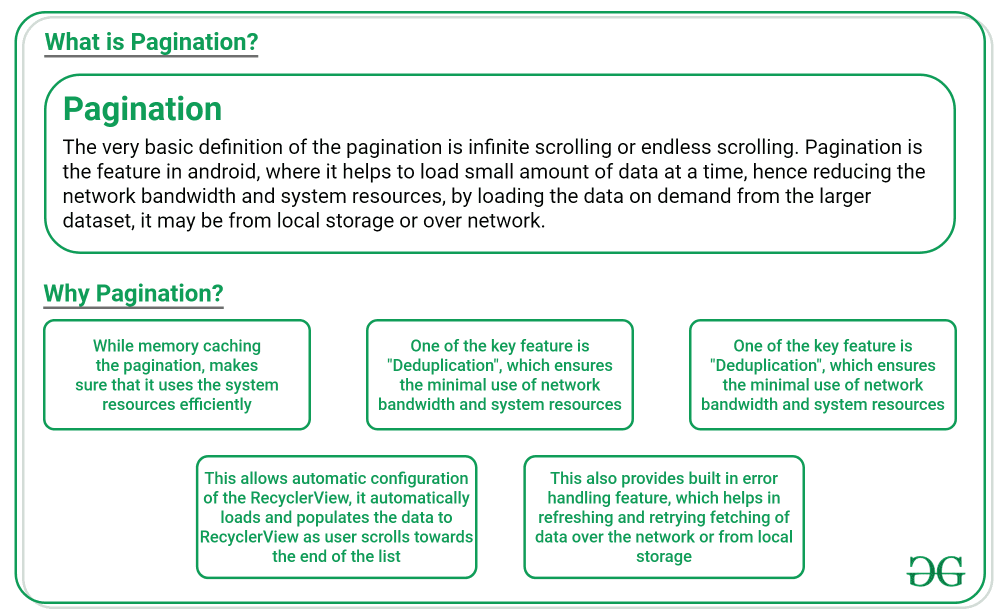
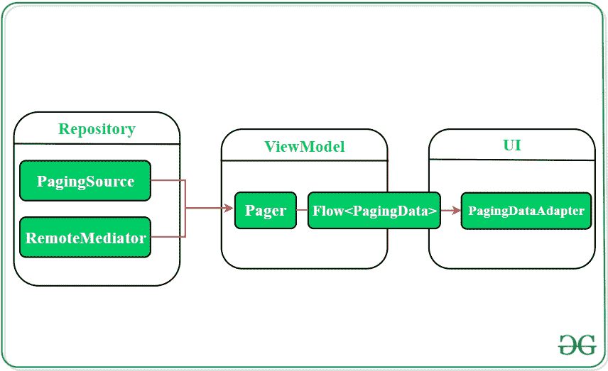

# 安卓分页库 v3 入门

> 原文:[https://www . geeksforgeeks . org/入门-分页-库-v3-in-Android-use-kot Lin-coroutines/](https://www.geeksforgeeks.org/getting-started-with-paging-library-v3-in-android-using-kotlin-coroutines/)

安卓项目中使用的[回收视图](https://www.geeksforgeeks.org/android-recyclerview/)向用户显示一个大的数据列表。然而，这并不是一个有效的方法。从网络中获取大量信息并将其加载到应用程序中是一项至关重要的任务。此外，在使用移动应用程序时，用户一次只能观察到一小部分数据。为了解决这个问题，谷歌在发布安卓 11 测试版的同时，更新了安卓的分页架构组件库。谷歌发布了**分页 3 库**，以简化安卓应用中分页的实现。

> **注意:**Paging 3.0 库目前处于早期阶段，谷歌只发布了 alpha 版本。这个库更稳定的版本是分页 2。

Paging 3 库是作为 [Android Jetpack](https://www.geeksforgeeks.org/introduction-to-android-jetpack/) 系列的一部分引入的，它完全是使用 [Kotlin Coroutines](https://www.geeksforgeeks.org/kotlin-coroutines-on-android/) 编写的。该库提供了一种全新的方法来在应用程序上加载大量数据。这种方法是一次获取小块数据，当用户到达列表末尾时，它会立即在 RecyclerView 中加载更多数据。这个过程称为分页。这个分页 3 库提供了一种在需要时自动加载更多数据的方法。开发人员可以使用**分页库 v3** 在他们的应用程序中实现**分页**。但是**什么是分页，为什么我们需要分页**？人们可以参考下图来得到答案。

### 使用分页库的优势

与安卓分页库的早期版本相比，分页 3.0 版本非常独特。以下是新功能及其优势:

*   提供对错误处理以及刷新和重试功能的支持。
*   对柯特林协同程序、流、实时数据和 RxJava 的最佳支持。
*   添加加载状态页眉、页脚和列表分隔符的内置功能。
*   为分页数据提供内存缓存，确保系统地使用设备资源。
*   跟踪键，以便从下一页和上一页获取数据。
*   防止应用程序接口请求的重复，并确保应用程序以有效的方式使用网络带宽和系统资源。
*   通过提供取消支持和简化的数据源界面来改进存储库层。

### 在安卓项目中使用分页库:

通过在应用级 [build.gradle](https://www.geeksforgeeks.org/android-build-gradle/) 文件中添加分页 3.0 库的实现来导入分页组件，从而在项目中应用分页 3.0 库。

> 依赖项{
> 
> def paging _ version = " 3 . 0 . 0-alpha 11 "
> 
> 实现“androidx . paging:paging-runtime:$ paging _ version”
> 
> }

要使用 **RxJava** 或 **LiveData** ，需要添加以下实现:

> // RxJava2 支持–可选
> 
> 实现“androidx . paging:paging-rxjava2:$ paging _ version”
> 
> //番石榴列表启用未来支持–可选
> 
> 实现“androidx . paging:paging-guava:$ paging _ version”

### 分页库的体系结构

分页库需要适当分离项目的关注点，因此它集成了推荐的安卓架构模式。库的组件在应用程序的三层中工作:

1.  存储库层
2.  视图模型层
3.  用户界面层

*   **存储库层:**该层包含组件，即**分页源**和**远程调解器。**paging source 的任务是定义数据源，并从该数据源获取数据。它能够从本地数据库或任何网络源加载数据。RemoteMediator 组件控制任何分层数据源上的分页。
*   **视图模型:**分页数据的实例由视图模型的**分页组件**提供的公共应用编程接口创建。这种分页数据暴露在将视图模型连接到用户界面层的反应流中。
*   **UI:** 分页数据的可视化表示由该层表示。它的主要组件是**分页数据适配器**，这是一个处理分页数据的回收视图。

**参考:**[https://developer . Android . com/topic/libraries/architecture/paging/v3-概述](https://developer.android.com/topic/libraries/architecture/paging/v3-overview)