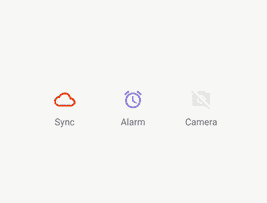

# 谷歌启动器风格的安卓开关图标实现

> 原文:[https://www . geesforgeks . org/Google-launcher-style-实现-开关-图标-在 android 中/](https://www.geeksforgeeks.org/google-launcher-style-implementation-of-switch-icon-in-android/)

**谷歌启动器样式(GLS)** 是一组应用于谷歌某些应用程序的显示元素的样式。还为切换视图或按钮提供了样式。但是这些风格的使用仅限于在谷歌工作的工程师。通过这篇文章，我们想与大家分享一个开源库，它将帮助我们实现 GLS 开关图标。以下是 GLS 开关图标的示例。请注意，我们将使用**柯特林**语言来实施该项目。



### 方法

**第一步:创建新项目**

要在安卓工作室创建新项目，请参考[如何在安卓工作室创建/启动新项目](https://www.geeksforgeeks.org/android-how-to-create-start-a-new-project-in-android-studio/)。注意选择**科特林**作为编程语言。

**第 2 步:对构建.梯度(项目:)**所做的更改

## 可扩展标记语言

```
allprojects {
    repositories {
        google()
        jcenter()
        maven { url "https://jitpack.io" } // Add this
    }
}
```

**第三步:将依赖项添加到 build.gradle(模块:app)文件**

设置完成后，进入**根**和**app**[**build . gradle**](https://www.geeksforgeeks.org/android-build-gradle/)并添加以下代码和依赖项。立即同步项目。

> 实现' com . github . zagum:Android-SwitChicon:1 . 4 . 0 '

**第四步:添加需要的可绘制文件**

转到 **app > res >可绘制文件>右键>新建>可绘制资源文件**并将文件命名为 **ic_cloud** ，并在该文件中添加以下代码。

## 可扩展标记语言

```
<vector xmlns:android="http://schemas.android.com/apk/res/android"
    android:width="32dp"
    android:height="32dp"
    android:viewportWidth="24.0"
    android:viewportHeight="24.0">
    <path
        android:fillColor="#01579B"
        android:pathData="M19.35,10.04C18.67,6.59 15.64,4 12,4 9.11,4 6.6,5.64 5.35,8.04 2.34,8.36 0,
        10.91 0,14c0,3.31 2.69,6 6,6h13c2.76,0 5,-2.24 5,-5 0,-2.64 -2.05,-4.78 -4.65,-4.96zM19,
        18H6c-2.21,0 -4,-1.79 -4,-4s1.79,-4 4,-4h0.71C7.37,7.69 9.48,6 12,6c3.04,0 5.5,2.46 5.5,
        5.5v0.5H19c1.66,0 3,1.34 3,3s-1.34,3 -3,3z" />

</vector>
```