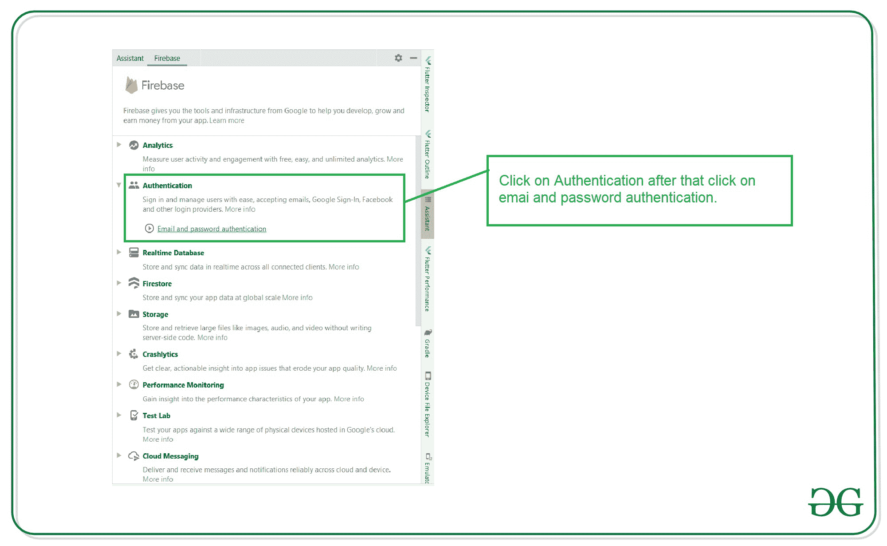
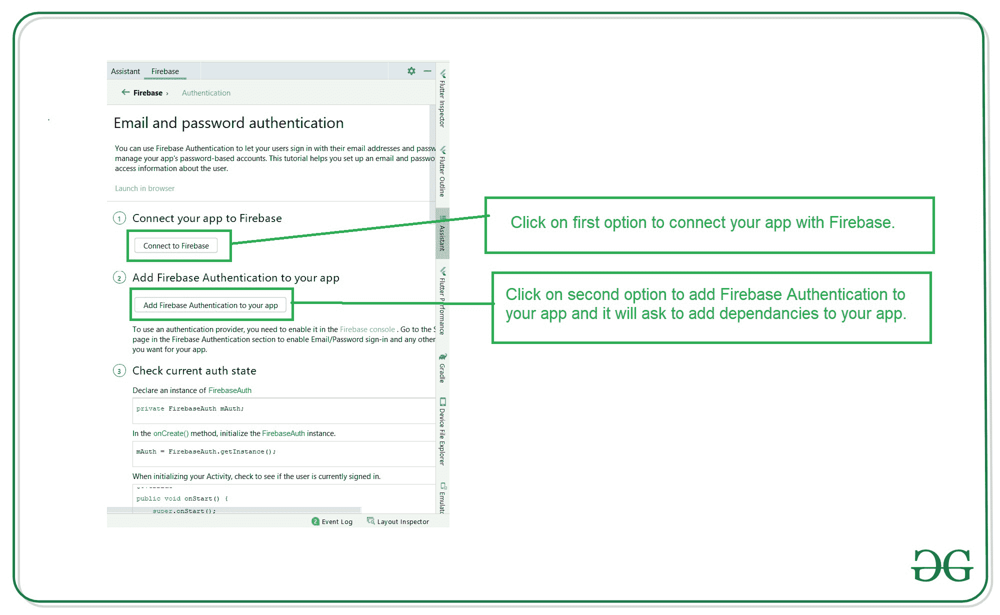

# 在 Kotlin 中使用 Firebase 认证的谷歌签名

> 原文:[https://www . geeksforgeeks . org/Google-signing-use-firebase-authentication-in-kot Lin/](https://www.geeksforgeeks.org/google-signing-using-firebase-authentication-in-kotlin/)

[Firebase](https://www.geeksforgeeks.org/user-authentication-using-firebase-in-android/) 是一个移动和 web 应用开发平台。它提供 web 应用程序或移动应用程序可能需要的服务。Firebase 提供电子邮件和密码身份验证，无需为用户身份验证构建后端。谷歌登录是一种在你的应用程序中验证用户身份的安全方式。它减少了用户处理和处理这些额外密码以获得应用程序认证的麻烦。Firebase 提供了大量的选项来在你的应用程序中实现登录，如电子邮件、电话号码、谷歌、脸书等。

### **分步实施**

**第一步:创建新项目**

要在安卓工作室创建新项目，请参考[如何在安卓工作室创建/启动新项目](https://www.geeksforgeeks.org/android-how-to-create-start-a-new-project-in-android-studio/)。注意选择 **Java** 作为编程语言。

**第二步:将你的应用连接到 Firebase**

在 Android Studio 中创建新项目后。将您的应用程序连接到 Firebase。用于将您的应用程序连接到 firebase。导航到顶部栏上的工具。之后点击 Firebase。右侧将打开一个新窗口。在该窗口中，单击身份验证，然后单击电子邮件和密码身份验证。



点击电子邮件和密码认证后，您将看到下面的屏幕。在此屏幕中，单击第一个选项连接到 firebase，然后单击第二个选项将 Firebase 身份验证添加到您的应用程序中。



如果以下依赖项尚不存在，请添加这些依赖项。

> 实现' com . Google . firebase:firebase-auth:16 . 0 . 5 '
> 
> 实现' com . Google . Android . GMS:play-services-auth:18 . 1 . 0 '

**第三步:启用谷歌登录**

<video class="wp-video-shortcode" id="video-571162-1" width="640" height="360" preload="metadata" controls=""><source type="video/mp4" src="https://media.geeksforgeeks.org/wp-content/uploads/20210307232126/20210307_232031.mp4?_=1">[https://media.geeksforgeeks.org/wp-content/uploads/20210307232126/20210307_232031.mp4](https://media.geeksforgeeks.org/wp-content/uploads/20210307232126/20210307_232031.mp4)</video>

**第 4 步:使用 activity_main.xml 文件**

导航到**应用程序> res >布局> activity_main.xml** 并将下面的代码添加到该文件中。下面是 **activity_main.xml** 文件的代码。

## 可扩展标记语言

```
<?xml version="1.0" encoding="utf-8"?>
<LinearLayout 
    xmlns:android="http://schemas.android.com/apk/res/android"
    xmlns:tools="http://schemas.android.com/tools"
    android:layout_width="match_parent"
    android:layout_height="match_parent"
    android:gravity="center"
    android:orientation="vertical"
    tools:context=".MainActivity">

    <Button
        android:id="@+id/Signin"
        android:layout_width="match_parent"
        android:layout_height="wrap_content"
        android:layout_margin="20dp"
        android:padding="20dp"
        android:text="Google Sign In"
        android:textColor="#000"
        android:textSize="22sp" />

</LinearLayout>
```

**步骤 5:使用**T2【主活动. kt】文件

转到 **MainActivity.kt** 文件，参考以下代码。下面是 **MainActivity.kt** 文件的代码。代码中添加了注释，以更详细地理解代码。

## 我的锅

```
import android.content.Intent
import android.os.Bundle
import android.view.View
import android.widget.Toast
import androidx.appcompat.app.AppCompatActivity
import com.google.android.gms.auth.api.signin.GoogleSignIn
import com.google.android.gms.auth.api.signin.GoogleSignInAccount
import com.google.android.gms.auth.api.signin.GoogleSignInClient
import com.google.android.gms.auth.api.signin.GoogleSignInOptions
import com.google.android.gms.common.api.ApiException
import com.google.android.gms.tasks.Task
import com.google.firebase.FirebaseApp
import com.google.firebase.auth.FirebaseAuth
import com.google.firebase.auth.GoogleAuthProvider
import kotlinx.android.synthetic.main.activity_main.*

class MainActivity : AppCompatActivity() {

    lateinit var mGoogleSignInClient: GoogleSignInClient
    val Req_Code: Int = 123
    private lateinit var firebaseAuth: FirebaseAuth

    override fun onCreate(savedInstanceState: Bundle?) {
        super.onCreate(savedInstanceState)
        setContentView(R.layout.activity_main)

        FirebaseApp.initializeApp(this)

        val gso = GoogleSignInOptions.Builder(GoogleSignInOptions.DEFAULT_SIGN_IN)
            .requestIdToken(getString(R.string.default_web_client_id))
            .requestEmail()
            .build()

        mGoogleSignInClient = GoogleSignIn.getClient(this, gso)
        firebaseAuth = FirebaseAuth.getInstance()

        Signin.setOnClickListener { view: View? ->
            Toast.makeText(this, "Logging In", Toast.LENGTH_SHORT).show()
            signInGoogle()
        }
    }

    private fun signInGoogle() {
        val signInIntent: Intent = mGoogleSignInClient.signInIntent
        startActivityForResult(signInIntent, Req_Code)
    }

    // onActivityResult() function : this is where
    // we provide the task and data for the Google Account
    override fun onActivityResult(requestCode: Int, resultCode: Int, data: Intent?) {
        super.onActivityResult(requestCode, resultCode, data)
        if (requestCode == Req_Code) {
            val task: Task<GoogleSignInAccount> = GoogleSignIn.getSignedInAccountFromIntent(data)
            handleResult(task)
        }
    }

    private fun handleResult(completedTask: Task<GoogleSignInAccount>) {
        try {
            val account: GoogleSignInAccount? = completedTask.getResult(ApiException::class.java)
            if (account != null) {
                UpdateUI(account)
            }
        } catch (e: ApiException) {
            Toast.makeText(this, e.toString(), Toast.LENGTH_SHORT).show()
        }
    }

    // this is where we update the UI after Google signin takes place
    private fun UpdateUI(account: GoogleSignInAccount) {
        val credential = GoogleAuthProvider.getCredential(account.idToken, null)
        firebaseAuth.signInWithCredential(credential).addOnCompleteListener { task ->
            if (task.isSuccessful) {
                SavedPreference.setEmail(this, account.email.toString())
                SavedPreference.setUsername(this, account.displayName.toString())
                val intent = Intent(this, DashboardActivity::class.java)
                startActivity(intent)
                finish()
            }
        }
    }

    override fun onStart() {
        super.onStart()
        if (GoogleSignIn.getLastSignedInAccount(this) != null) {
            startActivity(
                Intent(
                    this, DashboardActivity
                    ::class.java
                )
            )
            finish()
        }
    }
}
```

**第六步:创建一个新的空活动**

请参考 [在安卓工作室](https://www.geeksforgeeks.org/how-to-create-constructor-getter-setter-methods-and-new-activity-in-android-studio-using-shortcuts/) 创建新活动，并将活动命名为 **DashboardActivity。**

**第 7 步:使用 activity_dashboard.xml 文件**

转到 **activity_dashboard.xml** 文件，参考以下代码。下面是 **activity_dashboard.xml** 文件的代码。创建一个按钮，点击该按钮后，用户将从应用程序中注销。

## 可扩展标记语言

```
<?xml version="1.0" encoding="utf-8"?>
<androidx.constraintlayout.widget.ConstraintLayout
    xmlns:android="http://schemas.android.com/apk/res/android"
    xmlns:app="http://schemas.android.com/apk/res-auto"
    xmlns:tools="http://schemas.android.com/tools"
    android:layout_width="match_parent"
    android:layout_height="match_parent"
    tools:context=".DashboardActivity">

    <Button
        android:id="@+id/logout"
        android:layout_width="300dp"
        android:layout_height="100dp"
        android:padding="10dp"
        android:text="Logout"
        android:textColor="#000"
        android:textSize="40sp"
        app:layout_constraintBottom_toBottomOf="parent"
        app:layout_constraintLeft_toLeftOf="parent"
        app:layout_constraintRight_toRightOf="parent"
        app:layout_constraintTop_toTopOf="parent" />

</androidx.constraintlayout.widget.ConstraintLayout>
```

**步骤 8:使用 DashboardActivity.kt 文件**

转到 **DashboardActivity.kt** 文件，参考以下代码。下面是 **DashboardActivity.kt** 文件的代码。代码中添加了注释，以更详细地理解代码。

## 我的锅

```
import android.content.Intent
import android.os.Bundle
import android.widget.Toast
import androidx.appcompat.app.AppCompatActivity
import com.google.android.gms.auth.api.signin.GoogleSignIn
import com.google.android.gms.auth.api.signin.GoogleSignInClient
import com.google.android.gms.auth.api.signin.GoogleSignInOptions
import com.google.firebase.auth.FirebaseAuth
import kotlinx.android.synthetic.main.activity_dashboard.*

class DashboardActivity : AppCompatActivity() {

    // declare the GoogleSignInClient
    lateinit var mGoogleSignInClient: GoogleSignInClient

    private val auth by lazy {
        FirebaseAuth.getInstance()
    }

    override fun onCreate(savedInstanceState: Bundle?) {
        super.onCreate(savedInstanceState)
        setContentView(R.layout.activity_dashboard)

        // call requestIdToken as follows
        val gso = GoogleSignInOptions.Builder(GoogleSignInOptions.DEFAULT_SIGN_IN)
            .requestIdToken(getString(R.string.default_web_client_id))
            .requestEmail()
            .build()
        mGoogleSignInClient = GoogleSignIn.getClient(this, gso)

        logout.setOnClickListener {
            mGoogleSignInClient.signOut().addOnCompleteListener {
                val intent = Intent(this, MainActivity::class.java)
                Toast.makeText(this, "Logging Out", Toast.LENGTH_SHORT).show()
                startActivity(intent)
                finish()
            }
        }
    }
}
```

**输出:**

<video class="wp-video-shortcode" id="video-571162-2" width="640" height="360" preload="metadata" controls=""><source type="video/mp4" src="https://media.geeksforgeeks.org/wp-content/uploads/20210307230848/googlesignin.mp4?_=2">[https://media.geeksforgeeks.org/wp-content/uploads/20210307230848/googlesignin.mp4](https://media.geeksforgeeks.org/wp-content/uploads/20210307230848/googlesignin.mp4)</video>