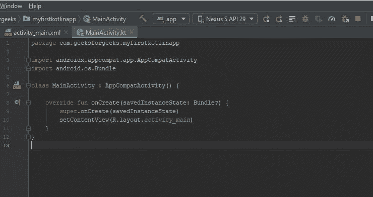
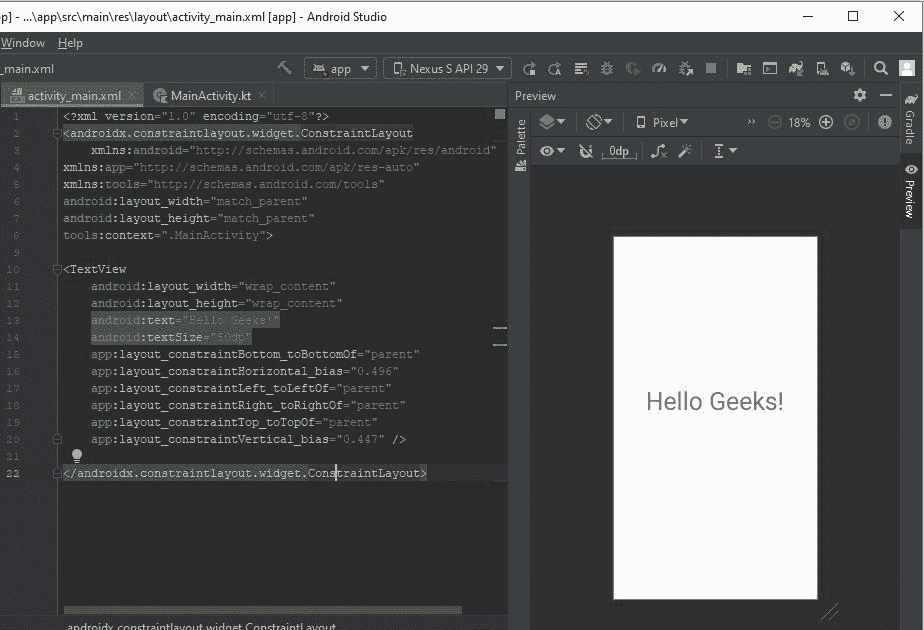
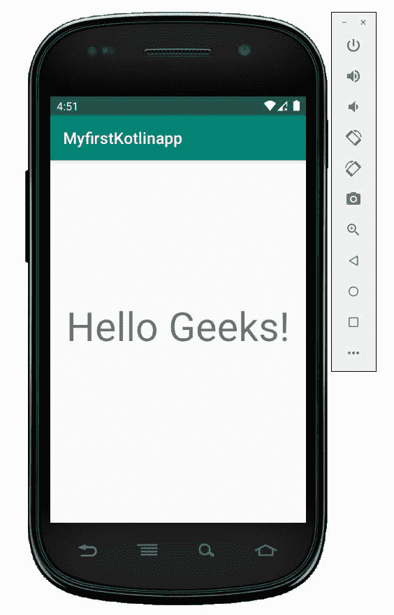

# 极客们好！科特林

中的 app

> 原文:[https://www.geeksforgeeks.org/hello-geeks-app-in-kotlin/](https://www.geeksforgeeks.org/hello-geeks-app-in-kotlin/)

我们可以使用 Kotlin 和 Java 构建一个安卓应用程序。在教程中，我们使用 Kotlin 语言来构建应用程序。[在之前的教程](https://www.geeksforgeeks.org/how-to-create-project-in-android-studio-using-kotlin/)中，我们学习了如何为 Kotlin 语言创建项目，但在这里，我们将学习如何使用 AVD (Android Virtual Device)运行应用程序。

我们在启动项目时会获得两个文件，它们是:

*   **`MainActivity.kt`**–这是 Kotlin 文件，用来用 Kotlin 语言编码。
*   **`activity_main.xml`**–这是 xml 文件，用于我们主要活动的布局。

## MainActivity.kt 文件

安卓应用程序中有大量的活动。对于每个活动，我们需要一个单独的 Kotlin 文件来编写代码。添加了所有功能，如*点击*、*点击*等。

**科特林代码–**

```
package com.geeksforgeeks.myfirstkotlinapp

import androidx.appcompat.app.AppCompatActivity
import android.os.Bundle

class MainActivity : AppCompatActivity() {

    override fun onCreate(savedInstanceState: Bundle?) {
        super.onCreate(savedInstanceState)
        setContentView(R.layout.activity_main)
    }
}
```

## activity_main.xml 文件

对于每个活动，都有单独的 xml 文件来指定我们活动的设计或布局。因此，有许多功能，如我们可以调整按钮顶部或底部，使文本加粗或斜体等。

**XML 代码–**

```
<?xml version="1.0" encoding="utf-8"?>
<androidx.constraintlayout.widget.ConstraintLayout
    xmlns:android="http://schemas.android.com/apk/res/android"
xmlns:app="http://schemas.android.com/apk/res-auto"
xmlns:tools="http://schemas.android.com/tools"
android:layout_width="match_parent"
android:layout_height="match_parent"
tools:context=".MainActivity">

<TextView
    android:layout_width="wrap_content"
    android:layout_height="wrap_content"
    android:text="Hello Geeks!"
    android:textSize="50dp"
    app:layout_constraintBottom_toBottomOf="parent"
    app:layout_constraintHorizontal_bias="0.496"
    app:layout_constraintLeft_toLeftOf="parent"
    app:layout_constraintRight_toRightOf="parent"
    app:layout_constraintTop_toTopOf="parent"
    app:layout_constraintVertical_bias="0.447" />

</androidx.constraintlayout.widget.ConstraintLayout>
```

## 作为模拟器运行

我们在 Kotlin 和 xml 文件中做了一些更改，然后可以使用模拟器运行我们的应用程序。好像是下图:-
