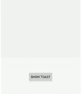

# 如何使用 Kotlin

在安卓中添加自定义风格的吐司

> 原文:[https://www . geeksforgeeks . org/how-add-a-custom-style-toast-in-Android-use-kot Lin/](https://www.geeksforgeeks.org/how-to-add-a-custom-styled-toast-in-android-using-kotlin/)

a[](https://www.geeksforgeeks.org/android-toast-in-kotlin/)**是短时间间隔内显示在[安卓](https://www.geeksforgeeks.org/introduction-to-android-development/)屏幕上的短提醒信息。安卓**吐司**是一个简短的弹出通知，用于我们在 app 中执行任何操作时显示信息。在本文中，让我们学习如何使用 Kotlin 在[安卓](https://www.geeksforgeeks.org/introduction-to-android-development/)中创建自定义吐司。**

****

> ****注意**:要使用 Java 在安卓系统中创建自定义风格的吐司，请参考[如何在安卓系统中添加自定义风格的吐司。](https://www.geeksforgeeks.org/how-to-add-a-custom-styled-toast-in-android/)**

### **属性表**

<figure class="table">

| 

属性

 | 

描述

 |
| --- | --- |
| layout info water | 将布局 XML 文件实例化到其对应的视图对象中 |
| 膨胀 | 从指定的 XML 资源展开新的视图层次结构。 |
| setGravity | 用于更改吐司的位置 |

</figure>

### ****接近****

****步骤 1:** **创建吐司布局****

**转到 **res - >布局(右键)- >新建- >布局资源文件- >创建(custom_toast_layout.xml)文件。**添加一个卡片视图来包含自定义的敬酒信息，同时添加一个[文本视图](https://www.geeksforgeeks.org/textview-in-kotlin/)来显示自定义敬酒信息中的文本。[框架布局](https://www.geeksforgeeks.org/android-framelayout-in-kotlin/)用于指定多个视图放置在彼此顶部的位置，以表示单个视图屏幕。**

## **可扩展标记语言**

```
<?xml version="1.0" encoding="utf-8"?>
<RelativeLayout
    xmlns:android="http://schemas.android.com/apk/res/android"
    xmlns:app="http://schemas.android.com/apk/res-auto"
    android:layout_width="match_parent"
    android:layout_height="match_parent"
    android:id="@+id/toast_container">

    <RelativeLayout
        android:id="@+id/button_parent"
        android:layout_width="match_parent"
        android:layout_height="60dp"
        android:layout_centerHorizontal="true"
        android:layout_centerVertical="true">

        <androidx.cardview.widget.CardView
            android:id="@+id/button_card_parent"
            android:layout_width="match_parent"
            android:layout_height="56dp"
            android:layout_centerHorizontal="true"
            android:layout_centerVertical="true"
            android:layout_marginLeft="25dp"
            app:cardElevation="20dp"
            android:layout_marginRight="25dp"
            app:cardCornerRadius="4dp">

            <RelativeLayout
                android:id="@+id/button_click_parent"
                android:layout_width="match_parent"
                android:layout_height="match_parent"
                android:background="?attr/selectableItemBackground"
                android:clickable="true"
                android:focusable="true">

                <FrameLayout
                    android:id="@+id/button_accent_border"
                    android:layout_width="4dp"
                    android:layout_height="match_parent"
                    android:background="#3EAA56" />

                <TextView
                    android:id="@+id/toast_text"
                    android:layout_width="wrap_content"
                    android:layout_height="wrap_content"
                    android:layout_centerVertical="true"
                    android:layout_marginStart="17dp"
                    android:ellipsize="end"
                    android:lines="1"
                    android:text="This is a custom Toast"
                    android:textColor="#131313"
                    android:textSize="18sp"
                    android:textStyle="bold" />

            </RelativeLayout>

        </androidx.cardview.widget.CardView>

    </RelativeLayout>

</RelativeLayout>
```

****第二步:** **新建** **柯特林文件****

**现在创建一个新的 Kotlin 文件，并将其命名为**wrapptoast . kt**，以使代码可重用。转到**项目包(右键)- >新建- > Kotlin 文件/类- >创建(WrapToast.kt)文件。**现在我们要用**【showcustomToast()】**扩展 **Toast::class** ，它将字符串和上下文作为参数。**

> ****注:****
> 
> *   **使用 layoutInflater 扩展之前创建的布局(custom_toast_layout.xml)。**
> *   **之后，虚增布局，找到它的视图。在这种情况下，设置消息的文本视图的文本。**
> *   **最后一步是创建一个关于 Toast::类的新实例。然后，使用其应用程序扩展功能设置重力、持续时间和布局。内敷，谓之 **显()** 法为好。**

## **我的锅**

```
import android.app.Activity
import android.view.Gravity
import android.widget.TextView
import android.widget.Toast

fun Toast.showCustomToast(message: String, activity: Activity)
{
    val layout = activity.layoutInflater.inflate (
        R.layout.custom_toast_layout,
        activity.findViewById(R.id.toast_container)
    )

    // set the text of the TextView of the message
    val textView = layout.findViewById<TextView>(R.id.toast_text)
    textView.text = message

    // use the application extension function
    this.apply {
        setGravity(Gravity.BOTTOM, 0, 40)
        duration = Toast.LENGTH_LONG
        view = layout
        show()
    }
}
```

****第 3 步:创建一个按钮来显示活动中的祝酒词****

**在约束布局中添加一个[按钮](https://www.geeksforgeeks.org/button-in-kotlin/)。因此，当用户点击按钮时，屏幕上会弹出定制的吐司。**

## **可扩展标记语言**

```
<?xml version="1.0" encoding="utf-8"?>
<androidx.constraintlayout.widget.ConstraintLayout
    xmlns:android="http://schemas.android.com/apk/res/android"
    xmlns:app="http://schemas.android.com/apk/res-auto"
    xmlns:tools="http://schemas.android.com/tools"
    android:layout_width="match_parent"
    android:layout_height="match_parent"
    tools:context=".MainActivity">

    <Button
        android:id="@+id/btn_show_toast"
        android:layout_width="100dp"
        android:layout_height="wrap_content"
        android:text="Show Toast"
        android:background="#3EAA56"
        android:textColor="#fff"
        app:layout_constraintBottom_toBottomOf="parent"
        app:layout_constraintLeft_toLeftOf="parent"
        app:layout_constraintRight_toRightOf="parent"
        app:layout_constraintTop_toTopOf="parent" />

</androidx.constraintlayout.widget.ConstraintLayout>
```

****第四步:制作吐司****

**之后，创建显示吐司的按钮，应用 **onClickListener()** ，并传递吐司消息和活动的上下文。**

## **我的锅**

```
import androidx.appcompat.app.AppCompatActivity
import android.os.Bundle
import android.widget.Toast
import kotlinx.android.synthetic.main.activity_main.*

class MainActivity : AppCompatActivity() {
    override fun onCreate(savedInstanceState: Bundle?) {
        super.onCreate(savedInstanceState)
        setContentView(R.layout.activity_main)

        // apply an onClickListener() method
        btn_show_toast.setOnClickListener{
            Toast(this).showCustomToast ("Hello! This is a custom Toast!", this)
        }
    }
}
```

### **输出:**

**<video class="wp-video-shortcode" id="video-453344-1" width="640" height="360" preload="metadata" controls=""><source type="video/mp4" src="https://media.geeksforgeeks.org/wp-content/uploads/20200713125009/custom_toast_in_kotlin.mp4?_=1">[https://media.geeksforgeeks.org/wp-content/uploads/20200713125009/custom_toast_in_kotlin.mp4](https://media.geeksforgeeks.org/wp-content/uploads/20200713125009/custom_toast_in_kotlin.mp4)</video>**

> ****注:****
> 
> **不再推荐自定义吐司视图。当在前台时，应用程序可以使用 makeText()函数来生成一个普通的文本吐司，或者它们可以创建一个 Snackbar。自定义吐司视图不会在拥有应用程序时显示，目标是应用编程接口级别的构建。版本代码#R 或以上在后台。目前，在以应用编程接口级构建为目标的应用程序中，使用 makeText()或其变体构建的祝酒词同样会返回空值。版本代码。除非他们用非空视图调用了 setView。**