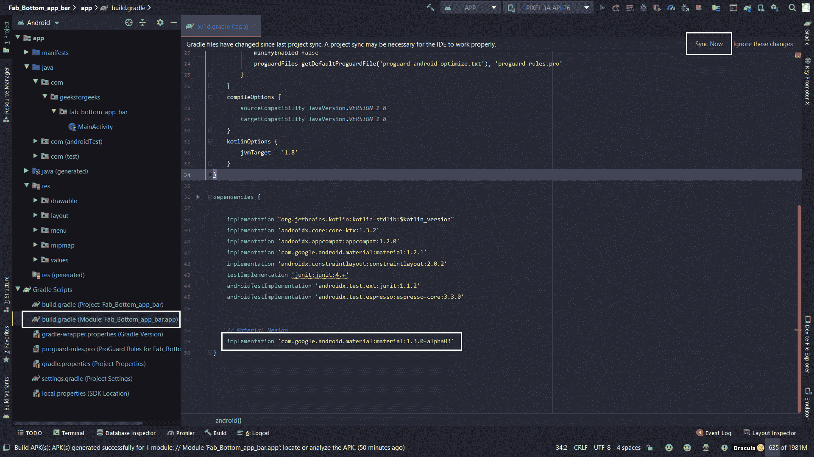

# 如何在安卓中底部导航栏添加浮动动作按钮？

> 原文:[https://www . geesforgeks . org/how-add-a-floating-action-button-to-bottom-导航栏-in-android/](https://www.geeksforgeeks.org/how-to-add-a-floating-action-button-to-bottom-navigation-bar-in-android/)

[浮动动作按钮](https://www.geeksforgeeks.org/floating-action-button-fab-in-android-with-example/) 与普通按钮有点不同。浮动操作按钮在应用程序的用户界面中实现，用于用户的主要操作(提升的操作)，浮动操作按钮下的操作由开发人员确定优先级。例如，向现有列表中添加一个项目到这样的操作。 [底部导航栏](https://www.geeksforgeeks.org/bottom-navigation-bar-in-android/)允许在应用程序的主要目的地之间移动。一些流行的例子包括 Instagram、WhatsApp 等 *。*在本文中，我们将学习如何在 android 中的底部导航栏中间添加一个浮动动作按钮(FAB)。下面给出一个示例图片，了解一下在这篇 文章中我们要做什么。 注意，我们要用 **Kotlin** 语言来实现这个项目。


### 逐步实施

**第一步:创建新项目**

要在安卓工作室创建新项目，请参考[如何在安卓工作室创建/启动新项目](https://www.geeksforgeeks.org/android-how-to-create-start-a-new-project-in-android-studio/)。注意选择**科特林**作为编程语言。

**第二步:向 build.gradle 文件添加依赖关系**

在 [build.gradle(app)](https://www.geeksforgeeks.org/android-build-gradle/) 中添加材料设计依赖项。

> 实现' com . Google . Android . material:material:1 . 3 . 0-alpha 03 '

添加材料设计依赖项后，点击**立即同步**。



**第三步:将应用的主题更改为材料组件**

以下是**样式**和T4 的代码。xml 文件。

## 可扩展标记语言

```
<resources>

    <!-- Base application theme. -->
    <style name="Theme.Fab_Bottom_app_bar" parent="Theme.MaterialComponents.DayNight.NoActionBar">
        <item name="colorPrimary">#0F9D58</item>
        <item name="colorPrimaryVariant">#0F9D58</item>
        <item name="colorOnPrimary">#000</item>
    </style>

</resources>
```