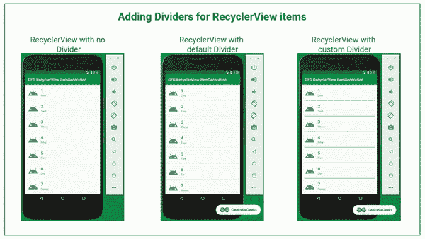
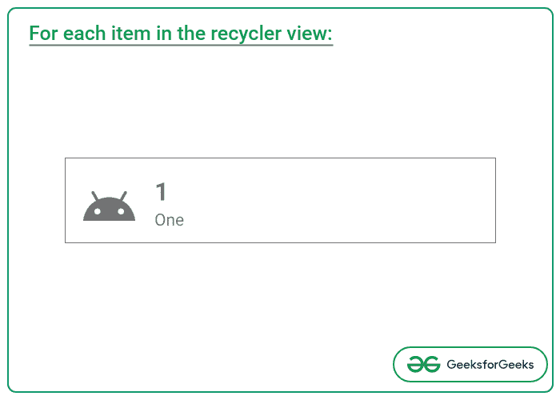

# 如何在安卓 RecyclerView 中添加分频器？

> 原文:[https://www . geeksforgeeks . org/如何在 android 中添加分频器-recycle view/](https://www.geeksforgeeks.org/how-to-add-dividers-in-android-recyclerview/)

在科特林的[安卓回收视图一文中，已经演示了如何在安卓中实现回收视图。但是在用户体验的情况下，项目需要用分隔线和每个项目中适当的填充和边距来区分。在这种情况下，回收视图项目装饰进入图片。因此，在这里已经演示了如何实际使用回收视图项目装饰以及在回收视图项目之间使用分隔器和自定义分隔器。请看下图，了解整个讨论的概况。](https://www.geeksforgeeks.org/android-recyclerview-in-kotlin/)



**创建一个空的活动项目**

要在安卓工作室创建新项目，请参考[如何在安卓工作室创建/启动新项目](https://www.geeksforgeeks.org/android-how-to-create-start-a-new-project-in-android-studio/)。

**添加必需的依赖关系**

在**build . grade le**文件中包含谷歌材料设计组件依赖关系。添加依赖项后，不要忘记点击右上角的“立即同步”按钮。

> 实现“androidx . recycle view:recycle view:1 . 2 . 1”

请注意，在同步项目时，您需要连接到网络，并确保您正在将依赖项添加到**应用程序级渐变**文件，如下所示。

### **在回收视图中实施项目装饰的步骤**

**第一步:使用 activity_main.xml 文件**

项目的主要布局包含一个用于演示目的的回收视图。要实现相同的功能，请在 activity_main.xml 文件中调用以下代码。

## 可扩展标记语言

```kt
<?xml version="1.0" encoding="utf-8"?>
<androidx.constraintlayout.widget.ConstraintLayout
    xmlns:android="http://schemas.android.com/apk/res/android"
    xmlns:tools="http://schemas.android.com/tools"
    android:layout_width="match_parent"
    android:layout_height="match_parent"
    tools:context=".MainActivity">

    <androidx.recyclerview.widget.RecyclerView
        android:id="@+id/recyclerView"
        android:layout_width="match_parent"
        android:layout_height="match_parent" />

</androidx.constraintlayout.widget.ConstraintLayout>
```

*在进入输出之前，我们需要用数据填充 RecyclerView。因此，我们现在需要使用回收视图适配器和回收视图的自定义视图。*

**步骤 2:为 recycle view**创建自定义视图

回收视图的自定义视图在左侧包含一个简单的图标和两个[文本视图](https://www.geeksforgeeks.org/textview-in-kotlin/)。为了实现相同的功能，在布局文件夹中创建一个名为 **recycler_data_view.xml** 的文件，并调用以下代码。

## 可扩展标记语言

```kt
<?xml version="1.0" encoding="utf-8"?>
<androidx.constraintlayout.widget.ConstraintLayout 
    xmlns:android="http://schemas.android.com/apk/res/android"
    xmlns:app="http://schemas.android.com/apk/res-auto"
    xmlns:tools="http://schemas.android.com/tools"
    android:layout_width="match_parent"
    android:layout_height="wrap_content"
    android:padding="16dp">

    <ImageView
        android:id="@+id/imageView"
        android:layout_width="54dp"
        android:layout_height="54dp"
        android:src="@drawable/ic_android"
        app:layout_constraintStart_toStartOf="parent"
        app:layout_constraintTop_toTopOf="parent" />

    <TextView
        android:id="@+id/tvNumber"
        android:layout_width="wrap_content"
        android:layout_height="wrap_content"
        android:layout_marginStart="16dp"
        android:textSize="24sp"
        android:textStyle="bold"
        app:layout_constraintBottom_toTopOf="@+id/tvNumbersInText"
        app:layout_constraintStart_toEndOf="@+id/imageView"
        app:layout_constraintTop_toTopOf="parent"
        tools:text="1" />

    <TextView
        android:id="@+id/tvNumbersInText"
        android:layout_width="wrap_content"
        android:layout_height="wrap_content"
        android:textSize="16sp"
        app:layout_constraintBottom_toBottomOf="parent"
        app:layout_constraintStart_toStartOf="@+id/tvNumber"
        app:layout_constraintTop_toBottomOf="@+id/tvNumber"
        tools:text="One" />

</androidx.constraintlayout.widget.ConstraintLayout>
```

**上述自定义视图为列表中的每个项目生成以下输出:**



**第 3 步:为 RecyclerView 创建数据类**

现在，通过使用以下代码创建一个数据类，为上述自定义视图创建数据。

## 我的锅

```kt
data class RecyclerViewData(
    val text1: String,
    val text2: String
)
```

**步骤 4:创建回收视图适配器**

下面的代码需要在一个单独的类中调用，方法是创建一个名为 MyRecyclerAdapter 的类。

## 我的锅

```kt
import android.view.LayoutInflater
import android.view.View
import android.view.ViewGroup
import android.widget.TextView
import androidx.recyclerview.widget.RecyclerView

class MyRecyclerViewAdapter(private val items: List<RecyclerViewData>) :
    RecyclerView.Adapter<MyRecyclerViewAdapter.MyRecyclerViewDataHolder>() {

    inner class MyRecyclerViewDataHolder(itemView: View) : RecyclerView.ViewHolder(itemView)

    override fun onCreateViewHolder(parent: ViewGroup, viewType: Int): MyRecyclerViewDataHolder {
        val view: View =
            LayoutInflater.from(parent.context).inflate(R.layout.recycler_data_view, parent, false)
        return MyRecyclerViewDataHolder(view)
    }

    override fun onBindViewHolder(holder: MyRecyclerViewDataHolder, position: Int) {
        val currentItem: RecyclerViewData = items[position]

        val tvNumber: TextView = holder.itemView.findViewById(R.id.tvNumber)
        tvNumber.text = currentItem.text1

        val tvNumbersInText: TextView = holder.itemView.findViewById(R.id.tvNumbersInText)
        tvNumbersInText.text = currentItem.text2
    }

    override fun getItemCount(): Int {
        return items.size
    }
}
```