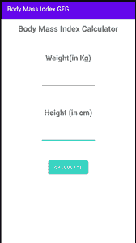

# 如何在安卓工作室搭建体重指数计算器？

> 原文:[https://www . geeksforgeeks . org/如何在安卓工作室构建体重指数计算器/](https://www.geeksforgeeks.org/how-to-build-a-body-mass-index-calculator-in-android-studio/)

体重指数(身体质量指数)计算器可用于根据身高和体重计算身体质量指数值。对于大多数人来说，身体质量指数是一个相当可靠的身体肥胖指标。

**公式:**

> 身体质量指数=(体重)/(身高*身高)

**趋近**:身体质量指数是根据个人的体重和身高计算出来的数字。为了找出身体质量指数，我们将从用户那里获取输入(身高和体重)，这些输入将存储在身高和体重变量中，以供进一步计算。计算过程很简单，我们简单地将重量(公斤)除以高度的平方。现在，根据身体质量指数的计算，它将执行相应的 if-else 语句。我们还在检查用户是否在没有输入输入的情况下按下了提交按钮，在这种情况下，我们将显示一条吐司消息，说“请输入有效的身高和体重”。在本文中，我们将使用**科特林**和 XML 在安卓工作室中构建体重指数计算器。

<video class="wp-video-shortcode" id="video-672759-1" width="640" height="360" preload="metadata" controls=""><source type="video/mp4" src="https://media.geeksforgeeks.org/wp-content/uploads/20210827203204/WhatsApp-Video-2021-08-27-at-8.26.35-PM.mp4?_=1">[https://media.geeksforgeeks.org/wp-content/uploads/20210827203204/WhatsApp-Video-2021-08-27-at-8.26.35-PM.mp4](https://media.geeksforgeeks.org/wp-content/uploads/20210827203204/WhatsApp-Video-2021-08-27-at-8.26.35-PM.mp4)</video>

### **分步实施**

**第一步:创建新项目**

要在安卓工作室创建新项目，请参考[如何在安卓工作室创建/启动新项目](https://www.geeksforgeeks.org/android-how-to-create-start-a-new-project-in-android-studio/)。注意选择**科特林**作为编程语言。

**步骤 2:使用构建.梯度(模块)文件**

你需要像这样在 app build.gradle 模块中应用插件 kotlin-android-extensions

> 插件{
> 
> id 'com.android.application '
> 
> kot Lin Android id
> 
> **id 'kotlin-android 扩展‘**
> 
> }

**步骤 3:使用 activity_main.xml 文件**

导航到**应用程序> res >布局> activity_main.xml** 并将下面的代码添加到该文件中。下面是 **activity_main.xml** 文件的代码。

## 可扩展标记语言

```kt
<?xml version="1.0" encoding="utf-8"?>
<androidx.appcompat.widget.LinearLayoutCompat 
    xmlns:android="http://schemas.android.com/apk/res/android"
    xmlns:app="http://schemas.android.com/apk/res-auto"
    xmlns:tools="http://schemas.android.com/tools"
    android:layout_width="match_parent"
    android:layout_height="match_parent"
    android:orientation="vertical"
    tools:context=".MainActivity">

    <TextView
        android:layout_width="wrap_content"
        android:layout_height="wrap_content"
        android:layout_gravity="center_horizontal"
        android:layout_marginTop="10dp"
        android:text="Body Mass Index Calculator"
        android:textSize="25sp"
        android:textStyle="bold" />

    <TextView
        android:layout_width="wrap_content"
        android:layout_height="wrap_content"
        android:layout_gravity="center_horizontal"
        android:layout_marginTop="50dp"
        android:text="Weight(in Kg)"
        android:textSize="20dp"
        android:textStyle="bold"
        app:layout_constraintBottom_toBottomOf="parent"
        app:layout_constraintLeft_toLeftOf="parent"
        app:layout_constraintRight_toRightOf="parent"
        app:layout_constraintTop_toTopOf="parent"
        app:layout_constraintVertical_bias="0.292" />

    <EditText
        android:id="@+id/etWeight"
        android:layout_width="150dp"
        android:layout_height="50dp"
        android:layout_gravity="center_horizontal"
        android:layout_marginTop="20dp" />

    <TextView
        android:layout_width="wrap_content"
        android:layout_height="wrap_content"
        android:layout_gravity="center_horizontal"
        android:layout_marginTop="50dp"
        android:text="Height (in cm)"
        android:textSize="20dp"
        android:textStyle="bold"
        app:layout_constraintBottom_toBottomOf="parent"
        app:layout_constraintLeft_toLeftOf="parent"
        app:layout_constraintRight_toRightOf="parent"
        app:layout_constraintTop_toTopOf="parent"
        app:layout_constraintVertical_bias="0.292" />

    <EditText
        android:id="@+id/etHeight"
        android:layout_width="150dp"
        android:layout_height="50dp"
        android:layout_gravity="center_horizontal"
        android:layout_marginTop="20dp"
        android:textSize="20dp" />

    <Button
        android:id="@+id/calculate_btn"
        android:layout_width="wrap_content"
        android:layout_height="wrap_content"
        android:layout_gravity="center_horizontal"
        android:layout_marginTop="40dp"
        android:backgroundTint="#2CD3BE"
        android:text="Calculate" />

    <TextView
        android:id="@+id/bmi_tv"
        android:layout_width="wrap_content"
        android:layout_height="wrap_content"
        android:layout_gravity="center_horizontal"
        android:layout_marginTop="20dp"
        android:text="The BMI is "
        android:textSize="20dp"
        android:visibility="gone" />

    <TextView
        android:id="@+id/bmi"
        android:layout_width="wrap_content"
        android:layout_height="wrap_content"
        android:layout_gravity="center_horizontal"
        android:layout_marginTop="20dp"
        android:text="BMI"
        android:textSize="20dp"
        android:visibility="gone" />

    <TextView
        android:id="@+id/status"
        android:layout_width="wrap_content"
        android:layout_height="wrap_content"
        android:layout_gravity="center_horizontal"
        android:layout_marginTop="20dp"
        android:text="Status"
        android:textSize="20dp"
        android:textStyle="bold"
        android:visibility="gone" />

    <Button
        android:id="@+id/ReCalculate"
        android:layout_width="wrap_content"
        android:layout_height="wrap_content"
        android:layout_gravity="center_horizontal"
        android:layout_marginTop="20dp"
        android:backgroundTint="#EAA268"
        android:text="Recalculate"
        android:visibility="gone" />

</androidx.appcompat.widget.LinearLayoutCompat>
```

写了这么多代码后，我们的用户界面如下所示:



**第 4 步:使用 MainActivity.kt 文件**

转到 **MainActivity.kt** 文件，参考以下代码。下面是 **MainActivity.kt** 文件的代码。代码中添加了注释，以更详细地理解代码。

## 我的锅

```kt
import android.os.Bundle
import android.view.View
import android.widget.Toast
import androidx.appcompat.app.AppCompatActivity
import kotlinx.android.synthetic.main.activity_main.*

class MainActivity : AppCompatActivity() {
    override fun onCreate(savedInstanceState: Bundle?) {
        super.onCreate(savedInstanceState)
        setContentView(R.layout.activity_main)

        calculate_btn.setOnClickListener {

            // Check if the height EditText and Weight EditText are not empty
            if (etHeight.text.isNotEmpty() && etWeight.text.isNotEmpty()) {
                val height = (etHeight.text.toString()).toInt()
                val weight = (etWeight.text.toString()).toInt()

                // calculateBMI will return BMI
                val BMI = calculateBMI(height, weight)

                bmi.text = BMI.toString()
                bmi.visibility = View.VISIBLE

                // update the status text as per the bmi conditions
                if (BMI < 18.5) {
                    status.text = "Under Weight"
                } else if (BMI >= 18.5 && BMI < 24.9) {
                    status.text = "Healthy"
                } else if (BMI >= 24.9 && BMI < 30) {
                    status.text = "Overweight"
                } else if (BMI >= 30) {
                    status.text = "Suffering from Obesity"
                }

                bmi_tv.visibility = View.VISIBLE
                status.visibility = View.VISIBLE

                ReCalculate.visibility = View.VISIBLE
                calculate_btn.visibility = View.GONE

            }

            // when either Weight EditText or 
            // height EditText have null value
            // we will display toast.
            else {
                Toast.makeText(this, "please enter the valid height and weight", Toast.LENGTH_SHORT).show()
            }
        }

        ReCalculate.setOnClickListener {
            ResetEverything()
        }

    }

    // Function to reset all Text and EditText fields.
    private fun ResetEverything() {

        calculate_btn.visibility = View.VISIBLE
        ReCalculate.visibility = View.GONE

        etHeight.text.clear()
        etWeight.text.clear()
        status.text = " "
        bmi.text = " "
        bmi_tv.visibility = View.GONE
    }

    // Function for calculating BMI
    private fun calculateBMI(height: Int, weight: Int): Float {

        val Height_in_metre = height.toFloat() / 100
        val BMI = weight.toFloat() / (Height_in_metre * Height_in_metre)

        return BMI
    }
}
```

**输出:**

<video class="wp-video-shortcode" id="video-672759-2" width="640" height="360" preload="metadata" controls=""><source type="video/mp4" src="https://media.geeksforgeeks.org/wp-content/uploads/20210827203204/WhatsApp-Video-2021-08-27-at-8.26.35-PM.mp4?_=2">[https://media.geeksforgeeks.org/wp-content/uploads/20210827203204/WhatsApp-Video-2021-08-27-at-8.26.35-PM.mp4](https://media.geeksforgeeks.org/wp-content/uploads/20210827203204/WhatsApp-Video-2021-08-27-at-8.26.35-PM.mp4)</video>