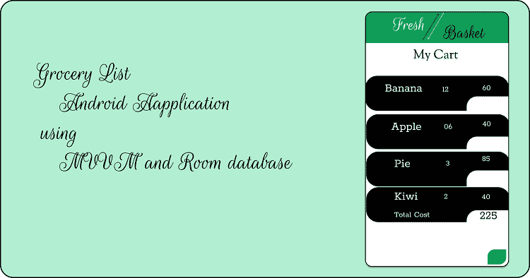
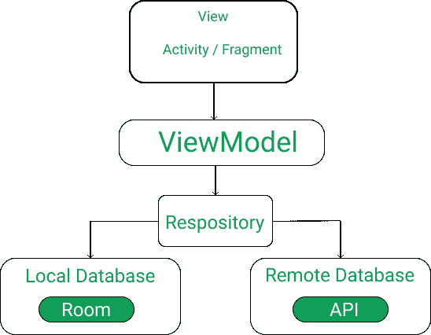

# 如何使用 MVVM 和房间数据库构建一个杂货安卓应用？

> 原文:[https://www . geesforgeks . org/how-to-build-a-杂货-Android-app-using-mvvm-and-room-database/](https://www.geeksforgeeks.org/how-to-build-a-grocery-android-app-using-mvvm-and-room-database/)

在本文中，我们将使用 android studio 在 android 中构建一个杂货应用程序。很多时候我们会忘记购买自己想买的东西，毕竟我们不可能记住所有的物品，所以借助这个 app，你可以记下你要购买的杂货物品，这样做你就不会忘记任何你想购买的物品。下面给出了一个示例图像，以了解本文中要做什么。请注意，我们将使用 **Kotlin** 语言来实现这个项目。



在这个项目中，我们使用 [MVVM(模型视图视图模型)](https://www.geeksforgeeks.org/introduction-to-model-view-view-model-mvvm/)作为建筑模式，**房间**作为数据库， [Coroutines](https://www.geeksforgeeks.org/kotlin-coroutines-on-android/) 和[recycle View](https://www.geeksforgeeks.org/android-recyclerview/)来显示项目列表。**在跳到项目之前，让我们先了解一下这些术语。**

### **MVVM(模型视图视图模型)**

android 中的 MVVM 架构被用来给项目的代码赋予结构，并且容易理解代码。MVVM 是安卓系统中的一种建筑设计模式。MVVM 将活动类和 XML 文件视为视图。这种设计模式将用户界面与其逻辑完全分离。下面是一个快速了解 MVVM 的图片。



看到这张图片后，如果你不明白它将如何工作，那么不要担心，因为我们将编写我们完全理解它的代码。

### **房间**数据库

房间持久性库是一个数据库管理库，用于存储应用程序的数据，如杂货项目名称、杂货项目数量和杂货项目价格。房间是 [SQLite](https://www.geeksforgeeks.org/introduction-to-sqlite/) 上的一个覆盖层，有助于轻松对数据库进行操作。

### **回收视图**

RecyclerView 是一个容器，用于显示大量数据集中的数据集合，通过维护有限数量的视图，可以非常有效地滚动这些数据。

### 协同程序

coroutine 是一个轻量级线程，我们使用 coroutine 在其他线程上执行操作，这样我们的主线程就不会阻塞，我们的应用程序也不会崩溃。

### **分步实施**

**第一步:创建新项目**

要在安卓工作室创建新项目，请参考[如何在安卓工作室创建/启动新项目](https://www.geeksforgeeks.org/android-how-to-create-start-a-new-project-in-android-studio/)。注意选择**科特林**作为编程语言。

**第二步:** **先去编码区之前，你要做一些前置任务**

在进入编码部分之前，首先将这些库添加到你的[渐变文件](https://www.geeksforgeeks.org/android-build-gradle/)中，并将插件作为“kotlin-kapt”应用。要添加这些库，请转到**梯度脚本>构建.梯度(模块:应用程序)。**

> def room_version = "2.2.1 "
> 
> def lifecycle_version = "2.0.0 "
> 
> //房间和建筑构件
> 
> 实现“androidx . room:room-runtime:$ room _ version”
> 
> 实现“androidx . legacy:legacy-support-v4:1 . 0 . 0”
> 
> 实现“androidx . life cycle:life cycle-extensions:2 . 1 . 0”
> 
> 实现' androidx . life cycle:life cycle-view model-ktx:2 . 1 . 0 '
> 
> 实现“androidx.room:room-ktx:2.2.1”
> 
> kapt“androidx . room:room-编译器:$room_version”
> 
> // Coroutines
> 
> 实现' org . jet brains . kot linx:kot linx-coroutines-core:1 . 3 . 0 '
> 
> 实现" org . jet brains . kot linx:kot linx-coroutines-Android:1 . 3 . 0 "
> 
> //新材料设计
> 
> 实现“com . Google . Android . material:material:1 . 0 . 0”
> 
> // ViewModel
> 
> 实现“androidx . life cycle:life cycle-extensions:$ life cycle _ version”
> 
> 实现“androidx . life cycle:life cycle-view model-ktx:$ life cycle _ version”
> 
> kapt“androidx . life cycle:life cycle-编译器:$lifecycle_version”

以下是 **build.gradle(:app)** 文件的完整代码。

## 我的锅

```kt
apply plugin: 'com.android.application'
apply plugin: 'kotlin-android'
apply plugin: 'kotlin-android-extensions'
apply plugin: 'kotlin-kapt'

android {
    compileSdkVersion 29
    buildToolsVersion "30.0.3"

    defaultConfig {
        applicationId "com.example.grocerylist"
        minSdkVersion 16
        targetSdkVersion 29
        versionCode 1
        versionName "1.0"

        testInstrumentationRunner "androidx.test.runner.AndroidJUnitRunner"
    }

    buildTypes {
        release {
            minifyEnabled false
            proguardFiles getDefaultProguardFile('proguard-android-optimize.txt'), 'proguard-rules.pro'
        }
    }
    compileOptions {
        sourceCompatibility = 1.8
        targetCompatibility = 1.8
    }
    kotlinOptions {
        jvmTarget = "1.8"
    }
}

dependencies {
    implementation fileTree(dir: 'libs', include: ['*.jar'])
    implementation "org.jetbrains.kotlin:kotlin-stdlib-jdk7:$kotlin_version"
    implementation 'androidx.appcompat:appcompat:1.0.2'
    implementation 'androidx.core:core-ktx:1.0.2'
    implementation 'androidx.constraintlayout:constraintlayout:1.1.3'
    testImplementation 'junit:junit:4.12'
    androidTestImplementation 'androidx.test.ext:junit:1.1.1'
    androidTestImplementation 'androidx.test.espresso:espresso-core:3.2.0'

    def room_version = "2.2.1"
    def lifecycle_version = "2.0.0"

    // Room and Architectural Components
    implementation "androidx.room:room-runtime:$room_version"
    implementation "androidx.legacy:legacy-support-v4:1.0.0"
    implementation 'androidx.lifecycle:lifecycle-extensions:2.1.0'
    implementation 'androidx.lifecycle:lifecycle-viewmodel-ktx:2.1.0'
    implementation "androidx.room:room-ktx:2.2.1"
    kapt "androidx.room:room-compiler:$room_version"

    // Coroutines
    implementation 'org.jetbrains.kotlinx:kotlinx-coroutines-core:1.3.0'
    implementation "org.jetbrains.kotlinx:kotlinx-coroutines-android:1.3.0"

    // New Material Design
    implementation "com.google.android.material:material:1.0.0"

    // ViewModel
    implementation "androidx.lifecycle:lifecycle-extensions:$lifecycle_version"
    implementation "androidx.lifecycle:lifecycle-viewmodel-ktx:$lifecycle_version"
    kapt "androidx.lifecycle:lifecycle-compiler:$lifecycle_version"

}
```

下面是 **strings.xml** 文件的代码。在这里，我们添加了将在项目中使用的必要字符串。

## 可扩展标记语言

```kt
<resources>
    <string name="app_name">Fresh Basket</string>

    <!-- TODO: Remove or change this placeholder text -->
    <string name="hello_blank_fragment">Hello blank fragment</string>
    <string name="itemName">Banana</string>
    <string name="itemQuantity">35</string>
    <string name="itemPrice">250Rs</string>
    <string name="totalCost">20</string>
    <string name="totalCostTitle">Total Cost</string>
    <string name="title">Add Items to your cart</string>
    <string name="etItem">Item</string>
    <string name="etQuantity">Quantity</string>
    <string name="etPrice">Price</string>
    <string name="save">Save</string>
    <string name="cancel">Cancel</string>

</resources>
```

下面是 **colors.xml** 文件的代码。在这里，我们添加了必要的颜色，我们将在我们的项目中使用。

## 可扩展标记语言

```kt
<?xml version="1.0" encoding="utf-8"?>
<resources>
    <color name="colorPrimary">#0AD042</color>
    <color name="colorPrimaryDark">#03551A</color>
    <color name="colorAccent">#03DAC5</color>
    <color name="black">#000000</color>
    <color name="white">#ffffff</color>
</resources>
```

**第三步:实现房间数据库**

**a)实体类**

entities 类包含数据库中的所有列，应该用@Entity(tablename =“表的名称”)进行注释。实体类是一个数据类。@Column info 注释用于输入列变量名和数据类型。我们还将添加主键用于自动增量。转到**app>Java>com . example . application-name。**右键单击**com . example . application-name**转到新建并创建 Kotlin 文件/类，并将该文件命名为 **GroceryEntities** 。看下面的代码来完全理解和实现。

## 我的锅

```kt
package com.example.grocerylist.Database.Entity

import androidx.room.ColumnInfo
import androidx.room.Entity
import androidx.room.PrimaryKey

// This is a data class which store data.
// Entities class create a table in database,
// in our database we will create three column

@Entity(tableName = "grocery_items")

data class GroceryItems(

    // create itemName variable to
    // store grocery items.
    @ColumnInfo(name = "itemName")
    var itemName: String,

    // create itemQuantity variable
    // to store grocery quantity.
    @ColumnInfo(name = "itemQuantity")
    var itemQuantity: Int,

    // create itemPrice variable to
    // store grocery price.
    @ColumnInfo(name = "itemPrice")
    var itemPrice: Int
) {
    // Primary key is a unique key
    // for different database.
    @PrimaryKey(autoGenerate = true)
    var id: Int? = null
}
```