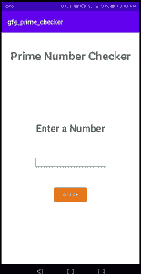

# 如何在安卓工作室搭建质数检查器安卓应用？

> 原文:[https://www . geesforgeks . org/如何构建质数检查器-Android-app-in-Android-studio/](https://www.geeksforgeeks.org/how-to-build-a-prime-number-checker-android-app-in-android-studio/)

质数是大于 1 的自然数，只能被 1 和自身整除。前几个质数是:2 3 5 7 11 13 17 19 23 ……在本文中，我们将使用 **Kotlin** 和 XML 在 android Studio 中构建一个质数检查器 Android 应用程序。该应用程序将检查输入的数字是否是质数，如果输入的单词是质数，则显示一条[吐司](https://www.geeksforgeeks.org/android-what-is-toast-and-how-to-use-it-with-examples/)，并显示信息“输入的数字是质数”，否则吐司的信息将是“输入的单词不是质数”。

<video class="wp-video-shortcode" id="video-681561-1" width="640" height="360" preload="metadata" controls=""><source type="video/mp4" src="https://media.geeksforgeeks.org/wp-content/uploads/20210911035743/WhatsApp-Video-2021-09-11-at-3.45.11-AM.mp4?_=1">[https://media.geeksforgeeks.org/wp-content/uploads/20210911035743/WhatsApp-Video-2021-09-11-at-3.45.11-AM.mp4](https://media.geeksforgeeks.org/wp-content/uploads/20210911035743/WhatsApp-Video-2021-09-11-at-3.45.11-AM.mp4)</video>

### **分步实施**

**第一步:创建新项目**

要在安卓工作室创建新项目，请参考[如何在安卓工作室创建/启动新项目](https://www.geeksforgeeks.org/android-how-to-create-start-a-new-project-in-android-studio/)。注意选择**科特林**作为编程语言。

**步骤 2:使用构建.梯度(模块)文件**

你需要像这样在 app build.gradle 模块中应用插件 kotlin-android-extensions

```kt
plugins {

   id 'com.android.application'

   id 'kotlin-android'

   id 'kotlin-android-extensions'

}
```

**步骤 3:使用 activity_main.xml 文件**

导航到**应用程序> res >布局> activity_main.xm** l，并将以下代码添加到该文件中。下面是 **activity_main.xm** l 文件的代码。

## 可扩展标记语言

```kt
<?xml version="1.0" encoding="utf-8"?>
<androidx.appcompat.widget.LinearLayoutCompat
    xmlns:android="http://schemas.android.com/apk/res/android"
    xmlns:app="http://schemas.android.com/apk/res-auto"
    xmlns:tools="http://schemas.android.com/tools"
    android:layout_width="match_parent"
    android:layout_height="match_parent"
    android:orientation="vertical"
    tools:context=".MainActivity">

    <TextView
        android:layout_width="wrap_content"
        android:layout_height="wrap_content"
        android:layout_gravity="center_horizontal"
        android:layout_marginTop="40dp"
        android:text="Prime Number Checker"
        android:textSize="35sp"
        android:textStyle="bold"
        app:layout_constraintBottom_toBottomOf="parent"
        app:layout_constraintLeft_toLeftOf="parent"
        app:layout_constraintRight_toRightOf="parent"
        app:layout_constraintTop_toTopOf="parent" />

    <TextView
        android:layout_width="wrap_content"
        android:layout_height="wrap_content"
        android:layout_gravity="center_horizontal"
        android:layout_marginTop="120dp"
        android:text="Enter a Number"
        android:textSize="30sp"
        android:textStyle="bold" />

    <EditText
        android:id="@+id/number_et"
        android:layout_width="190dp"
        android:layout_height="wrap_content"
        android:layout_gravity="center_horizontal"
        android:layout_marginTop="50dp" />

    <Button
        android:id="@+id/check_btn"
        android:layout_width="wrap_content"
        android:layout_height="wrap_content"
        android:layout_gravity="center_horizontal"
        android:layout_marginTop="40dp"
        android:backgroundTint="#E67212"
        android:text="Check"
        android:textColor="@color/white" />

</androidx.appcompat.widget.LinearLayoutCompat>
```

写了这么多代码后，我们的用户界面如下所示:



**第 4 步:使用 MainActivity.kt 文件**

转到 **MainActivity.kt** 文件，参考以下代码。下面是 **MainActivity.kt** 文件的代码。代码中添加了注释，以更详细地理解代码。

## 我的锅

```kt
import androidx.appcompat.app.AppCompatActivity
import android.os.Bundle
import android.widget.Toast
import androidx.core.text.isDigitsOnly
import kotlinx.android.synthetic.main.activity_main.*
import android.R.bool
import java.lang.Math.sqrt

class MainActivity : AppCompatActivity() {
    override fun onCreate(savedInstanceState: Bundle?) {
        super.onCreate(savedInstanceState)
        setContentView(R.layout.activity_main)

        // when user clicks on check button.
        check_btn.setOnClickListener {

            // check if number_et.text is empty or not
            if (number_et.text.isNotEmpty()) {

                // check if et.text is an integer or not.
                if (number_et.text.isDigitsOnly()) {
                    val num = number_et.text.toString().toInt()

                    // check if num is a prime number or not.
                    if (CheckPrime(num)) {
                        Toast.makeText(this, "Entered number is a Prime Number.", Toast.LENGTH_SHORT).show()
                    } else {
                        Toast.makeText(this, "Entered number is a not a Prime Number.", Toast.LENGTH_SHORT).show()
                    }
                }
                // when number_et.text is not an integer value.
                else {
                    Toast.makeText(this, "please enter a valid number.", Toast.LENGTH_SHORT).show()
                }
            }
            // when number_et.text is empty.
            else {
                Toast.makeText(this, "please enter a number", Toast.LENGTH_SHORT).show()
            }
        }
    }

    // function to check is a number is prime or not.
    private fun CheckPrime(num: Int): Boolean {
        // Corner case
        if (num <= 1) return false

        // Check from 2 to square root of n
        for (i in 2..sqrt(num.toDouble()).toInt()) if (num % i == 0) return false
        return true
    }

}
```

**输出:**

<video class="wp-video-shortcode" id="video-681561-2" width="640" height="360" preload="metadata" controls=""><source type="video/mp4" src="https://media.geeksforgeeks.org/wp-content/uploads/20210911035743/WhatsApp-Video-2021-09-11-at-3.45.11-AM.mp4?_=2">[https://media.geeksforgeeks.org/wp-content/uploads/20210911035743/WhatsApp-Video-2021-09-11-at-3.45.11-AM.mp4](https://media.geeksforgeeks.org/wp-content/uploads/20210911035743/WhatsApp-Video-2021-09-11-at-3.45.11-AM.mp4)</video>