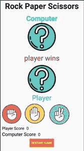

# 如何在安卓工作室搭建岩纸剪刀游戏？

> 原文:[https://www . geesforgeks . org/how-to-build-a-rock-paper-剪刀-game-in-android-studio/](https://www.geeksforgeeks.org/how-to-build-a-rock-paper-scissor-game-in-android-studio/)

石头纸剪刀(又称**石头纸剪刀**)是一种手游，在两个人之间进行，每个玩家同时形成三种形状中的一种。比赛的获胜者根据以下规则决定:

*   石头 vs 纸->纸赢。
*   岩石 vs 剪刀->岩石获胜。
*   纸 vs 剪刀->剪刀获胜。

在这个游戏中，用户将被要求做出选择，并根据用户和计算机的选择，然后结果将与计算机和用户的选择一起显示。在这篇文章中，我们将使用**科特林**和 **XML** 在安卓工作室构建石头纸剪刀游戏。

<video class="wp-video-shortcode" id="video-668060-1" width="640" height="360" preload="metadata" controls=""><source type="video/mp4" src="https://media.geeksforgeeks.org/wp-content/uploads/20210811195422/gfg_sps.mp4?_=1">[https://media.geeksforgeeks.org/wp-content/uploads/20210811195422/gfg_sps.mp4](https://media.geeksforgeeks.org/wp-content/uploads/20210811195422/gfg_sps.mp4)</video>

### **分步实施**

**第一步:创建新项目**

要在安卓工作室创建新项目，请参考[如何在安卓工作室创建/启动新项目](https://www.geeksforgeeks.org/android-how-to-create-start-a-new-project-in-android-studio/)。注意选择**科特林**作为编程语言。

**步骤 2:使用 activity_main.xml 文件**

导航到**应用程序> res >布局> activity_main.xml** 并将下面的代码添加到该文件中。下面是 **activity_main.xml** 文件的代码。

## 可扩展标记语言

```kt
<?xml version="1.0" encoding="utf-8"?>
<android.support.v7.widget.LinearLayoutCompat 
    xmlns:android="http://schemas.android.com/apk/res/android"
    xmlns:app="http://schemas.android.com/apk/res-auto"
    xmlns:tools="http://schemas.android.com/tools"
    android:layout_width="match_parent"
    android:layout_height="match_parent"
    android:orientation="vertical"
    tools:context=".MainActivity">

    <TextView
        android:layout_width="match_parent"
        android:layout_height="wrap_content"
        android:gravity="center_horizontal"
        android:text="Rock Paper Scissors"
        android:textColor="@color/black"
        android:textSize="34dp"
        android:textStyle="bold" />

    <TextView
        android:layout_width="match_parent"
        android:layout_height="wrap_content"
        android:gravity="center_horizontal"
        android:paddingTop="10dp"
        android:text="Computer"
        android:textColor="@color/teal_200"
        android:textSize="30dp"
        android:textStyle="bold" />

    <ImageView
        android:id="@+id/computer_move_img"
        android:layout_width="match_parent"
        android:layout_height="120dp"
        android:src="@drawable/question_mark" />

    <TextView
        android:id="@+id/winner_tv"
        android:layout_width="match_parent"
        android:layout_height="wrap_content"
        android:gravity="center_horizontal"
        android:paddingTop="10dp"
        android:paddingBottom="10dp"
        android:text=" "
        android:textColor="#F11010"
        android:textSize="30dp" />

    <ImageView
        android:id="@+id/user_move_img"
        android:layout_width="match_parent"
        android:layout_height="120dp"
        android:src="@drawable/question_mark" />

    <TextView
        android:layout_width="match_parent"
        android:layout_height="wrap_content"
        android:gravity="center_horizontal"
        android:text="Player"
        android:textColor="@color/teal_200"
        android:textSize="30dp" />

    <LinearLayout
        android:layout_width="match_parent"
        android:layout_height="wrap_content"
        android:orientation="horizontal">

        <ImageView
            android:id="@+id/rock_btn"
            android:layout_width="100dp"
            android:layout_height="100dp"
            android:src="@drawable/stone_icons" />

        <ImageView
            android:id="@+id/paper_btn"
            android:layout_width="100dp"
            android:layout_height="100dp"
            android:src="@drawable/paper_icon" />

        <ImageView
            android:id="@+id/scissors_btn"
            android:layout_width="100dp"
            android:layout_height="100dp"
            android:src="@drawable/scissors_icons" />

    </LinearLayout>

    <LinearLayout
        android:layout_width="match_parent"
        android:layout_height="wrap_content"
        android:orientation="horizontal">

        <TextView
            android:layout_width="wrap_content"
            android:layout_height="wrap_content"
            android:paddingLeft="10dp"
            android:text="Player Score"
            android:textColor="@color/black"
            android:textSize="20sp" />

        <TextView
            android:id="@+id/player_score"
            android:layout_width="wrap_content"
            android:layout_height="wrap_content"
            android:paddingLeft="10dp"
            android:text="0"
            android:textColor="@color/black"
            android:textSize="20sp" />

    </LinearLayout>

    <LinearLayout
        android:layout_width="match_parent"
        android:layout_height="wrap_content"
        android:orientation="horizontal">

        <TextView
            android:layout_width="wrap_content"
            android:layout_height="wrap_content"
            android:paddingLeft="10dp"
            android:text="Computer Score"
            android:textColor="@color/black"
            android:textSize="20dp" />

        <TextView
            android:id="@+id/computer_score"
            android:layout_width="wrap_content"
            android:layout_height="wrap_content"
            android:paddingLeft="10dp"
            android:text="0"
            android:textColor="@color/black"
            android:textSize="20sp" />

    </LinearLayout>

    <android.support.v7.widget.LinearLayoutCompat
        android:layout_width="match_parent"
        android:layout_height="wrap_content"
        android:orientation="vertical">

        <Button
            android:id="@+id/restart_btn"
            android:layout_width="wrap_content"
            android:layout_height="wrap_content"
            android:layout_gravity="center_horizontal"
            android:backgroundTint="#ED7716"
            android:text="Restart Game"
            android:textColor="@color/white" />

    </android.support.v7.widget.LinearLayoutCompat>

</android.support.v7.widget.LinearLayoutCompat>
```

写了这么多代码后，我们的用户界面如下所示:



**第三步:使用 MainActivity.kt 文件**

转到 **MainActivity.kt** 文件，参考以下代码。下面是 **MainActivity.kt** 文件的代码。代码中添加了注释，以更详细地理解代码。

## 我的锅

```kt
import android.support.v7.app.AppCompatActivity
import android.os.Bundle
import kotlinx.android.synthetic.main.activity_main.*
import kotlinx.android.synthetic.main.activity_main.view.*

class MainActivity : AppCompatActivity() {
    override fun onCreate(savedInstanceState: Bundle?) {
        super.onCreate(savedInstanceState)
        setContentView(R.layout.activity_main)

        restart_btn.setOnClickListener {
            clear_score()
        }

        // when player click on scissor icon.
        scissors_btn.setOnClickListener {

            // set the image of user move to scissors
            user_move_img.setImageDrawable(getResources().getDrawable(R.drawable.scissors));

            // choose a random number between 1 to 3.
            val computer_move = (1..4).random() // 4 is not included.

            // 1 denotes "Rock"
            // if value of computer move is 1 it means computer has chosen Rock

            // 2 denotes "Paper"
            // if value of computer move is 2 it means computer has chosen paper

            // 3 denotes "Scissors"
            // if value of computer move is 1 it means computer has chosen Scissors

            if (computer_move == 1) {
                // set the image of computer move to rock
                computer_move_img.setImageDrawable(getResources().getDrawable(R.drawable.rock));

                // rock beats scissors.
                winner_tv.text = "Computer has won"

                // increase the computer score
                val cscore: Int = computer_score.text.toString().toInt() + 1
                computer_score.text = cscore.toString()
            } else if (computer_move == 2) {

                // set the image of computer move to paper
                computer_move_img.setImageDrawable(getResources().getDrawable(R.drawable.paper));

                // scissors beats paper
                winner_tv.text = "Player has won"

                // increase the player score
                val pscore: Int = player_score.text.toString().toInt() + 1
                player_score.text = pscore.toString()
            } else {

                // set the image of computer move to scissors
                computer_move_img.setImageDrawable(getResources().getDrawable(R.drawable.scissors));

                // both user move and computer move are "scissors"
                winner_tv.text = "Draw"
            }

        }

        // when player clicks on  paper icon
        paper_btn.setOnClickListener {

            // set the image of player move to paper
            user_move_img.setImageDrawable(getResources().getDrawable(R.drawable.paper));

            val computer_move = (1..4).random()

             // 1 denotes "Rock"
            // if value of computer move is 1 it means computer has chosen Rock

            // 2 denotes "Paper"
            // if value of computer move is 2 it means computer has chosen paper

            // 3 denotes "Scissors"
            // if value of computer move is 1 it means computer has chosen Scissors

            if (computer_move == 1) {

                // set the image of computer move to rock
                computer_move_img.setImageDrawable(getResources().getDrawable(R.drawable.rock));

                // paper beats rock
                winner_tv.text = "Player has won"

                // increase count of player score
                val pscore: Int = player_score.text.toString().toInt() + 1
                player_score.text = pscore.toString()
            }
            else if (computer_move == 2) {

                // set the image of computer move to paper
                computer_move_img.setImageDrawable(getResources().getDrawable(R.drawable.paper));

                // both user move and computer move are "paper"
                winner_tv.text = "Draw"
            } else {

                // set the image of computer move to scissors

                computer_move_img.setImageDrawable(getResources().getDrawable(R.drawable.scissors));
                // scissors beats paper
                winner_tv.text = "Computer has won"

                // increase the computer score
                val cscore: Int = computer_score.text.toString().toInt() + 1
                computer_score.text = cscore.toString()
            }

        }

        // when player click on rock icon.
        rock_btn.setOnClickListener {

            // set the image of user move to rock
            user_move_img.setImageDrawable(getResources().getDrawable(R.drawable.rock));

            val computer_move = (1..4).random()

            // 1 denotes "Rock"
            // if value of computer move is 1 it means computer has chosen Rock

            // 2 denotes "Paper"
            // if value of computer move is 2 it means computer has chosen paper

            // 3 denotes "Scissors"
            // if value of computer move is 1 it means computer has chosen Scissors

            if (computer_move == 1) {
                // set the image of computer move to rock
                computer_move_img.setImageDrawable(getResources().getDrawable(R.drawable.rock));

                // both user  and computer moves are rock
                winner_tv.text = "Draw"

            } else if (computer_move == 2) {

                // set the image of computer move to paper
                computer_move_img.setImageDrawable(getResources().getDrawable(R.drawable.paper));

                // paper beats rock
                winner_tv.text = "Computer has won"

                // increase the computer score
                val cscore: Int = computer_score.text.toString().toInt() + 1
                computer_score.text = cscore.toString()

            } else {
                // set the image of computer move to scissors
                computer_move_img.setImageDrawable(getResources().getDrawable(R.drawable.scissors));

                // rock beats scissors
                winner_tv.text = "Player has won"

                // increase the count of plyer
                val pscore: Int = player_score.text.toString().toInt() + 1
                player_score.text = pscore.toString()
            }
        }
    }

    private fun clear_score() {

        // set the computer and player score to 0
        computer_score.text = "0"
        player_score.text = "0"

        winner_tv.text = ""

        // set the images of computer move and user move to "Question mark image".
        user_move_img.setImageDrawable(getResources().getDrawable(R.drawable.question_mark));
        computer_move_img.setImageDrawable(getResources().getDrawable(R.drawable.question_mark));

    }

}
```

**输出:**现在运行你的应用，看看应用的输出。

<video class="wp-video-shortcode" id="video-668060-2" width="640" height="360" preload="metadata" controls=""><source type="video/mp4" src="https://media.geeksforgeeks.org/wp-content/uploads/20210811195422/gfg_sps.mp4?_=2">[https://media.geeksforgeeks.org/wp-content/uploads/20210811195422/gfg_sps.mp4](https://media.geeksforgeeks.org/wp-content/uploads/20210811195422/gfg_sps.mp4)</video>

从这里[获取完整的项目。](https://media.geeksforgeeks.org/wp-content/cdn-uploads/20210821143035/GFG-Rock-Paper-Scissors-App-master.zip)