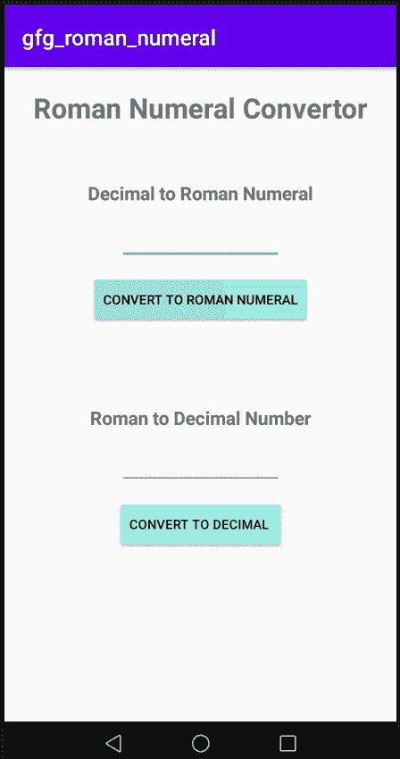

# 如何在安卓工作室搭建罗马数字转换器？

> 原文:[https://www . geesforgeks . org/如何在安卓工作室中构建罗马数字转换器/](https://www.geeksforgeeks.org/how-to-build-a-roman-numeral-convertor-in-android-studio/)

罗马数字转换器是一个应用程序，通过它我们可以在 1 到 3999 的范围内将十进制数字转换成相应的罗马数字，或者将罗马数字转换成相应的十进制数字。用户将输入一个十进制数，点击转换为罗马数字按钮，输入的数字将转换为相应的罗马数字，如果用户输入一个罗马数字，点击转换为十进制数，输入的数字将转换为相应的十进制数。在本文中，我们将在 Android Studio 中使用 **Kotlin** 和 XML 成为罗马数字转换器。

<video class="wp-video-shortcode" id="video-675507-1" width="640" height="360" preload="metadata" controls=""><source type="video/mp4" src="https://media.geeksforgeeks.org/wp-content/uploads/20210905180821/WhatsApp-Video-2021-09-05-at-6.06.56-PM.mp4?_=1">[https://media.geeksforgeeks.org/wp-content/uploads/20210905180821/WhatsApp-Video-2021-09-05-at-6.06.56-PM.mp4](https://media.geeksforgeeks.org/wp-content/uploads/20210905180821/WhatsApp-Video-2021-09-05-at-6.06.56-PM.mp4)</video>

**先决条件:**

*   [将 1 到 3999 之间的十进制数转换为罗马数字](https://www.geeksforgeeks.org/converting-decimal-number-lying-between-1-to-3999-to-roman-numerals/)
*   [将罗马数字转换为 1 到 3999 之间的十进制数](https://www.geeksforgeeks.org/converting-roman-numerals-decimal-lying-1-3999/)

## 逐步实施

**第一步:创建新项目**

要在安卓工作室创建新项目，请参考[如何在安卓工作室创建/启动新项目](https://www.geeksforgeeks.org/android-how-to-create-start-a-new-project-in-android-studio/)。注意选择**科特林**作为编程语言。

**步骤 2:使用构建.梯度(模块)文件**

你需要像这样在 app build.gradle 模块中应用插件 kotlin-android-extensions

```kt
plugins {

   id 'com.android.application'

   id 'kotlin-android'

   id 'kotlin-android-extensions'

}
```

**步骤 3:使用 activity_main.xml 文件**

导航到**应用程序> res >布局> activity_main.xml** 并将下面的代码添加到该文件中。下面是 **activity_main.xm** l 文件的代码。

## 可扩展标记语言

```kt
<?xml version="1.0" encoding="utf-8"?>
<LinearLayout 
    xmlns:android="http://schemas.android.com/apk/res/android"
    xmlns:app="http://schemas.android.com/apk/res-auto"
    xmlns:tools="http://schemas.android.com/tools"
    android:layout_width="match_parent"
    android:layout_height="match_parent"
    android:orientation="vertical"
    tools:context=".MainActivity">

    <TextView
        android:layout_width="wrap_content"
        android:layout_height="wrap_content"
        android:layout_gravity="center_horizontal"
        android:layout_marginTop="20dp"
        android:text="Roman Numeral Convertor"
        android:textSize="30sp"
        android:textStyle="bold"
        app:layout_constraintBottom_toBottomOf="parent"
        app:layout_constraintLeft_toLeftOf="parent"
        app:layout_constraintRight_toRightOf="parent"
        app:layout_constraintTop_toTopOf="parent" />

    <TextView
        android:layout_width="wrap_content"
        android:layout_height="wrap_content"
        android:layout_gravity="center_horizontal"
        android:layout_marginTop="50dp"
        android:text="Decimal to Roman Numeral"
        android:textSize="20sp"
        android:textStyle="bold" />

    <EditText
        android:id="@+id/decimal_et"
        android:layout_width="150dp"
        android:layout_height="wrap_content"
        android:layout_gravity="center_horizontal"
        android:layout_marginTop="10dp"/>

    <Button
        android:id="@+id/convert_to_roman_numeral"
        android:layout_width="wrap_content"
        android:layout_height="wrap_content"
        android:layout_gravity="center_horizontal"
        android:layout_marginTop="10dp"
        android:backgroundTint="#A1F6EE"
        android:text="Convert to roman numeral" />

    <TextView
        android:id="@+id/roman_numeral_tv"
        android:layout_width="wrap_content"
        android:layout_height="wrap_content"
        android:layout_gravity="center_horizontal"
        android:textSize="20sp" />

    <TextView
        android:layout_width="wrap_content"
        android:layout_height="wrap_content"
        android:layout_gravity="center_horizontal"
        android:layout_marginTop="50dp"
        android:text="Roman to Decimal Number"
        android:textSize="20sp"
        android:textStyle="bold" />

    <EditText
        android:id="@+id/roman_et"
        android:layout_width="150dp"
        android:layout_height="wrap_content"
        android:layout_gravity="center_horizontal"
        android:layout_marginTop="10dp"
        android:capitalize="characters" />

    <Button
        android:id="@+id/convert_to_decimal"
        android:layout_width="wrap_content"
        android:layout_height="wrap_content"
        android:layout_gravity="center_horizontal"
        android:layout_marginTop="10dp"
        android:backgroundTint="#A1F6EE"
        android:text="Convert to decimal " />

    <TextView
        android:id="@+id/decimal_tv"
        android:layout_width="wrap_content"
        android:layout_height="wrap_content"
        android:layout_gravity="center_horizontal"
        android:textSize="20sp" />

</LinearLayout>
```

写了这么多代码后，我们的用户界面如下所示:



**第 4 步:使用 MainActivity.kt 文件**

转到 **MainActivity.kt** 文件，参考以下代码。下面是 **MainActivity.kt** 文件的代码。代码中添加了注释，以更详细地理解代码。

## 我的锅

```kt
import android.support.v7.app.AppCompatActivity
import android.os.Bundle
import android.widget.Toast
import kotlinx.android.synthetic.main.activity_main.*

class MainActivity : AppCompatActivity() {
    override fun onCreate(savedInstanceState: Bundle?) {
        super.onCreate(savedInstanceState)
        setContentView(R.layout.activity_main)

        // Decimal to Roman convertor
        convert_to_roman_numeral.setOnClickListener {

            // check if decimal_et.text is empty or not.
            if (decimal_et.text.isNotEmpty()) {

                val number = decimal_et.text.toString().toInt()

                if (number <= 3999) {
                    // int_to_Roman function convert a decimal
                    // number to its corresponding Roman number.
                    val roman = decimal_to_Roman(number)

                    roman_numeral_tv.text = roman.toString()

                } else {
                    Toast.makeText(this, "please enter a number in range between 1 to 3999",Toast.LENGTH_SHORT).show()
                }
            } else {
                Toast.makeText(this, "please enter a number ", Toast.LENGTH_SHORT).show()
            }

        }

        // Roman to Decimal convertor.
        convert_to_decimal.setOnClickListener {
            // check if roman_et.text is empty or not.
            if (roman_et.text.isNotEmpty()) {
                val roman = roman_et.text.toString()
                // RomanToDecimal function convert a Roman number
                // to its corresponding decimal number.
                decimal_tv.text = RomanToDecimal(roman).toString()
            } else {
                Toast.makeText(this, "please enter a Roman Numeral ", Toast.LENGTH_SHORT).show()
            }
        }
    }

    private fun decimal_to_Roman(num: Int): Any {

        val m = arrayOf("", "M", "MM", "MMM")
        val c = arrayOf(
            "", "C", "CC", "CCC", "CD", "D",
            "DC", "DCC", "DCCC", "CM"
        )
        val x = arrayOf(
            "", "X", "XX", "XXX", "XL", "L",
            "LX", "LXX", "LXXX", "XC"
        )
        val i = arrayOf(
            "", "I", "II", "III", "IV", "V",
            "VI", "VII", "VIII", "IX"
        )

        // Converting to roman
        val thousands = m[num / 1000]
        val hundereds = c[num % 1000 / 100]
        val tens = x[num % 100 / 10]
        val ones = i[num % 10]

        return thousands + hundereds + tens + ones
    }

    fun value(r: Char): Int {
        if (r == 'I') return 1
        if (r == 'V') return 5
        if (r == 'X') return 10
        if (r == 'L') return 50
        if (r == 'C') return 100
        if (r == 'D') return 500
        return if (r == 'M') 1000 else -1
    }

    // Finds decimal value of a
    // given romal numeral
    fun RomanToDecimal(str: String): Int {
        // Initialize result
        var res = 0
        var i = 0
        while (i < str.length) {

            // Getting value of symbol s[i]
            val s1 = value(str[i])

            // Getting value of symbol s[i+1]
            if (i + 1 < str.length) {
                val s2 = value(str[i + 1])

                // Comparing both values
                if (s1 >= s2) {
                    // Value of current symbol
                    // is greater or equalto
                    // the next symbol
                    res = res + s1
                } else {
                    // Value of current symbol is
                    // less than the next symbol
                    res = res + s2 - s1
                    i++
                }
            } else {
                res = res + s1
            }
            i++
        }
        return res
    }
}
```

**输出:**

<video class="wp-video-shortcode" id="video-675507-2" width="640" height="360" preload="metadata" controls=""><source type="video/mp4" src="https://media.geeksforgeeks.org/wp-content/uploads/20210905180821/WhatsApp-Video-2021-09-05-at-6.06.56-PM.mp4?_=2">[https://media.geeksforgeeks.org/wp-content/uploads/20210905180821/WhatsApp-Video-2021-09-05-at-6.06.56-PM.mp4](https://media.geeksforgeeks.org/wp-content/uploads/20210905180821/WhatsApp-Video-2021-09-05-at-6.06.56-PM.mp4)</video>