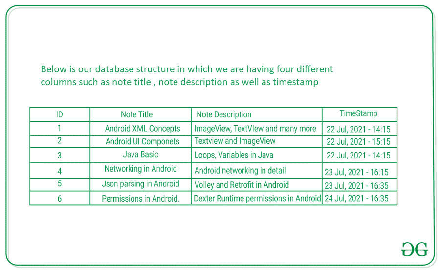

# 如何用 MVVM 和房间数据库搭建简易笔记安卓应用？

> 原文:[https://www . geesforgeks . org/如何构建一个简单的笔记安卓应用使用 mvvm 和房间数据库/](https://www.geeksforgeeks.org/how-to-build-a-simple-note-android-app-using-mvvm-and-room-database/)

安卓为我们提供了一个功能，我们可以通过不同的存储选项将用户的数据存储在自己的手机中，例如[共享首选项](https://www.geeksforgeeks.org/shared-preferences-in-android-with-examples/)、 [SQLite 数据库](https://www.geeksforgeeks.org/how-to-create-and-add-data-to-sqlite-database-in-android/)和[房间数据库](https://www.geeksforgeeks.org/how-to-perform-crud-operations-in-room-database-in-android/)。所有的数据存储技术都有不同的用例。在本文中，我们将专门研究如何在安卓系统中使用带有架构组件的房间数据库。在本文中，我们将特别关注诸如实时数据、视图模型和房间等组件。我们可以看到每个组件的详细解释。下面是它的指南。


下面列出了我们将在应用程序中使用的组件，并给出了详细的解释:

*   [LiveData](https://www.geeksforgeeks.org/livedata-in-android-architecture-components/) : Live Data 是一个可以观察到的数据持有者类。它保存并缓存数据的最新版本，并在数据更新或更改时通知我们的观察者。实时数据自动管理所有这些，因为它在观察的同时知道相关的生命周期状态变化。
*   [视图模型](https://www.geeksforgeeks.org/viewmodel-in-android-architecture-components/):视图模型充当存储库和用户界面之间的通信中心。用户界面不再需要担心数据的来源。视图模型实例在活动/片段重新创建后仍然存在。
*   **Repository** : Repository 是一个主要用于管理多个数据源的类。
*   **Entity** : Entity 是一个带注释的类，在我们使用 Room 的时候用来描述一个数据库表。
*   **房间数据库**:房间数据库是 SQLite 数据库的简易版。它简化了数据库工作，并作为底层 SQLite 数据库的访问点。房间使用 DAO 向 SQLite 数据库发出查询。
*   [DAO](https://www.geeksforgeeks.org/data-access-object-pattern/) : DAO 是一个**数据访问对象**，用于将 SQL 查询映射到函数。

### **本文我们要构建什么？**

我们将构建一个简单的笔记应用程序，其中我们将在用户添加的回收视图中显示笔记列表。除此之外，我们还可以在您的应用程序中添加新的注释。我们将使用房间数据库来存储用户设备中的数据。下面是视频，我们将在其中看到我们将在本文中构建的内容。注意，我们将使用 **Kotlin** 语言来实现这个项目。

<video class="wp-video-shortcode" id="video-650715-1" width="640" height="360" preload="metadata" controls=""><source type="video/mp4" src="https://media.geeksforgeeks.org/wp-content/uploads/20210722160210/20210722_155841.mp4?_=1">[https://media.geeksforgeeks.org/wp-content/uploads/20210722160210/20210722_155841.mp4](https://media.geeksforgeeks.org/wp-content/uploads/20210722160210/20210722_155841.mp4)</video>

### **分步实施**

**第一步:创建新项目**

要在安卓工作室创建新项目，请参考[如何在安卓工作室创建/启动新项目](https://www.geeksforgeeks.org/android-how-to-create-start-a-new-project-in-android-studio/)。注意选择**科特林**作为编程语言。

**步骤 2:更新 build.gradle(项目)文件。**

导航到**应用程序>渐变脚本> build.gradle(:project)** 级别文件，在该文件中，我们必须在该文件中添加以下代码，这些代码将用于我们的依赖版本。所以我们必须在这个文件的最后添加下面的代码块。

```kt
ext {
    activityVersion = '1.2.3'
    appCompatVersion = '1.3.0'
    constraintLayoutVersion = '2.0.4'
    coreTestingVersion = '2.1.0'
    coroutines = '1.5.0'
    lifecycleVersion = '2.3.1'
    materialVersion = '1.3.0'
    roomVersion = '2.3.0'
    // testing
    junitVersion = '4.13.2'
    espressoVersion = '3.1.0'
    androidxJunitVersion = '1.1.2'
}  
```

**第三步:更新你的 build.gradle (:app)文件**

导航到**应用程序> build.gradle** ，在里面，在第一个插件部分，我们必须添加一个插件的 id。下面是我们 build.gradle 中所有插件的代码。

```kt
plugins {
    id 'com.android.application'
    id 'kotlin-android'
    // add below plugin
    id 'kotlin-kapt'
}
```

现在在同一文件的安卓部分，我们必须在安卓部分的最后一部分添加下面的块。下面是该块的代码。

```kt
packagingOptions {
    exclude 'META-INF/atomicfu.kotlin_module'
}
```

现在在 build.gradle 文件中添加以下依赖项。我们只需用下面的更新依赖部分。

```kt
dependencies {
    implementation "androidx.appcompat:appcompat:$rootProject.appCompatVersion"
    implementation "androidx.activity:activity-ktx:$rootProject.activityVersion"

    // Dependencies for working with Architecture components
    // You'll probably have to update the version numbers in build.gradle (Project)

    // Room components
    implementation "androidx.room:room-ktx:$rootProject.roomVersion"
    kapt "androidx.room:room-compiler:$rootProject.roomVersion"
    androidTestImplementation "androidx.room:room-testing:$rootProject.roomVersion"

    // Lifecycle components
    implementation "androidx.lifecycle:lifecycle-viewmodel-ktx:$rootProject.lifecycleVersion"
    implementation "androidx.lifecycle:lifecycle-livedata-ktx:$rootProject.lifecycleVersion"
    implementation "androidx.lifecycle:lifecycle-common-java8:$rootProject.lifecycleVersion"

    // Kotlin components
    implementation "org.jetbrains.kotlin:kotlin-stdlib-jdk7:$kotlin_version"
    api "org.jetbrains.kotlinx:kotlinx-coroutines-core:$rootProject.coroutines"
    api "org.jetbrains.kotlinx:kotlinx-coroutines-android:$rootProject.coroutines"

    // UI
    implementation "androidx.constraintlayout:constraintlayout:$rootProject.constraintLayoutVersion"
    implementation "com.google.android.material:material:$rootProject.materialVersion"

    // Testing
    testImplementation "junit:junit:$rootProject.junitVersion"
    androidTestImplementation "androidx.arch.core:core-testing:$rootProject.coreTestingVersion"
    androidTestImplementation ("androidx.test.espresso:espresso-core:$rootProject.espressoVersion", {
        exclude group: 'com.android.support', module: 'support-annotations'
    })
    androidTestImplementation "androidx.test.ext:junit:$rootProject.androidxJunitVersion"
}
```

更新完你的文件后。现在我们必须同步您的项目，然后我们必须通过单击右上角的立即同步选项来安装应用程序中的所有依赖项。在我们的应用程序中安装了所有的依赖项之后，我们现在将为我们的应用程序创建一个实体。

**第四步:在 colors.xml 文件**中添加新的颜色

导航到**应用程序>RES>values>colors . XML**并在下面添加颜色。

## 可扩展标记语言

```kt
<?xml version="1.0" encoding="utf-8"?>
<resources>
    <color name="purple_200">#296D98</color>
    <color name="purple_500">#296D98</color>
    <color name="purple_700">#296D98</color>
    <color name="teal_200">#FF03DAC5</color>
    <color name="teal_700">#FF018786</color>
    <color name="black">#FF000000</color>
    <color name="white">#FFFFFFFF</color>

    <color name="black_shade_1">#0e2433</color>
    <color name="black_shade_2">#1C4966</color>
    <color name="black_shade_3">#22252D</color>
    <color name="gray">#424242</color>
    <color name="yellow">#ffa500</color>
    <color name="dark_blue_shade">#0D2162</color>
    <color name="dark_blue_shade_2">#17388E</color>
    <color name="light_blue_shade">#12B2E6</color>

</resources>
```

**步骤 5:创建实体**

实体基本上是一个模态类或我们的数据库结构，我们将在其中创建一个数据库结构。在我们的应用程序中，我们将有一个简单的表格，只有两列，如标识和文本。ID 将用于条目的标识，文本是用于文本列标识的列。下面是我们数据库的表结构。下面是数据库的图片。



为了创建一个新的实体，我们必须创建一个新的 Kotlin 类。为了创建这个，我们只需要导航到你的应用程序的包名。右键单击然后新建，选择 Kotlin 文件/类，然后指定类名为**注意**，并添加下面的代码。代码中添加了注释，以便更详细地了解。

## 我的锅

```kt
package com.gtappdevelopers.noteapplication

import androidx.room.ColumnInfo
import androidx.room.Entity
import androidx.room.PrimaryKey

// on below line we are specifying our table name
@Entity(tableName = "notesTable")

// on below line we are specifying our column infor
// and inside that we are passing our column name
class Note (@ColumnInfo(name = "title")val noteTitle :String,@ColumnInfo(name = "description")val noteDescription :String,@ColumnInfo(name = "timestamp")val timeStamp :String) {
    // on below line we are specifying our key and
    // then auto generate as true and we are
    // specifying its initial value as 0
    @PrimaryKey(autoGenerate = true) var id = 0
}
```

**第六步:创建 DAO 类**

DAO 是一个数据访问对象，用于指定 SQL 查询，然后将它们与不同的方法调用相关联。DAO 可以是抽象类，也可以是接口。在 DAO 类内部，我们必须创建不同的方法，比如插入、删除数据，以及从数据库中读取数据。因此，这个类将基本上与我们的数据库交互，以添加或删除数据库中的数据。

为了创建一个 DAO 接口，我们只需要导航到应用程序的包名，右键单击它>新建 Kotlin 文件，我们必须选择作为接口，并将其命名为**注意到**，我们必须创建这个文件。创建这个文件后，我们必须添加下面的代码。

## 我的锅

```kt
package com.gtappdevelopers.noteapplication

import androidx.lifecycle.LiveData
import androidx.room.*

// annotation for dao class.
@Dao
interface NotesDao {

    // below is the insert method for
    // adding a new entry to our database.
    @Insert(onConflict = OnConflictStrategy.IGNORE)
    suspend fun insert(note :Note)

    // below is the delete method
    // for deleting our note.
    @Delete
    suspend fun delete(note: Note)

    // below is the method to read all the notes
    // from our database we have specified the query for it.
    // inside the query we are arranging it in ascending
    // order on below line and we are specifying
    // the table name from which
    // we have to get the data.
    @Query("Select * from notesTable order by id ASC")
    fun getAllNotes(): LiveData<List<Note>>

      // below method is use to update the note.
      @Update
    suspend fun update(note: Note)

}
```

**第 7 步:为我们的应用程序添加房间数据库**

**什么是基本的房间数据库？**

*   Room 基本上是 SQLite 数据库之上的一个数据库层。
*   Room 处理您过去使用 SQLite 开放助手处理的普通任务。
*   Room 使用 DAO 向其数据库发出查询。
*   Room 提供对 SQLite 语句的编译时检查。

现在，为了在用户的设备中存储数据，我们必须创建一个房间数据库来存储数据。所以为了创建数据库，我们必须创建一个抽象类来创建我们的数据库。在这里，我们将简单地使用 Room 构建我们的数据库，并指定我们的数据库名称。为了创建一个新的抽象类，我们必须去**应用的包名>右键单击它>新建>柯特林文件**，我们将其命名为**笔记数据库**。创建这个类后，我们必须向其中添加下面的代码。代码中添加了注释，以便更详细地了解。

## 我的锅

```kt
package com.gtappdevelopers.noteapplication

import android.content.Context
import androidx.room.Database
import androidx.room.Room
import androidx.room.RoomDatabase

@Database(entities = arrayOf(Note::class), version = 1, exportSchema = false)
abstract class NoteDatabase : RoomDatabase() {

    abstract fun getNotesDao(): NotesDao

    companion object {
        // Singleton prevents multiple
        // instances of database opening at the
        // same time.
        @Volatile
        private var INSTANCE: NoteDatabase? = null

        fun getDatabase(context: Context): NoteDatabase {
            // if the INSTANCE is not null, then return it,
            // if it is, then create the database
            return INSTANCE ?: synchronized(this) {
                val instance = Room.databaseBuilder(
                    context.applicationContext,
                    NoteDatabase::class.java,
                    "note_database"
                ).build()
                INSTANCE = instance
                // return instance
                instance
            }
        }
    }
}
```

**第 8 步:创建存储库类**

存储库类基本上抽象了对多个数据源的访问，比如从 API 获取数据或者从 Room 数据库获取数据。存储库类将为我们提供一个干净的 API，用于应用程序的其余部分的数据访问。存储库将包含一个逻辑，该逻辑将决定我们是必须从网络获取数据，还是必须从数据库获取数据。

创建存储库类。为了创建一个存储库，我们必须创建一个新的 Kotlin 文件，只需右键单击你的**应用程序的包名>右键单击它>新建> Kotlin 类**，并将类名指定为**注释存储库**，并在其中添加下面的代码。代码中添加了注释，以便更详细地了解。

## 我的锅

```kt
package com.gtappdevelopers.noteapplication

import androidx.annotation.WorkerThread
import androidx.lifecycle.LiveData
import java.util.concurrent.Flow

class NoteRepository(private val notesDao: NotesDao) {

    // on below line we are creating a variable for our list
    // and we are getting all the notes from our DAO class.
    val allNotes: LiveData<List<Note>> = notesDao.getAllNotes()

    // on below line we are creating an insert method
    // for adding the note to our database.
    suspend fun insert(note: Note) {
        notesDao.insert(note)
    }

    // on below line we are creating a delete method
    // for deleting our note from database.
    suspend fun delete(note: Note){
        notesDao.delete(note)
    }

     // on below line we are creating a update method for
     // updating our note from database.
     suspend fun update(note: Note){
        notesDao.update(note)
    }
}
```

**第九步:创建视图模型**

视图模型主要用于向我们的用户界面提供数据。它充当存储库和用户界面之间的通信层。我们可以使用视图模式在片段之间共享数据。为了创建视图模式，我们必须简单地创建一个新的 Kotlin 类，然后我们必须将其命名为 **NoteViewModal** ，并添加下面的代码。代码中添加了注释，以便更详细地了解。

## 我的锅

```kt
package com.gtappdevelopers.noteapplication

import android.app.Application
import androidx.lifecycle.AndroidViewModel
import androidx.lifecycle.LiveData
import androidx.lifecycle.viewModelScope
import kotlinx.coroutines.Dispatchers
import kotlinx.coroutines.launch

class NoteViewModal (application: Application) :AndroidViewModel(application) {

    // on below line we are creating a variable
    // for our all notes list and repository
    val allNotes : LiveData<List<Note>>
    val repository : NoteRepository

    // on below line we are initializing
    // our dao, repository and all notes
    init {
        val dao = NoteDatabase.getDatabase(application).getNotesDao()
        repository = NoteRepository(dao)
        allNotes = repository.allNotes
    }

    // on below line we are creating a new method for deleting a note. In this we are
    // calling a delete method from our repository to delete our note.
    fun deleteNote (note: Note) = viewModelScope.launch(Dispatchers.IO) {
        repository.delete(note)
    }

    // on below line we are creating a new method for updating a note. In this we are
    // calling a update method from our repository to update our note.
    fun updateNote(note: Note) = viewModelScope.launch(Dispatchers.IO) {
       repository.update(note)
    }

    // on below line we are creating a new method for adding a new note to our database
    // we are calling a method from our repository to add a new note.
    fun addNote(note: Note) = viewModelScope.launch(Dispatchers.IO) {
        repository.insert(note)
    }
}
```

**第 10 步:使用 activity_main.xml 文件**

现在我们将致力于应用程序的用户界面部分。现在我们必须导航到**应用程序> res > activity_main.xml** 并添加下面的代码。代码中添加了注释，以便更详细地了解。

## 可扩展标记语言

```kt
<?xml version="1.0" encoding="utf-8"?>
<RelativeLayout
    xmlns:android="http://schemas.android.com/apk/res/android"
    xmlns:app="http://schemas.android.com/apk/res-auto"
    xmlns:tools="http://schemas.android.com/tools"
    android:layout_width="match_parent"
    android:layout_height="match_parent"
    android:background="@color/black_shade_1"
    tools:context=".MainActivity">

    <!--recycler view for displaying all notes-->
    <androidx.recyclerview.widget.RecyclerView
        android:id="@+id/notesRV"
        android:layout_width="match_parent"
        android:layout_height="match_parent"
        android:layout_marginTop="5dp"
        tools:listitem="@layout/note_rv_item" />

    <!--fab for adding a new note-->
    <com.google.android.material.floatingactionbutton.FloatingActionButton
        android:id="@+id/idFAB"
        android:layout_width="wrap_content"
        android:layout_height="wrap_content"
        android:layout_alignParentEnd="true"
        android:layout_alignParentRight="true"
        android:layout_alignParentBottom="true"
        android:layout_margin="20dp"
        android:src="@drawable/ic_add"
        app:backgroundTint="@color/black_shade_2"
        app:tint="@color/white" />

</RelativeLayout>
```

**第 11 步:为我们的回收视图**创建一个新的布局文件

导航到**应用程序> res >布局>右键单击它>新建>布局资源文件**并将您的文件命名为 **note_rv_item** ，并在其中添加以下代码。代码中添加了注释，以便更详细地了解。

## 可扩展标记语言

```kt
<?xml version="1.0" encoding="utf-8"?>
<androidx.cardview.widget.CardView
    xmlns:android="http://schemas.android.com/apk/res/android"
    xmlns:app="http://schemas.android.com/apk/res-auto"
    android:layout_width="match_parent"
    android:layout_height="wrap_content"
    android:layout_margin="5dp"
    app:cardBackgroundColor="@color/black_shade_2"
    app:cardCornerRadius="5dp"
    app:cardElevation="3dp">

    <RelativeLayout
        android:layout_width="match_parent"
        android:layout_height="wrap_content"
        android:layout_margin="4dp">

        <!--text view for displaying our note text-->
        <TextView
            android:id="@+id/idTVNote"
            android:layout_width="match_parent"
            android:layout_height="wrap_content"
            android:layout_margin="3dp"
            android:layout_toLeftOf="@id/idIVDelete"
            android:padding="4dp"
            android:text="Note"
            android:textColor="@color/white"
            android:textSize="18sp" />

        <!--text view for displaying our last updated text-->
        <TextView
            android:id="@+id/idTVDate"
            android:layout_width="match_parent"
            android:layout_height="wrap_content"
            android:layout_below="@id/idTVNote"
            android:layout_margin="3dp"
            android:layout_toLeftOf="@id/idIVDelete"
            android:padding="4dp"
            android:text="Updated At"
            android:textColor="@color/white"
            android:textSize="13sp" />

        <!--imageview for displaying delete icon-->
        <ImageView
            android:id="@+id/idIVDelete"
            android:layout_width="wrap_content"
            android:layout_height="wrap_content"
            android:layout_alignParentEnd="true"
            android:layout_alignParentRight="true"
            android:layout_centerVertical="true"
            android:layout_margin="3dp"
            android:padding="3dp"
            android:src="@drawable/ic_delete"
            app:tint="@color/white" />

    </RelativeLayout>

</androidx.cardview.widget.CardView>
```