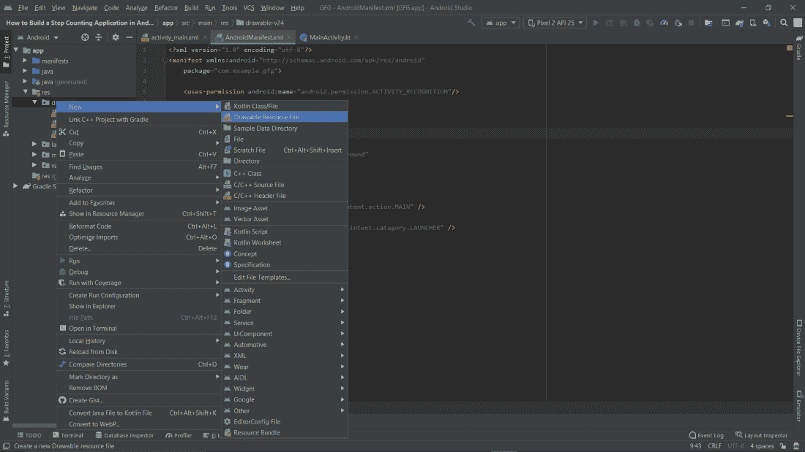

# 如何在安卓工作室搭建一个计步应用？

> 原文:[https://www . geeksforgeeks . org/如何构建一个步骤计数的安卓应用工作室/](https://www.geeksforgeeks.org/how-to-build-a-step-counting-application-in-android-studio/)

我们中的许多人在散步或跑步时都使用过手机上的踏板计数器。它计算用户走过的总步数并显示在屏幕上。步数计数器的另一个名字是计步器。但是你有没有想过一个应用程序如何计算我们的步数？这个应用工作背后的编码是什么？让我们通过做一个来找到这些问题的答案。

### **这篇文章我们要构建什么？**

我们将构建一个显示用户走过的步骤的应用程序。我们将在我们的 XML 文件中使用[文本视图](https://www.geeksforgeeks.org/textview-in-kotlin/)，它将在屏幕上显示步数和标题，一个[图像视图](https://www.geeksforgeeks.org/imageview-in-android-with-example/)用于显示文本周围的圆圈。当用户长时间点击屏幕时，它将被重置为 0。下面给出了一个示例 GIF，以了解我们将在本文中做什么。请注意，我们将使用**柯特林**语言实现应用程序。


### **分步实施**

**第一步:创建新项目**

要在安卓工作室创建新项目，请参考[如何在安卓工作室创建/启动新项目](https://www.geeksforgeeks.org/android-how-to-create-start-a-new-project-in-android-studio/)。注意选择**科特林**作为编程语言。

**第 2 步:使用 AndroidManifest.xml 从用户处获取权限**

导航到**应用程序/清单/AndroidManifest.xml** ，并在清单中编写下面给出的代码，以获得用户对活动识别的权限:

```kt
<uses-permission android:name="android.permission.ACTIVITY_RECOGNITION"/>
```


**第三步:添加可绘制的资源文件**

导航至**应用/资源/可绘制**，右键点击可绘制文件夹，进入**新建/可绘制资源文件**。



将文件命名为**圆**，在默认设置下，点击确定按钮。


**第四步:使用可绘制的资源文件**

在这一步中，我们将把代码添加到资源文件中。我们正在制作一个圆形笔画来使用它，在应用程序主 XML 文件的 [ImageView](https://www.geeksforgeeks.org/imageview-in-android-with-example/) 中。下面是我们在上一步中制作的 circle.xml 资源文件的代码。

## 可扩展标记语言

```kt
<?xml version="1.0" encoding="utf-8"?>
<selector xmlns:android="http://schemas.android.com/apk/res/android">
    <item>
          <!-- creates an oval shape --> 
        <shape android:shape="oval"> 

              <!-- giving the color and width to the stroke -->
            <stroke android:color="#0F9D58" android:width="3dp"/>

              <!-- giving the width and the height to the shape -->
            <size android:width="120dp" android:height="120dp"/> 
        </shape>
    </item>

</selector>
```

**第 5 步:使用 activity_main.xml 文件**

导航到**app/RES/layout/activity _ main . XML**，并将下面的代码添加到该文件中。下面是 **activity_main.xml** 文件的代码。

## 可扩展标记语言

```kt
<?xml version="1.0" encoding="utf-8"?>
<androidx.constraintlayout.widget.ConstraintLayout 
    xmlns:android="http://schemas.android.com/apk/res/android"
    xmlns:app="http://schemas.android.com/apk/res-auto"
    xmlns:tools="http://schemas.android.com/tools"
    android:layout_width="match_parent"
    android:layout_height="match_parent"
    tools:context=".MainActivity">

    <!--Text View for the "Steps" displayed-->
    <TextView
        android:id="@+id/steps"
        android:layout_width="wrap_content"
        android:layout_height="wrap_content"
        android:layout_marginEnd="8dp"
        android:layout_marginStart="8dp"
        android:layout_marginTop="290dp"
        android:text="Steps"
        android:textSize="45sp"
        android:textColor="@color/black"
        app:layout_constraintEnd_toEndOf="parent"
        app:layout_constraintStart_toStartOf="parent"
        app:layout_constraintTop_toTopOf="parent" />

    <!--Text View for the step count-->
    <TextView
        android:id="@+id/tv_stepsTaken"
        android:layout_width="wrap_content"
        android:layout_height="wrap_content"
        android:layout_marginEnd="8dp"
        android:layout_marginStart="8dp"
        android:layout_marginTop="30dp"
        android:text="0"
        android:textSize="37sp"
        android:textColor="@color/black"
        app:layout_constraintEnd_toEndOf="parent"
        app:layout_constraintStart_toStartOf="parent"
        app:layout_constraintTop_toBottomOf="@+id/steps" />

    <!--Image View for the circle-->
    <ImageView
        android:layout_width="200dp"
        android:layout_height="200dp"
        android:layout_marginTop="264dp"
        android:background="@drawable/circle"
        app:layout_constraintEnd_toEndOf="parent"
        app:layout_constraintHorizontal_bias="0.497"
        app:layout_constraintStart_toStartOf="parent"
        app:layout_constraintTop_toTopOf="parent" />

</androidx.constraintlayout.widget.ConstraintLayout>
```

**第 6 步:使用 MainActivity.kt 文件**

转到 **MainActivity.kt** 文件，参考以下代码。下面是 **MainActivity.kt** 文件的代码。代码中添加了注释，以更详细地理解代码。

## 我的锅

```kt
import android.content.Context
import android.hardware.Sensor
import android.hardware.SensorEvent
import android.hardware.SensorEventListener
import android.hardware.SensorManager
import androidx.appcompat.app.AppCompatActivity
import android.os.Bundle
import android.util.Log
import android.widget.TextView
import android.widget.Toast

class MainActivity : AppCompatActivity(), SensorEventListener { 
      // Added SensorEventListener the MainActivity class
    // Implement all the members in the class MainActivity 
    // after adding SensorEventListener

      // we have assigned sensorManger to nullable
    private var sensorManager: SensorManager? = null

      // Creating a variable which will give the running status 
    // and initially given the boolean value as false
    private var running = false 

      // Creating a variable which will counts total steps 
    // and it has been given the value of 0 float
    private var totalSteps = 0f 

      // Creating a variable  which counts previous total 
    // steps and it has also been given the value of 0 float
    private var previousTotalSteps = 0f 

    override fun onCreate(savedInstanceState: Bundle?) {
        super.onCreate(savedInstanceState)
        setContentView(R.layout.activity_main)

        loadData()
        resetSteps()

        // Adding a context of SENSOR_SERVICE aas Sensor Manager
        sensorManager = getSystemService(Context.SENSOR_SERVICE) as SensorManager 
    }

    override fun onResume() {
        super.onResume()
        running = true

          // Returns the number of steps taken by the user since the last reboot while activated
        // This sensor requires permission android.permission.ACTIVITY_RECOGNITION. 
          // So don't forget to add the following permission in AndroidManifest.xml present in manifest folder of the app.
        val stepSensor = sensorManager?.getDefaultSensor(Sensor.TYPE_STEP_COUNTER) 

        if (stepSensor == null) {         
              // This will give a toast message to the user if there is no sensor in the device
            Toast.makeText(this, "No sensor detected on this device", Toast.LENGTH_SHORT).show() 
        } else {          
              // Rate suitable for the user interface
            sensorManager?.registerListener(this, stepSensor, SensorManager.SENSOR_DELAY_UI) 
        }
    }

    override fun onSensorChanged(event: SensorEvent?) {

          // Calling the TextView that we made in activity_main.xml
        // by the id given to that TextView
        var tv_stepsTaken = findViewById<TextView>(R.id.tv_stepsTaken) 

        if (running) {
            totalSteps = event!!.values[0]

              // Current steps are calculated by taking the difference of total steps
            // and previous steps
            val currentSteps = totalSteps.toInt() - previousTotalSteps.toInt() 

            // It will show the current steps to the user
            tv_stepsTaken.text = ("$currentSteps") 
        }
    }

    fun resetSteps() {
        var tv_stepsTaken = findViewById<TextView>(R.id.tv_stepsTaken)
        tv_stepsTaken.setOnClickListener {          
              // This will give a toast message if the user want to reset the steps
            Toast.makeText(this, "Long tap to reset steps", Toast.LENGTH_SHORT).show() 
        }

        tv_stepsTaken.setOnLongClickListener {

            previousTotalSteps = totalSteps

              // When the user will click long tap on the screen, 
            // the steps will be reset to 0
            tv_stepsTaken.text = 0.toString()

            // This will save the data
            saveData() 

            true
        }
    }

    private fun saveData() {

        // Shared Preferences will allow us to save
          // and retrieve data in the form of key,value pair.
        // In this function we will save data
        val sharedPreferences = getSharedPreferences("myPrefs", Context.MODE_PRIVATE)

        val editor = sharedPreferences.edit()
        editor.putFloat("key1", previousTotalSteps)
        editor.apply()
    }

    private fun loadData() {

        // In this function we will retrieve data
        val sharedPreferences = getSharedPreferences("myPrefs", Context.MODE_PRIVATE)
        val savedNumber = sharedPreferences.getFloat("key1", 0f)

        // Log.d is used for debugging purposes
        Log.d("MainActivity", "$savedNumber") 

        previousTotalSteps = savedNumber
    }

    override fun onAccuracyChanged(sensor: Sensor?, accuracy: Int) { 
          // We do not have to write anything in this function for this app
    }
}
```

现在运行该应用程序，并查看下面代码的输出:

**输出:**

```kt
Note: 
We have to allow the permission required for the app by going to app settings and then enabling it. 
It will not count the steps in the emulator, you have to use a real android device to test it.
```

<video class="wp-video-shortcode" id="video-591046-1" width="640" height="360" preload="metadata" controls=""><source type="video/mp4" src="https://media.geeksforgeeks.org/wp-content/uploads/20210411165825/Screen_Recording_20210411-165144_GFG.mp4?_=1">[https://media.geeksforgeeks.org/wp-content/uploads/20210411165825/Screen_Recording_20210411-165144_GFG.mp4](https://media.geeksforgeeks.org/wp-content/uploads/20210411165825/Screen_Recording_20210411-165144_GFG.mp4)</video>