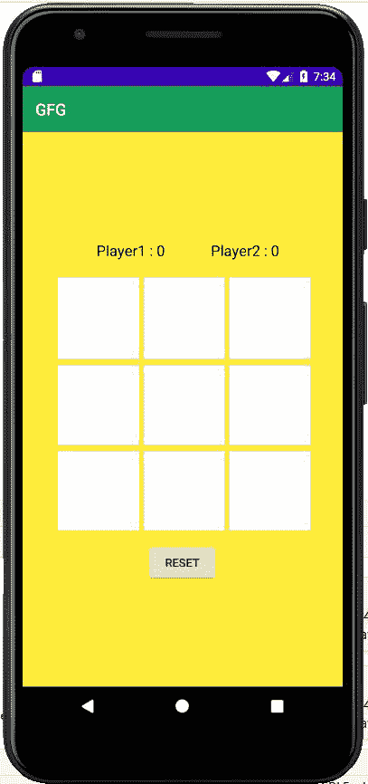

# 如何在安卓系统中构建一款线下和线上模式兼备的井字游戏？

> 原文:[https://www . geeksforgeeks . org/如何在安卓系统中构建一个线下和线上两种模式的井字游戏/](https://www.geeksforgeeks.org/how-to-build-a-tic-tac-toe-game-with-both-offline-and-online-mode-in-android/)

在本文中，我们将制作一款兼具线上和线下模式的井字游戏。所以对于这个项目，我们将使用 **Kotlin** 和 **XML** 。**井字游戏**是一款双人游戏。每个玩家都有 **X** 或 **O** 。两个玩家同时一个接一个地玩。一招中，玩家需要在 3×3 格子中选择一个位置，并在该位置打上标记。这个游戏一直持续到一个人赢为止。在前一篇文章中，我们已经在 Android 中构建了一个简单的[井字游戏，但是在这篇文章中，我们在应用程序中有以下附加功能:](https://www.geeksforgeeks.org/how-to-build-a-tic-tac-toe-game-in-android/)

*   **单人**
*   **多人**
    *   **网络游戏**
        *   **输入游戏代码**创建并加入
    *   **线下游戏**

下面给出了一个示例视频，让我们了解一下在本文中要做什么。

<video class="wp-video-shortcode" id="video-577233-1" width="640" height="360" preload="metadata" controls=""><source type="video/mp4" src="https://media.geeksforgeeks.org/wp-content/uploads/20210322155036/Build-a-Tic-Tac-Toe-Game-with-Both-Offline-and-Online-Mode-in-Android.mp4?_=1">[https://media.geeksforgeeks.org/wp-content/uploads/20210322155036/Build-a-Tic-Tac-Toe-Game-with-Both-Offline-and-Online-Mode-in-Android.mp4](https://media.geeksforgeeks.org/wp-content/uploads/20210322155036/Build-a-Tic-Tac-Toe-Game-with-Both-Offline-and-Online-Mode-in-Android.mp4)</video>

### 基本术语

*   **XML:** 它的完整形式是一种可扩展标记语言，是一组代码和标签。
*   **Kotlin:** 它是一种由 JetBrains 开发的免费开源编程语言。
*   **安卓工作室:**安卓工作室是安卓应用开发的官方集成开发环境。
*   **Firebase:** 是谷歌提供的后端服务。

### **分步实施**

**第一步:创建新项目**

要在安卓工作室创建新项目，请参考[如何在安卓工作室创建/启动新项目](https://www.geeksforgeeks.org/android-how-to-create-start-a-new-project-in-android-studio/)。注意选择**科特林**作为编程语言。

**步骤 2:使用 activity_main.xml 文件**

导航到**应用程序> res >布局> activity_main.xml** 并将下面的代码添加到该文件中。下面是 **activity_main.xml** 文件的代码。

## 可扩展标记语言

```
<?xml version="1.0" encoding="utf-8"?>
<TableLayout
    xmlns:android="http://schemas.android.com/apk/res/android"
    xmlns:tools="http://schemas.android.com/tools"
    android:layout_width="match_parent"
    android:layout_height="match_parent"
    android:background="#FFEB3B"
    android:gravity="center"
    tools:context=".MainActivity">

    <LinearLayout
        android:layout_width="wrap_content"
        android:layout_height="20dp"
        android:layout_margin="10dp"
        android:gravity="center">

        <TextView
            android:id="@+id/textView"
            android:layout_width="110dp"
            android:layout_height="30dp"
            android:layout_marginLeft="40dp"
            android:text="Player1 : 0"
            android:textColor="#000000"
            android:textSize="18dp" />

        <TextView
            android:id="@+id/textView2"
            android:layout_width="110dp"
            android:layout_height="30dp"
            android:layout_marginLeft="30dp"
            android:text="Player2 : 0"
            android:textColor="#000000"
            android:textSize="18dp" />
    </LinearLayout>

    <TableRow
        android:layout_width="match_parent"
        android:layout_height="match_parent"
        android:layout_marginTop="10dp"
        android:gravity="center">

        <Button
            android:id="@+id/button"
            android:layout_width="100dp"
            android:layout_height="100dp"
            android:layout_marginLeft="5dp"
            android:background="#FFFFFF"
            android:onClick="clickfun"
            android:textSize="60dp" />

        <Button
            android:id="@+id/button2"
            android:layout_width="100dp"
            android:layout_height="100dp"
            android:layout_marginLeft="5dp"
            android:background="#FFFFFF"
            android:onClick="clickfun"
            android:textSize="60dp" />

        <Button
            android:id="@+id/button3"
            android:layout_width="100dp"
            android:layout_height="100dp"
            android:layout_marginLeft="5dp"
            android:background="#FFFFFF"
            android:onClick="clickfun"
            android:textColor="#000000"
            android:textSize="60dp" />
    </TableRow>

    <TableRow
        android:layout_width="match_parent"
        android:layout_height="match_parent"
        android:gravity="center">

        <Button
            android:id="@+id/button4"
            android:layout_width="100dp"
            android:layout_height="100dp"
            android:layout_marginLeft="5dp"
            android:layout_marginTop="5dp"
            android:background="#FFFFFF"
            android:onClick="clickfun"
            android:textColor="#000000"
            android:textSize="60dp" />

        <Button
            android:id="@+id/button5"
            android:layout_width="100dp"
            android:layout_height="100dp"
            android:layout_marginLeft="5dp"
            android:layout_marginTop="5dp"
            android:background="#FFFFFF"
            android:onClick="clickfun"
            android:textColor="#000000"
            android:textSize="60dp" />

        <Button
            android:id="@+id/button6"
            android:layout_width="100dp"
            android:layout_height="100dp"
            android:layout_marginLeft="5dp"
            android:layout_marginTop="5dp"
            android:background="#FFFFFF"
            android:onClick="clickfun"
            android:textColor="#000000"
            android:textSize="60dp" />
    </TableRow>

    <TableRow
        android:layout_width="match_parent"
        android:layout_height="match_parent"
        android:gravity="center">

        <Button
            android:id="@+id/button7"
            android:layout_width="100dp"
            android:layout_height="100dp"
            android:layout_marginLeft="5dp"
            android:layout_marginTop="5dp"
            android:background="#FFFFFF"
            android:onClick="clickfun"
            android:textColor="#000000"
            android:textSize="60dp" />

        <Button
            android:id="@+id/button8"
            android:layout_width="100dp"
            android:layout_height="100dp"
            android:layout_marginLeft="5dp"
            android:layout_marginTop="5dp"
            android:background="#FFFFFF"
            android:onClick="clickfun"
            android:textColor="#000000"
            android:textSize="60dp" />

        <Button
            android:id="@+id/button9"
            android:layout_width="100dp"
            android:layout_height="100dp"
            android:layout_marginLeft="5dp"
            android:layout_marginTop="5dp"
            android:background="#FFFFFF"
            android:onClick="clickfun"
            android:textColor="#000000"
            android:textSize="60dp" />

    </TableRow>

    <LinearLayout
        android:layout_marginTop="15dp"
        android:gravity="center">

        <Button
            android:id="@+id/button10"
            android:layout_width="wrap_content"
            android:layout_height="wrap_content"
            android:text="Reset" />
    </LinearLayout>

</TableLayout>
```

**写了这么多代码之后，UI 看起来像** **这样:**



**第三步:使用**T2【主活动. kt】文件

转到 **MainActivity.kt** 文件，参考以下代码。下面是 **MainActivity.kt** 文件的代码。代码中添加了注释，以更详细地理解代码。在这里，我们将向我们的应用程序添加功能。

## 我的锅

```
class MainActivity : AppCompatActivity() {

    override fun onCreate(savedInstanceState: Bundle?) {
        super.onCreate(savedInstanceState)
        setContentView(R.layout.activity_main)

        // reset button listener
        button10.setOnClickListener {
            reset()

        }
    }

    // player winning count
    var player1Count = 0
    var player2Count = 0

      // this function handle the click event on the board.
    fun clickfun(view:View)
    {
        if(playerTurn) {
            val but = view as Button
            var cellID = 0
            when (but.id) {
                R.id.button -> cellID = 1
                R.id.button2 -> cellID = 2
                R.id.button3 -> cellID = 3
                R.id.button4 -> cellID = 4
                R.id.button5 -> cellID = 5
                R.id.button6 -> cellID = 6
                R.id.button7 -> cellID = 7
                R.id.button8 -> cellID = 8
                R.id.button9 -> cellID = 9
            }
            playerTurn = false;
            Handler().postDelayed(Runnable { playerTurn = true } , 600)
            playnow(but, cellID)
        }
    }
    var player1 = ArrayList<Int>()
    var player2 = ArrayList<Int>()
    var emptyCells = ArrayList<Int>()
    var activeUser = 1

      // this function update update the game board after every move.
    fun playnow(buttonSelected:Button , currCell:Int)
    {   val audio = MediaPlayer.create(this , R.raw.poutch)
        if(activeUser == 1)
        {
            buttonSelected.text = "X"
            buttonSelected.setTextColor(Color.parseColor("#EC0C0C"))
            player1.add(currCell)
            emptyCells.add(currCell)
            audio.start()
            buttonSelected.isEnabled = false
            Handler().postDelayed(Runnable { audio.release() } , 200)
            val checkWinner = checkwinner()
            if(checkWinner == 1){
                Handler().postDelayed(Runnable { reset() } , 2000)
            }
            else if(singleUser){
                Handler().postDelayed(Runnable { robot() } , 500)
            }
            else
                activeUser = 2
        }
        else
        {
            buttonSelected.text = "O"
            audio.start()
            buttonSelected.setTextColor(Color.parseColor("#D22BB804"))
            activeUser = 1
            player2.add(currCell)
            emptyCells.add(currCell)
            Handler().postDelayed(Runnable { audio.release() } , 200)
            buttonSelected.isEnabled = false
            val checkWinner  = checkwinner()
            if(checkWinner == 1)
                Handler().postDelayed(Runnable { reset() } , 4000)
        }
    }

    // this function resets the game.
    fun reset()
    {
        player1.clear()
        player2.clear()
        emptyCells.clear()
        activeUser = 1;
        for(i in 1..9)
        {
            var buttonselected : Button?
            buttonselected = when(i){
                1 -> button
                2 -> button2
                3 -> button3
                4 -> button4
                5 -> button5
                6 -> button6
                7 -> button7
                8 -> button8
                9 -> button9
                else -> {button}
            }
            buttonselected.isEnabled = true
            buttonselected.text = ""
            textView.text = "Player1 : $player1Count"
            textView2.text = "Player2 : $player2Count"
        }
    }

    // this function disable all the button on the board for a while.
       fun disableReset()
    {
        button10.isEnabled = false
        Handler().postDelayed(Runnable { button10.isEnabled = true } , 2200)
    }
}
```