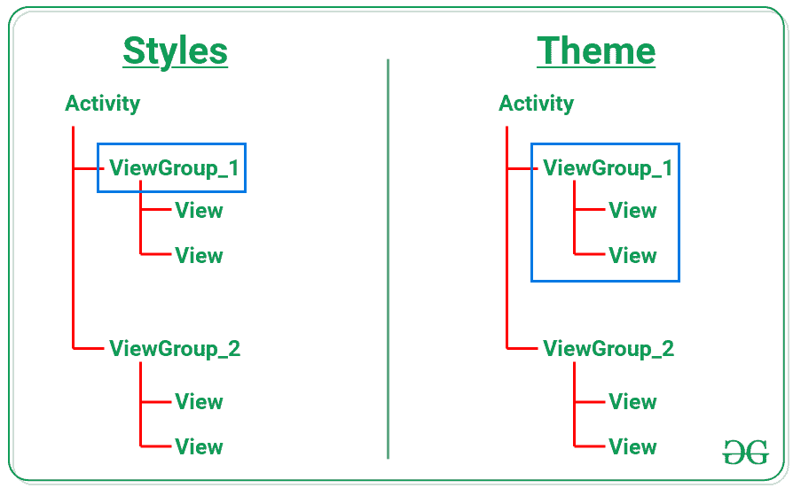
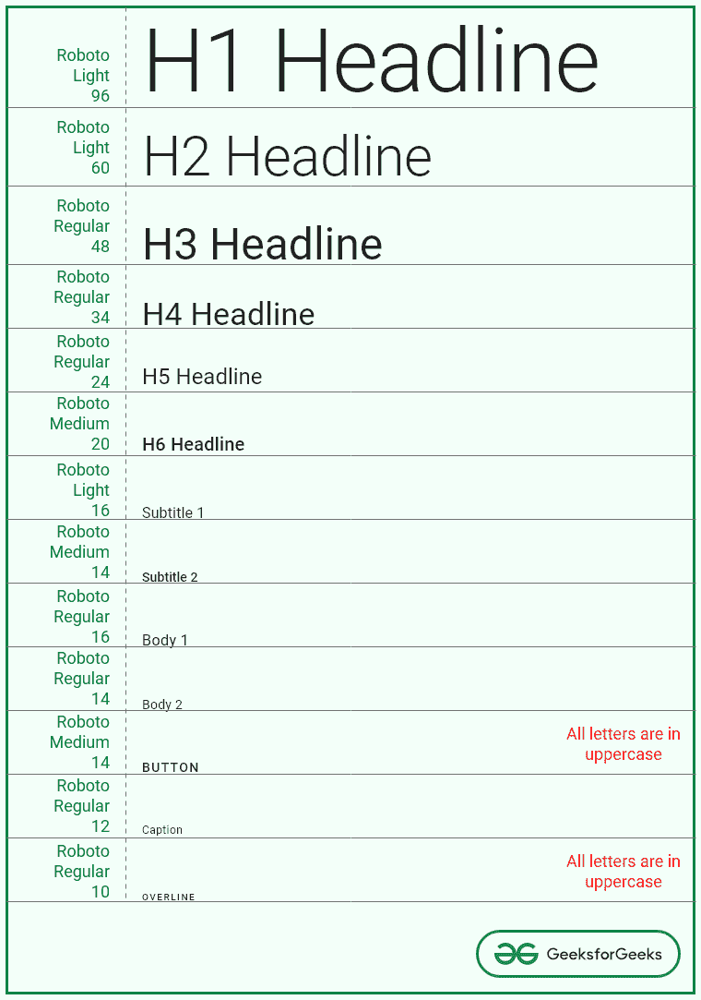

# 如何在安卓中使用风格构建材质和黑暗主题应用？

> 原文:[https://www . geesforgeks . org/how-to-build-material-and-dark-themes-apps-使用安卓风格/](https://www.geeksforgeeks.org/how-to-build-material-and-dark-themes-apps-using-style-in-android/)

为了增加安卓应用的用户流量，需要调整安卓应用的主题和风格。在当今的移动应用程序开发中，还需要考虑应用程序的外观和感觉。应用程序用户需求的一个主要特征是黑暗主题。安卓设备的默认主题是黑暗的，直到安卓棒棒糖(5.0)，但安卓 Q 在 2019 年第三季度发布。大多数应用程序都实现了暗主题版本的应用程序。在这篇文章中，已经说明了如何实现安卓应用程序的材质黑暗主题版本。

### **为什么是黑暗主题？**

深色主题会降低移动设备屏幕发出的亮度，从而减轻眼睛疲劳。同时保持最小的色彩对比度。这也有助于应用程序的功能设计。消耗更少的电池电量，适应当前的光线条件。带有有机发光二极管显示屏的设备可以适应黑暗主题。最重要的是，黑暗主题版本的应用程序有更多的粉丝。

**了解风格和主题的区别**

*   安卓开发者见证了风格和主题的模糊性。原因是在安卓系统中只有标签名称 ***<样式>*****没有 ***<主题>*** 标签可用。**
*   *****Style*** 是定义一个 ***单个*** 视图外观的属性集合。样式属性是字体、颜色、大小、背景颜色等。例如，标题和正文的字体大小可能不同。**
*   *****【主题】*****相反，适用于整个 app，或活动，或视图层次，而不仅仅是针对单个视图。主题还可以将样式应用于非视图元素，如状态栏、窗口背景等。例如，颜色主要应用于整个应用程序的所有浮动操作按钮或正常按钮。人们可以从下图中得到不同之处。****

********

*   ****上图可以清楚地看出《风格》和《主题》的区别。其中样式应用于父视图组内的特定视图，但主题应用于整个父视图组。****
*   ****但是风格和主题是密切相关的。例如，浮动操作按钮和普通可点击按钮可以分别有不同的颜色，如颜色主要和颜色次要。****

### ******材料主题属性******

****在安卓应用中实现功能素材主题的 3 个主要属性是:****

1.  ****颜色****
2.  ****排印****
3.  ****形状****
4.  ****材料设计组件****

*   ****关于这些属性的基本信息可以参考[安卓系统中的材料设计介绍](https://www.geeksforgeeks.org/introduction-to-material-design-in-android/)****
*   ****人们可能已经在安卓工作室(4.1 及以上版本)的最新更新中看到了颜色属性的不同。这些是:****

******原色变体:******

<figure class="table">

| 

属性

 | 

描述

 | 

缺省值

 |
| --- | --- | --- |
| 彩色原色 | 此颜色是应用程序的原色。此颜色是应用程序中使用最多的颜色。这也可以称为品牌颜色 | #FF6200EE |
| colorPrimaryVariant | 这是 colorPrimary 的变体。这可能是原色的较亮或较暗的变体。 | #FF3700B3 |
| 颜色主要 | 名称本身表明颜色应该分配给那些高于颜色原色的元素。 | #FFFFFFFF |

</figure>

******次要颜色变体:******

<figure class="table">

| 

属性

 | 

描述

 | 

缺省值

 |
| --- | --- | --- |
| 颜色辅助 | 在颜色原色之后使用最多的颜色。这种颜色是原色的补色。 | #FF03DAC5 |
| 颜色次要变量 | 这是 colorSecondary 的变体。这可能是 colorSecondary 的较亮或较暗的变体。 | #FF018786 |
| 颜色第二 | 该名称还表明颜色应该分配给那些高于颜色二级的元素。 | #FF000000 |

</figure>

******表面颜色:******

<figure class="table">

| 

属性

 | 

描述

 | 

缺省值

 |
| --- | --- | --- |
| 彩色表面 | 影响表面组件(如卡片、图纸、菜单)的表面颜色。 | #FFFFFF |
| 颜色表面 | 分配给颜色表面上方的文本或图标的颜色 | #000000 |

</figure>

******错误颜色:******

<figure class="table">

| 属性 | 描述 | 缺省值 |
| --- | --- | --- |
| 颜色错误 | 这表示分配给表示错误的元素的颜色。 | #B00020 |
| colorOnError | 分配给颜色错误上方的文本或图标的颜色。 | #FFFFFF |

</figure>

******排版:******

****在材料设计排版系统中，有预定义的和精心设计的文本排版变体。请看下图:****

********

****默认情况下，这些是材质设计主题附带的属性，可以根据应用程序中文本的上下文直接应用于文本视图。****

### ******实现应用的黑暗主题变体的步骤******

******第一步:创建空活动 Android Studio 项目:******

****创建一个空的活动 Android Studio 项目，并选择 Kotlin 作为编程语言。参考[安卓|如何在安卓工作室创建/启动新项目？](https://www.geeksforgeeks.org/android-how-to-create-start-a-new-project-in-android-studio/)。****

******第二步:添加需要的依赖关系******

*   ****将以下依赖项添加到应用程序级渐变文件中，并同步项目。****
*   ****然而，默认情况下，这种依赖性是在创建新的安卓工作室(4.0 及以上版本)项目时添加的。****

> ****实现' com . Google . Android . material:material:1 . 3 . 0-alpha 04 '****

******第三步:添加主次品牌颜色******

*   ****我们需要主要决定原色和次原色，并从中提取颜色代码。在这种情况下，原色是绿色，作为补充，红色 _200 和红色 _700 是次要品牌颜色。****
*   ****可以使用[这个](https://material.io/design/color/the-color-system.html#tools-for-picking-colors)或者[这个](https://material.io/resources/color/#!/?view.left=0&view.right=0)制作自己的色板和组合。****
*   ****调用以下颜色在 colors.xml 文件内的应用程序中实现相同的颜色。****

## ****可扩展标记语言****

```kt
**<?xml version="1.0" encoding="utf-8"?>
<resources>

    <!--Primary colors of the application-->
    <color name="green_200">#98d5b0</color>
    <color name="green_light">#e5f5eb</color>
    <color name="green_500">#18ad62</color>
    <color name="green_700">#008c4c</color>

    <!--Secondary brand color of the application-->
    <color name="red_200">#eb8baf</color>
    <color name="red_700">#b31058</color>

    <!--Other surface colors and red for error color-->
    <color name="black">#FF000000</color>
    <color name="white">#FFFFFFFF</color>
    <color name="red">#B00020</color>

</resources>**
```

******第 4 步:使用主题. xml 文件******

*   ****首先，将昼夜暗动作栏主题应用于应用程序的亮主题和暗主题，如下所示:****

> ******<风格名称=“主题”。GFGArticle" parent= "主题。>******

*   ****按照上面讨论的材料设计指南提供的颜色系统，下面是应用于应用程序的浅色主题和深色主题的颜色系统。****
*   ****当应用程序处于灯光主题下时，将应用下列值\theme.xml。****

## ****可扩展标记语言****

```kt
**<resources xmlns:tools="http://schemas.android.com/tools">
    <!-- Base application theme. -->
    <style name="Theme.GFGArticle" parent="Theme.MaterialComponents.DayNight.DarkActionBar">
        <!-- Primary brand color. -->
        <item name="colorPrimary">@color/green_500</item>
        <item name="colorPrimaryVariant">@color/green_700</item>
        <item name="colorOnPrimary">@color/white</item>
        <!-- Secondary brand color. -->
        <item name="colorSecondary">@color/teal_200</item>
        <item name="colorSecondaryVariant">@color/teal_700</item>
        <item name="colorOnSecondary">@color/black</item>
        <!-- Status bar color. -->
        <item name="android:statusBarColor" tools:targetApi="l">?attr/colorPrimaryVariant</item>
        <!-- Customize your theme here. -->
    </style>
</resources>**
```

*   ****当应用程序处于黑暗主题下时，将应用以下值-night\themes.xml。****

## ****可扩展标记语言****

```kt
**<resources xmlns:tools="http://schemas.android.com/tools">
    <!-- Base application theme. -->
    <style name="Theme.GFGArticle" parent="Theme.MaterialComponents.DayNight.DarkActionBar">
        <!-- Primary brand color. -->
        <item name="colorPrimary">@color/green_200</item>
        <item name="colorPrimaryVariant">@color/green_700</item>
        <item name="colorOnPrimary">@color/black</item>
        <!-- Secondary brand color. -->
        <item name="colorSecondary">@color/red_200</item>
        <item name="colorSecondaryVariant">@color/red_200</item>
        <item name="colorOnSecondary">@color/black</item>
        <!-- Status bar color. -->
        <item name="android:statusBarColor" tools:targetApi="l">?attr/colorPrimaryVariant</item>
        <!-- Customize your theme here. -->
    </style>
</resources>**
```