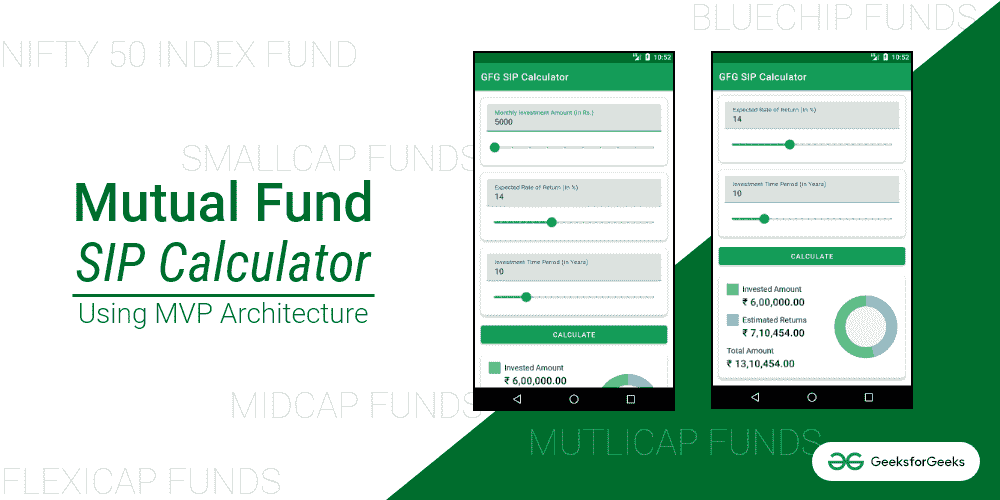
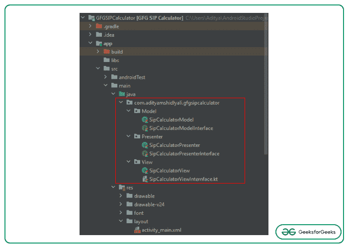

# 如何使用 MVP 架构搭建 SIP 计算器安卓 App？

> 原文:[https://www . geesforgeks . org/how-build-sip-calculator-Android-app-using-MVP-architecture/](https://www.geeksforgeeks.org/how-to-build-sip-calculator-android-app-using-mvp-architecture/)

系统投资计划。投资共同基金的方法之一是每周、每月、每季度或每半年。SIP 计算器是让投资者了解其投资回报的工具。然而，共同基金的回报因各种因素而异。例如，SIP 计算器不计算绝对回报，因为一些共同基金收取退出负荷和费用比率。因此，它只计算估计收益，并提供到期值的结果。本文讨论了在安卓系统中用健壮的 MVP 架构实现 SIP 计算器。看看下面的内容，了解一下最终产品。



### **T2 SIP 退货计算器有什么帮助？**

与共同基金的一次总付投资相比，投资保护协议提供了非常有利可图的回报。SIP 计算器可帮助投资者制定长期投资计划，因为它提供了以下功能:

1.  它决定了一段时间内的投资总额。
2.  讲述超过预期回报率的估计回报。
3.  还计算到期值，即**预计收益+投资总额**。

> **注:**预计收益简单来说就是**到期值-投资总额**。

计算 SIP 回报的公式很简单。

> m = p *(1+I)^ n–1 }/I)*(I+1)
> 
> m ->到期值(预计收益+投资总额)。
> 
> p ->本金金额(每月投资)。
> 
> i ->期间利率。
> 
> n ->付款次数。

### **从这个计算器获得的好处**

*   根据估计的回报，人们可以规划共同基金的长期投资。
*   它提供了准确的估计。
*   根据你的财务需求，通过提供参考你研究过的共同基金过去表现的准确性，它有助于塑造你的投资组合。

### **去执行之前，一些前提条件**

*   [MVP (Model View Presenter)架构模式在安卓中的应用举例](https://www.geeksforgeeks.org/mvp-model-view-presenter-architecture-pattern-in-android-with-example/)–通过一个例子来了解 MVP 架构在安卓中是如何工作的。
*   [安卓系统中的材质设计组件滑块](https://www.geeksforgeeks.org/material-design-components-sliders-in-android/)–了解如何在安卓系统中使用滑块。
*   [如何在安卓应用中添加饼图](https://www.geeksforgeeks.org/how-to-add-a-pie-chart-into-an-android-application/)–了解如何在安卓中实现饼图。

### **在安卓系统中实现 SIP 计算器的步骤**

**第一步:创建新项目**

要在安卓工作室创建新项目，请参考[如何在安卓工作室创建/启动新项目](https://www.geeksforgeeks.org/android-how-to-create-start-a-new-project-in-android-studio/)。注意选择**科特林**作为编程语言。

**步骤 2:使用 activity_main.xml 文件**

应用程序的主布局包含 3 个编辑文本和与之相关联的滑块，这样用户就可以在编辑文本中滑动和进行更改，而无需键入。一个“计算”按钮，按下该按钮后，将根据上述公式进行计算。一个是饼状图，这个饼状图有两个部分，一个是该期间的投资金额，另一个部分是在预期回报率和选定任期内产生的投资的估计回报。要实现相同的功能，请在 activity_main.xml 文件中调用以下代码。

## 可扩展标记语言

```
<?xml version="1.0" encoding="utf-8"?>
<ScrollView xmlns:android="http://schemas.android.com/apk/res/android"
    xmlns:app="http://schemas.android.com/apk/res-auto"
    xmlns:tools="http://schemas.android.com/tools"
    android:layout_width="match_parent"
    android:layout_height="match_parent"
    android:clipToPadding="false"
    tools:context=".View.SipCalculatorView"
    tools:ignore="HardcodedText">

    <androidx.constraintlayout.widget.ConstraintLayout
        android:layout_width="match_parent"
        android:layout_height="wrap_content">

        <androidx.cardview.widget.CardView
            android:id="@+id/monthlyInvestmentAmountCardView"
            android:layout_width="match_parent"
            android:layout_height="wrap_content"
            android:layout_marginStart="16dp"
            android:layout_marginTop="16dp"
            android:layout_marginEnd="16dp"
            app:cardCornerRadius="8dp"
            app:cardElevation="4dp"
            app:cardMaxElevation="6dp"
            app:cardPreventCornerOverlap="true"
            app:layout_constraintEnd_toEndOf="parent"
            app:layout_constraintStart_toStartOf="parent"
            app:layout_constraintTop_toTopOf="parent">

            <androidx.constraintlayout.widget.ConstraintLayout
                android:layout_width="match_parent"
                android:layout_height="match_parent"
                android:padding="12dp">

                <com.google.android.material.textfield.TextInputLayout
                    android:id="@+id/monthlyInvestmentAmountTextInputLayout"
                    android:layout_width="match_parent"
                    android:layout_height="wrap_content"
                    android:hint="Monthly Investment Amount (in Rs.)"
                    app:layout_constraintTop_toTopOf="parent"
                    tools:layout_editor_absoluteX="8dp">

                    <com.google.android.material.textfield.TextInputEditText
                        android:id="@+id/monthlyInvestmentAmountTextInputEditText"
                        android:layout_width="match_parent"
                        android:layout_height="wrap_content"
                        android:inputType="number" />

                </com.google.android.material.textfield.TextInputLayout>

                <com.google.android.material.slider.Slider
                    android:id="@+id/monthlyInvestmentAmountSlider"
                    android:layout_width="match_parent"
                    android:layout_height="wrap_content"
                    android:layout_marginTop="8dp"
                    android:stepSize="5000"
                    android:valueFrom="5000"
                    android:valueTo="50000"
                    app:layout_constraintTop_toBottomOf="@id/monthlyInvestmentAmountTextInputLayout"
                    tools:layout_editor_absoluteX="8dp" />

            </androidx.constraintlayout.widget.ConstraintLayout>

        </androidx.cardview.widget.CardView>

        <androidx.cardview.widget.CardView
            android:id="@+id/expectedReturnRateCardView"
            android:layout_width="match_parent"
            android:layout_height="wrap_content"
            android:layout_marginStart="16dp"
            android:layout_marginTop="16dp"
            android:layout_marginEnd="16dp"
            app:cardCornerRadius="8dp"
            app:cardElevation="4dp"
            app:cardMaxElevation="6dp"
            app:cardPreventCornerOverlap="true"
            app:layout_constraintEnd_toEndOf="parent"
            app:layout_constraintStart_toStartOf="parent"
            app:layout_constraintTop_toBottomOf="@id/monthlyInvestmentAmountCardView">

            <androidx.constraintlayout.widget.ConstraintLayout
                android:layout_width="match_parent"
                android:layout_height="match_parent"
                android:padding="12dp">

                <com.google.android.material.textfield.TextInputLayout
                    android:id="@+id/expectedReturnRateTextInputLayout"
                    android:layout_width="match_parent"
                    android:layout_height="wrap_content"
                    android:hint="Expected Rate of Return (in %)"
                    app:layout_constraintEnd_toEndOf="parent"
                    app:layout_constraintStart_toStartOf="parent"
                    app:layout_constraintTop_toTopOf="parent">

                    <com.google.android.material.textfield.TextInputEditText
                        android:id="@+id/expectedReturnRateTextInputEditText"
                        android:layout_width="match_parent"
                        android:layout_height="wrap_content"
                        android:inputType="number" />

                </com.google.android.material.textfield.TextInputLayout>

                <com.google.android.material.slider.Slider
                    android:id="@+id/expectedReturnRateSlider"
                    android:layout_width="match_parent"
                    android:layout_height="wrap_content"
                    android:layout_marginTop="8dp"
                    android:stepSize="1"
                    android:valueFrom="5"
                    android:valueTo="30"
                    app:layout_constraintTop_toBottomOf="@id/expectedReturnRateTextInputLayout"
                    tools:layout_editor_absoluteX="12dp" />

            </androidx.constraintlayout.widget.ConstraintLayout>

        </androidx.cardview.widget.CardView>

        <androidx.cardview.widget.CardView
            android:id="@+id/investmentTimePeriodCardView"
            android:layout_width="match_parent"
            android:layout_height="wrap_content"
            android:layout_marginStart="16dp"
            android:layout_marginTop="16dp"
            android:layout_marginEnd="16dp"
            app:cardCornerRadius="8dp"
            app:cardElevation="4dp"
            app:cardMaxElevation="6dp"
            app:cardPreventCornerOverlap="true"
            app:layout_constraintEnd_toEndOf="parent"
            app:layout_constraintStart_toStartOf="parent"
            app:layout_constraintTop_toBottomOf="@+id/expectedReturnRateCardView">

            <androidx.constraintlayout.widget.ConstraintLayout
                android:layout_width="match_parent"
                android:layout_height="match_parent"
                android:padding="12dp">

                <com.google.android.material.textfield.TextInputLayout
                    android:id="@+id/investmentTimePeriodTextInputLayout"
                    android:layout_width="match_parent"
                    android:layout_height="wrap_content"
                    android:hint="Investment Time Period (in Years)"
                    app:layout_constraintEnd_toEndOf="parent"
                    app:layout_constraintStart_toStartOf="parent"
                    app:layout_constraintTop_toTopOf="parent">

                    <com.google.android.material.textfield.TextInputEditText
                        android:id="@+id/investmentTimePeriodTextInputEditText"
                        android:layout_width="match_parent"
                        android:layout_height="wrap_content"
                        android:inputType="number" />

                </com.google.android.material.textfield.TextInputLayout>

                <com.google.android.material.slider.Slider
                    android:id="@+id/investmentTimePeriodSlider"
                    android:layout_width="match_parent"
                    android:layout_height="wrap_content"
                    android:layout_marginTop="8dp"
                    android:stepSize="1"
                    android:valueFrom="5"
                    android:valueTo="30"
                    app:layout_constraintTop_toBottomOf="@id/investmentTimePeriodTextInputLayout"
                    tools:layout_editor_absoluteX="12dp" />

            </androidx.constraintlayout.widget.ConstraintLayout>

        </androidx.cardview.widget.CardView>

        <com.google.android.material.button.MaterialButton
            android:id="@+id/sipCalculateResultButton"
            android:layout_width="match_parent"
            android:layout_height="wrap_content"
            android:layout_marginStart="16dp"
            android:layout_marginTop="16dp"
            android:layout_marginEnd="16dp"
            android:text="CALCULATE"
            app:layout_constraintEnd_toEndOf="parent"
            app:layout_constraintStart_toStartOf="parent"
            app:layout_constraintTop_toBottomOf="@id/investmentTimePeriodCardView" />

        <androidx.cardview.widget.CardView
            android:id="@+id/sipCalculationResultCardView"
            android:layout_width="match_parent"
            android:layout_height="wrap_content"
            android:layout_margin="16dp"
            app:cardCornerRadius="8dp"
            app:cardElevation="4dp"
            app:cardMaxElevation="6dp"
            app:cardPreventCornerOverlap="true"
            app:layout_constraintBottom_toBottomOf="parent"
            app:layout_constraintEnd_toEndOf="parent"
            app:layout_constraintStart_toStartOf="parent"
            app:layout_constraintTop_toBottomOf="@+id/sipCalculateResultButton">

            <androidx.constraintlayout.widget.ConstraintLayout
                android:layout_width="match_parent"
                android:layout_height="match_parent"
                android:padding="16dp">

                <View
                    android:id="@+id/view"
                    android:layout_width="24dp"
                    android:layout_height="24dp"
                    android:background="@color/green_200"
                    app:layout_constraintStart_toStartOf="parent"
                    app:layout_constraintTop_toTopOf="@+id/totalInvestedAmountMaterialHeading" />

                <com.google.android.material.textview.MaterialTextView
                    android:id="@+id/totalInvestedAmountMaterialHeading"
                    style="@style/TextAppearance.MdcTypographyStyles.Subtitle1"
                    android:layout_width="wrap_content"
                    android:layout_height="wrap_content"
                    android:layout_marginStart="8dp"
                    android:text="Invested Amount"
                    app:layout_constraintStart_toEndOf="@+id/view"
                    app:layout_constraintTop_toTopOf="parent" />

                <com.google.android.material.textview.MaterialTextView
                    android:id="@+id/totalInvestedAmountMaterialTextView"
                    style="@style/TextAppearance.MdcTypographyStyles.Headline6"
                    android:layout_width="wrap_content"
                    android:layout_height="wrap_content"
                    android:layout_marginTop="2dp"
                    app:layout_constraintStart_toStartOf="@+id/totalInvestedAmountMaterialHeading"
                    app:layout_constraintTop_toBottomOf="@+id/totalInvestedAmountMaterialHeading"
                    tools:text="10000" />

                <View
                    android:id="@+id/view2"
                    android:layout_width="24dp"
                    android:layout_height="24dp"
                    android:background="@color/blue_200"
                    app:layout_constraintStart_toStartOf="parent"
                    app:layout_constraintTop_toTopOf="@+id/estimatedReturnsMaterialHeading" />

                <com.google.android.material.textview.MaterialTextView
                    android:id="@+id/estimatedReturnsMaterialHeading"
                    style="@style/TextAppearance.MdcTypographyStyles.Subtitle1"
                    android:layout_width="wrap_content"
                    android:layout_height="wrap_content"
                    android:layout_marginStart="8dp"
                    android:layout_marginTop="12dp"
                    android:text="Estimated Returns"
                    app:layout_constraintStart_toEndOf="@+id/view2"
                    app:layout_constraintTop_toBottomOf="@+id/totalInvestedAmountMaterialTextView" />

                <com.google.android.material.textview.MaterialTextView
                    android:id="@+id/estimatedReturnsMaterialTextView"
                    style="@style/TextAppearance.MdcTypographyStyles.Headline6"
                    android:layout_width="wrap_content"
                    android:layout_height="wrap_content"
                    android:layout_marginTop="2dp"
                    app:layout_constraintStart_toStartOf="@+id/estimatedReturnsMaterialHeading"
                    app:layout_constraintTop_toBottomOf="@+id/estimatedReturnsMaterialHeading"
                    tools:text="25000" />

                <com.google.android.material.textview.MaterialTextView
                    android:id="@+id/totalAmountMaterialHeading"
                    style="@style/TextAppearance.MdcTypographyStyles.Subtitle1"
                    android:layout_width="wrap_content"
                    android:layout_height="wrap_content"
                    android:layout_marginTop="12dp"
                    android:text="Total Amount"
                    app:layout_constraintStart_toStartOf="parent"
                    app:layout_constraintTop_toBottomOf="@+id/estimatedReturnsMaterialTextView" />

                <com.google.android.material.textview.MaterialTextView
                    android:id="@+id/totalAmountMaterialTextView"
                    style="@style/TextAppearance.MdcTypographyStyles.Headline6"
                    android:layout_width="wrap_content"
                    android:layout_height="wrap_content"
                    android:layout_marginTop="2dp"
                    app:layout_constraintStart_toStartOf="@+id/totalAmountMaterialHeading"
                    app:layout_constraintTop_toBottomOf="@+id/totalAmountMaterialHeading"
                    tools:text="35000" />

                <org.eazegraph.lib.charts.PieChart
                    android:id="@+id/sipResultPieChart"
                    android:layout_width="128dp"
                    android:layout_height="128dp"
                    app:layout_constraintBottom_toBottomOf="parent"
                    app:layout_constraintEnd_toEndOf="parent"
                    app:layout_constraintTop_toTopOf="parent" />

            </androidx.constraintlayout.widget.ConstraintLayout>

        </androidx.cardview.widget.CardView>

    </androidx.constraintlayout.widget.ConstraintLayout>

</ScrollView>
```

然而，以下是可选的，应用程序是由谷歌材料设计建议的机器人类型系统品牌。在 **themes.xml** 文件中包含以下代码。

## 可扩展标记语言

```
<resources xmlns:tools="http://schemas.android.com/tools">
    <!-- Base application theme. -->
    <style name="Theme.GFGSIPCalculator" parent="Theme.MaterialComponents.DayNight.DarkActionBar">
        <!-- Primary brand color. -->
        <item name="colorPrimary">@color/green_500</item>
        <item name="colorPrimaryVariant">@color/green_700</item>
        <item name="colorOnPrimary">@color/white</item>
        <!-- Secondary brand color. -->
        <item name="colorSecondary">@color/teal_200</item>
        <item name="colorSecondaryVariant">@color/teal_700</item>
        <item name="colorOnSecondary">@color/black</item>
        <!-- Status bar color. -->
        <item name="android:statusBarColor" tools:targetApi="l">?attr/colorPrimaryVariant</item>
        <!-- Customize your theme here. -->
    </style>

    <style name="TextAppearance.MdcTypographyStyles.Headline1" parent="TextAppearance.MaterialComponents.Headline1">
        <item name="fontFamily">@font/roboto_light</item>
        <item name="android:fontFamily">@font/roboto_light</item>
        <item name="android:textSize">96sp</item>
    </style>

    <style name="TextAppearance.MdcTypographyStyles.Headline2" parent="TextAppearance.MaterialComponents.Headline2">
        <item name="fontFamily">@font/roboto_light</item>
        <item name="android:fontFamily">@font/roboto_light</item>
        <item name="android:textSize">60sp</item>
    </style>

    <style name="TextAppearance.MdcTypographyStyles.Headline3" parent="TextAppearance.MaterialComponents.Headline3">
        <item name="fontFamily">@font/roboto_regular</item>
        <item name="android:fontFamily">@font/roboto_regular</item>
        <item name="android:textSize">48sp</item>
    </style>

    <style name="TextAppearance.MdcTypographyStyles.Headline4" parent="TextAppearance.MaterialComponents.Headline4">
        <item name="fontFamily">@font/roboto_regular</item>
        <item name="android:fontFamily">@font/roboto_regular</item>
        <item name="android:textSize">34sp</item>
    </style>

    <style name="TextAppearance.MdcTypographyStyles.Headline5" parent="TextAppearance.MaterialComponents.Headline5">
        <item name="fontFamily">@font/roboto_regular</item>
        <item name="android:fontFamily">@font/roboto_regular</item>
        <item name="android:textSize">24sp</item>
    </style>

    <style name="TextAppearance.MdcTypographyStyles.Headline6" parent="TextAppearance.MaterialComponents.Headline6">
        <item name="fontFamily">@font/roboto_medium</item>
        <item name="android:fontFamily">@font/roboto_medium</item>
        <item name="android:textSize">20sp</item>
    </style>

    <style name="TextAppearance.MdcTypographyStyles.Subtitle1" parent="TextAppearance.MaterialComponents.Subtitle1">
        <item name="fontFamily">@font/roboto_regular</item>
        <item name="android:fontFamily">@font/roboto_regular</item>
        <item name="android:textSize">16sp</item>
    </style>

    <style name="TextAppearance.MdcTypographyStyles.Subtitle2" parent="TextAppearance.MaterialComponents.Subtitle2">
        <item name="fontFamily">@font/roboto_medium</item>
        <item name="android:fontFamily">@font/roboto_medium</item>
        <item name="android:textSize">14sp</item>
    </style>

    <style name="TextAppearance.MdcTypographyStyles.Body1" parent="TextAppearance.MaterialComponents.Body1">
        <item name="fontFamily">@font/roboto_regular</item>
        <item name="android:fontFamily">@font/roboto_regular</item>
        <item name="android:textSize">16sp</item>
    </style>

    <style name="TextAppearance.MdcTypographyStyles.Body2" parent="TextAppearance.MaterialComponents.Body2">
        <item name="fontFamily">@font/roboto_regular</item>
        <item name="android:fontFamily">@font/roboto_regular</item>
        <item name="android:textSize">14sp</item>
    </style>

    <style name="TextAppearance.MdcTypographyStyles.Button" parent="TextAppearance.MaterialComponents.Button">
        <item name="fontFamily">@font/roboto_regular</item>
        <item name="android:fontFamily">@font/roboto_regular</item>
        <item name="android:textSize">14sp</item>
    </style>

    <style name="TextAppearance.MdcTypographyStyles.Caption" parent="TextAppearance.MaterialComponents.Caption">
        <item name="fontFamily">@font/roboto_regular</item>
        <item name="android:fontFamily">@font/roboto_regular</item>
        <item name="android:textSize">12sp</item>
    </style>

    <style name="TextAppearance.MdcTypographyStyles.Overline" parent="TextAppearance.MaterialComponents.Overline">
        <item name="fontFamily">@font/roboto_regular</item>
        <item name="android:fontFamily">@font/roboto_regular</item>
        <item name="android:textSize">10sp</item>
    </style>

</resources>
```

**步骤 3:使用架构**

因为该应用程序所需的架构组件很小，但易于维护、记录和扩展应用程序。所以下图表示应该创建架构组件类和相关接口，因为在 MVP 架构中，这里的接口被称为契约。为架构的每个组件创建一个包。



**步骤 4:使用架构的所有接口(契约)**

**sicalculatormodel interface:**

## 我的锅

```
interface SipCalculatorModelInterface {
    fun getTotalInvestedAmount(): Long
    fun getEstimatedReturns(): Long
    fun getTotalValue(): Long
}
```

**sipccalculatorpresenteriinterface:**

## 我的锅

```
interface SipCalculatorPresenterInterface {
    fun forCalculation(
        monthlyInvestmentAmount: String,
        expectedReturnRate: String,
        investmentTimePeriod: String
    )
}
```

**sicalculatorviewinterface:**

## 我的锅

```
interface SipCalculatorViewInterface {
    fun onCalculationResult(
        totalInvestedAmount: String,
        estimatedReturns: String,
        totalValue: String
    )
}
```

**第五步:使用 SipCalculatorModel.kt 类**

这个类实现了 SipCalculatorModelInterface 接口。这包含了计算所有结果的主要逻辑。添加注释是为了更好地理解。

## 我的锅

```
class SipCalculatorModel(
    monthlyInvestmentAmount: String,
    expectedReturnRate: String,
    investmentTimePeriod: String
    ) : SipCalculatorModelInterface {

    val TAG = SipCalculatorModel::class.java.simpleName

    // convert all the inputs to integer.
    private var monthlyInvestmentAmountInt: Int = monthlyInvestmentAmount.toInt()
    private var expectedReturnRateInt: Int = expectedReturnRate.toInt()
    private var investmentTimePeriodInt: Int = investmentTimePeriod.toInt() * 12

    // total investment is considered here is according to monthly investment plans
    override fun getTotalInvestedAmount(): Long {
        return (monthlyInvestmentAmountInt * investmentTimePeriodInt).toLong()
    }

    // estimated returns = maturity value - total investment amount
    override fun getEstimatedReturns(): Long {
        return getTotalValue() - getTotalInvestedAmount()
    }

    // calculate the maturity value according to the formula
    override fun getTotalValue(): Long {
        val periodicInterest: Float = ((expectedReturnRateInt.toFloat() / 12) / 100)

        return (monthlyInvestmentAmountInt * (((Math.pow(
            (1 + periodicInterest).toDouble(),
            investmentTimePeriodInt.toDouble()
        )
                - 1) / periodicInterest) * (1 + periodicInterest)))
            .toLong()
    }
}
```

**第 6 步:使用 SipCalculatorPresenter.kt 类**

这个类实现了 SipCalculatorPresenterInterface，它只是在 SipCalculatorModel 和 SipCalculatorView 之间起作用。在 SipCalculatorPresenter.kt 类中调用以下代码。添加注释是为了更好地理解。

## 我的锅

```
import com.adityamshidlyali.gfgsipcalculator.Model.SipCalculatorModel
import com.adityamshidlyali.gfgsipcalculator.View.SipCalculatorViewInterface

class SipCalculatorPresenter(
    private val sipCalculatorViewInterface: SipCalculatorViewInterface
    ) : SipCalculatorPresenterInterface {

    override fun forCalculation(
        monthlyInvestmentAmount: String,
        expectedReturnRate: String,
        investmentTimePeriod: String
    ) {

        // create instance of the sip model and calculate all the results.
        val sipModel = SipCalculatorModel(
            monthlyInvestmentAmount,
            expectedReturnRate,
            investmentTimePeriod
        )

        // pass the data to view by accepting the context of the view class
        sipCalculatorViewInterface.onCalculationResult(
            sipModel.getTotalInvestedAmount().toString(),
            sipModel.getEstimatedReturns().toString(),
            sipModel.getTotalValue().toString()
        )
    }
}
```

**第 7 步:使用 SipCalculatorView.kt 类**

这个类实现了 SipCalculatorViewInterface，这个类的上下文被提供给 Presenter 类以获得计算结果。它创建每个用户界面元素的实例，并在从演示者那里获得计算结果后更新用户界面元素。要实现相同的功能，请在 SipCalculatorView.kt 类中调用以下代码。添加注释是为了更好地理解。

## 我的锅

```
import android.annotation.SuppressLint
import android.os.Bundle
import androidx.appcompat.app.AppCompatActivity
import androidx.core.content.ContextCompat
import com.adityamshidlyali.gfgsipcalculator.Presenter.SipCalculatorPresenter
import com.adityamshidlyali.gfgsipcalculator.R
import com.google.android.material.button.MaterialButton
import com.google.android.material.slider.Slider
import com.google.android.material.textfield.TextInputEditText
import com.google.android.material.textfield.TextInputLayout
import com.google.android.material.textview.MaterialTextView
import org.eazegraph.lib.charts.PieChart
import org.eazegraph.lib.models.PieModel
import java.text.NumberFormat
import java.util.*

class SipCalculatorView : AppCompatActivity(), SipCalculatorViewInterface {

    // material text views
    private lateinit var totalInvestedAmountMaterialTextView: MaterialTextView
    private lateinit var estimatedReturnsMaterialTextView: MaterialTextView
    private lateinit var totalAmountMaterialTextView: MaterialTextView

    // material text input edit texts and text input layout
    private lateinit var monthlyInvestmentAmountTextInputEditText: TextInputEditText
    private lateinit var expectedReturnRateTextInputEditText: TextInputEditText
    private lateinit var investmentTimePeriodTextInputEditText: TextInputEditText
    private lateinit var monthlyInvestmentAmountTextInputLayout: TextInputLayout
    private lateinit var expectedReturnRateTextInputLayout: TextInputLayout
    private lateinit var investmentTimePeriodTextInputLayout: TextInputLayout

    // buttons
    private lateinit var sipCalculateResultButton: MaterialButton

    // pie chart
    private lateinit var sipResultPieChart: PieChart

    // calculation result strings
    private lateinit var monthlyInvestmentAmount: String
    private lateinit var expectedReturnRate: String
    private lateinit var investmentTimePeriod: String

    // sliders
    private lateinit var monthlyInvestmentAmountSlider: Slider
    private lateinit var expectedReturnRateSlider: Slider
    private lateinit var investmentTimePeriodSlider: Slider

    @SuppressLint("UseCompatLoadingForDrawables", "SetTextI18n")
    override fun onCreate(savedInstanceState: Bundle?) {
        super.onCreate(savedInstanceState)
        setContentView(R.layout.activity_main)

        // initialise all the UI elements

        // material textViews
        totalInvestedAmountMaterialTextView = findViewById(R.id.totalInvestedAmountMaterialTextView)
        estimatedReturnsMaterialTextView = findViewById(R.id.estimatedReturnsMaterialTextView)
        totalAmountMaterialTextView = findViewById(R.id.totalAmountMaterialTextView)

        // material text input editTexts and text input layout
        monthlyInvestmentAmountTextInputEditText =
            findViewById(R.id.monthlyInvestmentAmountTextInputEditText)
        expectedReturnRateTextInputEditText =
            findViewById(R.id.expectedReturnRateTextInputEditText)
        investmentTimePeriodTextInputEditText =
            findViewById(R.id.investmentTimePeriodTextInputEditText)
        monthlyInvestmentAmountTextInputLayout =
            findViewById(R.id.monthlyInvestmentAmountTextInputLayout)
        expectedReturnRateTextInputLayout =
            findViewById(R.id.expectedReturnRateTextInputLayout)
        investmentTimePeriodTextInputLayout =
            findViewById(R.id.investmentTimePeriodTextInputLayout)

        // buttons
        sipCalculateResultButton = findViewById(R.id.sipCalculateResultButton)

        // pie chart
        sipResultPieChart = findViewById(R.id.sipResultPieChart)

        // sliders
        monthlyInvestmentAmountSlider = findViewById(R.id.monthlyInvestmentAmountSlider)
        expectedReturnRateSlider = findViewById(R.id.expectedReturnRateSlider)
        investmentTimePeriodSlider = findViewById(R.id.investmentTimePeriodSlider)

        // setting initial values to all the UI elements

        // TextInputEditTexts
        monthlyInvestmentAmountTextInputEditText.setText("5000")
        expectedReturnRateTextInputEditText.setText("14")
        investmentTimePeriodTextInputEditText.setText("10")

        // sliders
        monthlyInvestmentAmountSlider.value = 5000f
        expectedReturnRateSlider.value = 14f
        investmentTimePeriodSlider.value = 10f

        val sipPresenter = SipCalculatorPresenter(this)
        sipPresenter.forCalculation(
            "5000",
            "14",
            "10"
        )

        // handling all listeners for all the UI elements

        // handling sliders
        monthlyInvestmentAmountSlider.addOnChangeListener { slider, value, fromUser ->
            monthlyInvestmentAmountTextInputEditText.setText(value.toInt().toString())
        }
        expectedReturnRateSlider.addOnChangeListener { slider, value, fromUser ->
            expectedReturnRateTextInputEditText.setText(value.toInt().toString())
        }
        investmentTimePeriodSlider.addOnChangeListener { slider, value, fromUser ->
            investmentTimePeriodTextInputEditText.setText(value.toInt().toString())
        }

        // handling buttons
        sipCalculateResultButton.setOnClickListener {

            monthlyInvestmentAmount = monthlyInvestmentAmountTextInputEditText.text.toString()
            expectedReturnRate = expectedReturnRateTextInputEditText.text.toString()
            investmentTimePeriod = investmentTimePeriodTextInputEditText.text.toString()

            if (checkAllFields()) {
                sipPresenter.forCalculation(
                    monthlyInvestmentAmount,
                    expectedReturnRate,
                    investmentTimePeriod
                )
            }
        }
    }

    // update the text views in the
    // result section of the view
    // and also update the pie chart
    override fun onCalculationResult(
        totalInvestedAmount: String,
        estimatedReturns: String,
        totalValue: String
    ) {

        val currencyFormatter: NumberFormat =
            NumberFormat.getCurrencyInstance(Locale("en", "IN", "#"))

        val totalInvestedAmountFormatted: String =
            currencyFormatter.format(totalInvestedAmount.toLong())
        val estimatedReturnsFormatted: String = currencyFormatter.format(estimatedReturns.toLong())
        val totalValueFormatted: String = currencyFormatter.format(totalValue.toLong())

        totalInvestedAmountMaterialTextView.text = totalInvestedAmountFormatted
        estimatedReturnsMaterialTextView.text = estimatedReturnsFormatted
        totalAmountMaterialTextView.text = totalValueFormatted

        sipResultPieChart.clearAnimation()
        sipResultPieChart.clearChart()

        sipResultPieChart.addPieSlice(
            PieModel(
                "Invested Amount",
                totalInvestedAmount.toFloat(),
                ContextCompat.getColor(this, R.color.blue_200)
            )
        )

        sipResultPieChart.addPieSlice(
            PieModel(
                "Estimated Returns",
                totalValue.toFloat() - totalInvestedAmount.toFloat(),
                ContextCompat.getColor(this, R.color.green_200)
            )
        )

        sipResultPieChart.startAnimation()
    }

    // check whether all the text fields are filled or not
    private fun checkAllFields(): Boolean {
        if (monthlyInvestmentAmount.isEmpty()) {
            monthlyInvestmentAmountTextInputEditText.error = "Can't be empty"
            return false
        }

        if (expectedReturnRate.isEmpty()) {
            expectedReturnRateTextInputEditText.error = "Can't be empty"
            return false
        }

        if (investmentTimePeriod.isEmpty()) {
            investmentTimePeriodTextInputEditText.error = "Can't be empty"
            return false
        }

        return true
    }
}
```

**输出:**

<video class="wp-video-shortcode" id="video-695874-1" width="640" height="360" preload="metadata" controls=""><source type="video/mp4" src="https://media.geeksforgeeks.org/wp-content/uploads/20211003193703/sipcalculatorgfgoutput.mp4?_=1">[https://media.geeksforgeeks.org/wp-content/uploads/20211003193703/sipcalculatorgfgoutput.mp4](https://media.geeksforgeeks.org/wp-content/uploads/20211003193703/sipcalculatorgfgoutput.mp4)</video>