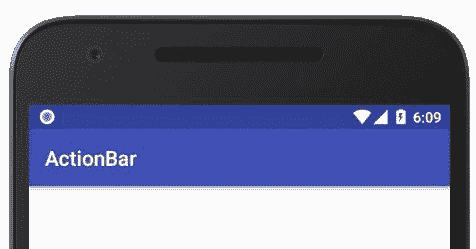

# 如何在安卓中以编程方式更改动作栏标题？

> 原文:[https://www . geesforgeks . org/how-change-action bar-title-以编程方式在安卓中运行/](https://www.geeksforgeeks.org/how-to-change-actionbar-title-programmatically-in-android/)

每当我们开发一个安卓应用程序并运行它时，我们经常会观察到该应用程序附带一个 [ActionBar](https://www.geeksforgeeks.org/actionbar-in-android-with-example/) ，其中有该应用程序的名称。除非明确更改，否则默认情况下会发生这种情况。本文在应用中称为**标题**。您可以通过更改值中的 app_name 字符串来更改应用程序的标题。



但是，如果一个应用程序有多个活动，所有这些活动将具有相同的标题。假设我们有主活动、次活动和第三活动。在导航时，可以观察到它们都有相同的标题，即应用程序的名称。因此，通过本文，我们将展示如何在运行时动态更改应用程序的标题。如果有多个活动来区分它们，您可以应用相同的概念。

### 逐步实施

**第一步:在安卓工作室新建项目**

要在安卓工作室创建新项目，请参考[如何在安卓工作室创建/启动新项目](https://www.geeksforgeeks.org/android-how-to-create-start-a-new-project-in-android-studio/)。我们在 **Kotlin** 中演示了该应用程序，因此在创建新项目时，请确保选择 Kotlin 作为主要语言。

**步骤 2:使用 activity_main.xml 文件**

导航到**应用程序> res >布局> activity_main.xml** ，并将下面的代码添加到该文件中。下面是 **activity_main.xml** 文件的代码。在布局文件中添加编辑文本和一个[按钮](https://www.geeksforgeeks.org/button-in-kotlin/)。我们将在[编辑文本](https://www.geeksforgeeks.org/edittext-widget-in-android-using-java-with-examples/)中键入所需的标题，并点击按钮执行标题更改操作。

## 可扩展标记语言

```kt
<?xml version="1.0" encoding="utf-8"?>
<RelativeLayout 
    xmlns:android="http://schemas.android.com/apk/res/android"
    xmlns:app="http://schemas.android.com/apk/res-auto"
    xmlns:tools="http://schemas.android.com/tools"
    android:layout_width="match_parent"
    android:layout_height="match_parent"
    tools:context=".MainActivity">

    <!-- Type something in this EditText
          to change the ActionBar text -->
    <EditText
        android:id="@+id/editText"
        android:layout_width="match_parent"
        android:layout_height="wrap_content"
        android:layout_centerInParent="true"/>

    <!-- Click this button to make changes -->
    <Button
        android:id="@+id/button1"
        android:layout_width="wrap_content"
        android:layout_height="wrap_content"
        android:text="Change Text"
        android:layout_centerHorizontal="true"
        android:layout_below="@id/editText"/>

</RelativeLayout>
```

**第 4 步:使用**T2【主活动. kt】文件

转到 **MainActivity.kt** 文件，参考以下代码。下面是 **MainActivity.kt** 文件的代码。代码中添加了注释，以更详细地理解代码。

## 我的锅

```kt
import androidx.appcompat.app.AppCompatActivity
import android.os.Bundle
import android.widget.Button
import android.widget.EditText
import android.widget.Toast

class MainActivity : AppCompatActivity() {
    override fun onCreate(savedInstanceState: Bundle?) {
        super.onCreate(savedInstanceState)
        setContentView(R.layout.activity_main)

        // Declaring and initializing EditText
        // and Button from the layout file
        val mEditText = findViewById<EditText>(R.id.editText)
        val mButtonText = findViewById<Button>(R.id.button1)

        // When the button is clicked
        mButtonText.setOnClickListener {

            // If the EditText field is not empty,
            // the ActionBar title will change
            // Else, the application will display a Toast message
            if(mEditText.text.isNotEmpty()){
                title = mEditText.text.toString()
            } else {
                Toast.makeText(applicationContext, "No input", Toast.LENGTH_SHORT).show()
            }
        }
    }
}
```

**输出:**

您可以看到，我们能够在运行时更改标题。

<video class="wp-video-shortcode" id="video-659024-1" width="640" height="360" preload="metadata" controls=""><source type="video/mp4" src="https://media.geeksforgeeks.org/wp-content/uploads/20210803101552/1019.mp4?_=1">[https://media.geeksforgeeks.org/wp-content/uploads/20210803101552/1019.mp4](https://media.geeksforgeeks.org/wp-content/uploads/20210803101552/1019.mp4)</video>