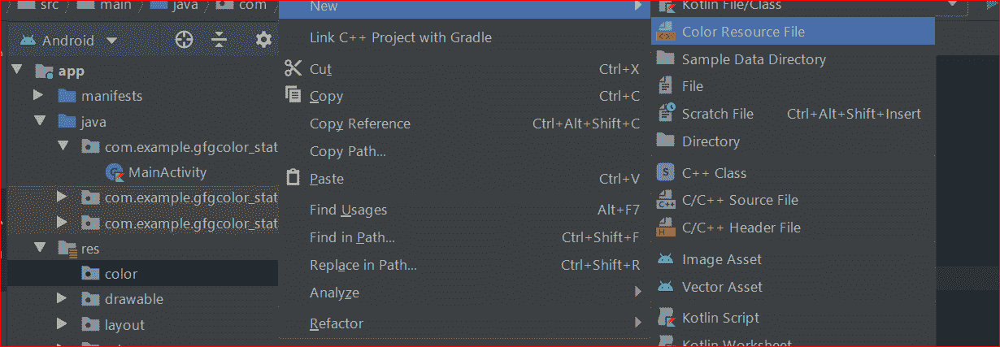

# 如何使用 ColorStateList 改变安卓系统中按钮的背景颜色？

> 原文:[https://www . geeksforgeeks . org/如何更改使用 colorstatelist 的安卓按钮的背景颜色/](https://www.geeksforgeeks.org/how-to-change-the-background-color-of-button-in-android-using-colorstatelist/)

**colorstatist 是一个可以在 XML 文件中定义的对象，该对象可以根据其所应用的**[**widgets**](https://www.geeksforgeeks.org/how-to-create-a-basic-widget-of-an-android-app/)**的状态，在 Widgets(如** [**【按钮】**](https://www.geeksforgeeks.org/button-in-kotlin/) **等)上应用不同的颜色。例如，按钮有许多状态，如(按下、聚焦或没有)和其他小部件状态，如启用、可检查、选中等。使用颜色状态列表是一种很好的方式来更改按钮的颜色，而不使用形状可绘制或自定义图像。人们应该记住颜色状态列表可以在任何使用颜色的地方使用。颜色状态列表是用 XML 定义的，保存在 res/color 文件夹下。**颜色状态列表的根元素是选择器**，使用颜色和 alpha 属性为您想要定义颜色的每个状态定义项目元素。**默认颜色应该是未定义特定状态的颜色时使用的最后一个元素。** 下面给出一个 GIF 样例，来了解一下在本文中我们要做什么。请注意，我们将使用**柯特林**语言来实现这个项目。**


### 方法

**第一步:创建新项目**

要在安卓工作室创建新项目，请参考[如何在安卓工作室创建/启动新项目](https://www.geeksforgeeks.org/android-how-to-create-start-a-new-project-in-android-studio/)。注意选择**科特林**作为编程语言。

**步骤 2:使用 activity_main.xml 文件**

转到布局文件夹，在**活动 _main.xml** 文件中，将 [约束布局](https://www.geeksforgeeks.org/android-ui-layouts/) 更改为 [线性布局](https://www.geeksforgeeks.org/android-linearlayout-in-kotlin/)，并将其方向垂直。将按钮和[开关](https://www.geeksforgeeks.org/switch-in-kotlin/)添加到布局中。下面是**activity _ main . XML**文件的代码。

## 可扩展标记语言

```kt
<?xml version="1.0" encoding="utf-8"?>

<!--Linear Layout with the vertical orientation and center gravity-->
<LinearLayout 
    xmlns:android="http://schemas.android.com/apk/res/android"
    xmlns:tools="http://schemas.android.com/tools"
    android:layout_width="match_parent"
    android:layout_height="match_parent"
    android:gravity="center"
    android:orientation="vertical"
    tools:context=".MainActivity">

    <!--Button whose background color depends on the 
        selector and state of the button-->
    <Button
        android:id="@+id/button"
        android:layout_width="160dp"
        android:layout_height="110dp"
        android:backgroundTint="@color/button_background_color"
        android:text="Click Me"
        android:textColor="@color/button_text_color"
        android:textSize="24sp"
        android:textStyle="bold" />

    <!--Switch with default state as enabled-->
    <Switch
        android:id="@+id/buttonSwitch"
        android:layout_width="160dp"
        android:layout_height="80dp"
        android:checked="true"
        android:text="Enabled"
        android:textAlignment="center"
        android:textSize="24sp"
        android:textStyle="bold" />

</LinearLayout>
```

**第三步:添加一个以颜色**命名的资源目录

向 res 文件夹添加一个名为 color 的资源目录，并保留根元素作为选择器，因为我们希望根据状态选择颜色。将两个名为**按钮 _ 文本 _ 颜色. xml** 和**按钮 _ 背景 _ 颜色. xml** 的资源文件添加到颜色资源目录中。出于与上面提到的相同的原因，保留选择器作为根元素。要执行上述操作，请参考下面的图像和代码。

要创建颜色资源文件，请右键单击 res 文件夹，单击新建，然后选择安卓资源目录。


现在在颜色资源目录中创建资源文件( **button_text_color.xml 和 button_background_color.xml** )，方法是右键单击颜色目录并保持选择器为根元素。



下面是****按钮 _background_color.xml** 文件的代码。**

## **可扩展标记语言**

```kt
<?xml version="1.0" encoding="utf-8"?>
<selector xmlns:android="http://schemas.android.com/apk/res/android">

    <!--When Button is not enabled -->
    <item android:state_enabled="false" android:color="#b6b7b5" />
    <!--When Button is in pressed state -->
    <item android:state_pressed="true" android:color="#22a540" />
    <!--When Button is in selected state -->
    <item android:state_selected="true" android:color="#fabcff" />
    <!--Default Background Color -->
    <item android:color="@android:color/white" />

</selector>
```

**下面是**按钮 _text_color.xml** 文件的代码。**

## **可扩展标记语言**

```kt
<?xml version="1.0" encoding="utf-8"?>
<selector xmlns:android="http://schemas.android.com/apk/res/android">

    <!--When the button is not enabled-->
    <item android:state_enabled="false" android:color="@android:color/white" />
    <!--When button is enabled-->
    <item android:state_selected="true" android:color="@android:color/white" />
    <!--Default Text Color-->
    <item android:color="#db402c" />

</selector>
```

****第 4 步:使用 MainActivity.kt 文件****

**转到 **MainActivity.kt** 文件，参考至以下代码。下面是 **MainActivity.kt** 文件的代码。代码中添加了注释，以更详细地理解代码。**

## **我的锅**

```kt
import android.os.Bundle
import androidx.appcompat.app.AppCompatActivity
import kotlinx.android.synthetic.main.activity_main.*

class MainActivity : AppCompatActivity() {
    override fun onCreate(savedInstanceState: Bundle?) {
        super.onCreate(savedInstanceState)
        setContentView(R.layout.activity_main)

        button.setOnClickListener {
            // if button is already in selected state and now it is pressed
            // again,then it will reach in not selected state and vice versa
            button.isSelected != button.isSelected
        }

        buttonSwitch.setOnCheckedChangeListener { buttonView, isChecked ->
            // if the switch is checked,then enable the button,else not
            button.isEnabled = isChecked
        }
    }
}
```

### ****输出:在仿真器上运行****

**<video class="wp-video-shortcode" id="video-500374-1" width="640" height="360" preload="metadata" controls=""><source type="video/mp4" src="https://media.geeksforgeeks.org/wp-content/uploads/20201013003613/Output_Video.mp4?_=1">[https://media.geeksforgeeks.org/wp-content/uploads/20201013003613/Output_Video.mp4](https://media.geeksforgeeks.org/wp-content/uploads/20201013003613/Output_Video.mp4)</video>**