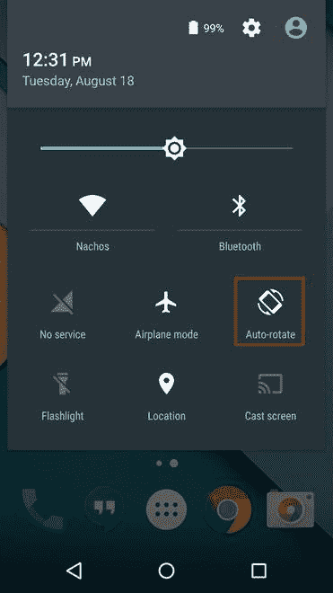

# 如何在安卓中使用按钮编程改变屏幕方向？

> 原文:[https://www . geeksforgeeks . org/如何更改屏幕方向-以编程方式使用安卓中的按钮/](https://www.geeksforgeeks.org/how-to-change-the-screen-orientation-programmatically-using-a-button-in-android/)

通常，任何应用程序的屏幕方向都是纵向样式的。但是，当涉及到游戏或任何其他多媒体服务(如观看视频)时，屏幕方向必须从纵向功能更改为横向功能，或者当不需要该功能时，反之亦然。因此，开发人员必须明确地编写一个程序，在该程序中，方向会改变，而无需用户通过打开和关闭向下滑动菜单中的旋转/自动旋转来调用它。



将屏幕更改为横向模式的主要重点是增加动作和响应的面积，在不需要时恢复正常。如果直接退出应用程序，可以忽略后者。所以这不是一个应用程序，相反，它是一个特性，可以给任何应用程序。可以添加此功能的一些应用包括:

1.  **游戏应用程序:**如前所述。横向视图为游戏应用程序中的触摸屏幕提供了更好的可访问性。
2.  **视频应用程序**:播放视频等多媒体的应用程序可以通过利用每个屏幕的像素来启用该功能来观看相同的视频。
3.  **照片编辑应用程序:**随着显示尺寸的增加，该功能可以帮助用户查看变化并比较图像的两个不同部分。
4.  **需要多个用户输入的应用程序:**如记事本或浏览器，用户可以在其中阅读正在编写的整行或整段文字或应用程序。

在这个应用程序中，我们将创建这个特性并保持它的明确性，也就是说，应该单击一个按钮来进行更改。本文后面部分的代码仅限于创建的应用程序。在应用程序内部更改的屏幕方向不会在应用程序外部进行更改，即应用程序外部的方向与之前相同。注意，我们将使用**语言来实现这个项目。**

### ****使用按钮以编程方式更改屏幕方向的步骤****

****第一步:创建新项目****

**要在安卓工作室创建新项目，请参考[如何在安卓工作室创建/启动新项目](https://www.geeksforgeeks.org/android-how-to-create-start-a-new-project-in-android-studio/)。注意选择**科特林**作为编程语言。**

****步骤 2:使用 activity_main.xml 文件****

**设置完成后，转到 **activity_main.xml** 文件，该文件代表项目的 UI。创建一个[按钮](https://www.geeksforgeeks.org/button-in-kotlin/)，点击后改变屏幕方向。下面是**activity _ main . XML**文件的代码。**

## **可扩展标记语言**

```
<?xml version="1.0" encoding="utf-8"?>
<RelativeLayout 
    xmlns:android="http://schemas.android.com/apk/res/android"
    xmlns:app="http://schemas.android.com/apk/res-auto"
    xmlns:tools="http://schemas.android.com/tools"
    android:layout_width="match_parent"
    android:layout_height="match_parent"
    tools:context=".MainActivity">

    <Button
        android:id="@+id/btn"
        android:layout_width="wrap_content"
        android:layout_height="wrap_content"
        android:layout_centerInParent="true"
        android:text="click" />

</RelativeLayout>
```

****第三步:使用 MainActivity.kt 文件****

**在 **MainActivity.kt** 文件中，声明按钮改变屏幕方向(参考代码)。将 **onClickListeners** 设置为按钮时，定向请求被发送到 **ActivityInfo** 。下面是 **MainActivity.kt** 文件的代码。代码中添加了注释，以更详细地理解代码。**

## **我的锅**

```
import android.content.pm.ActivityInfo
import androidx.appcompat.app.AppCompatActivity
import android.os.Bundle
import android.widget.Button

class MainActivity : AppCompatActivity() {
    override fun onCreate(savedInstanceState: Bundle?) {
        super.onCreate(savedInstanceState)
        setContentView(R.layout.activity_main)

        val btn = findViewById<Button>(R.id.btn)

        // reference to change the orientation on every click
        var isPortrait = true

        // Button action on click
        btn.setOnClickListener {
            // if isPortrait true, change to Landscape
            requestedOrientation = if (isPortrait) {
                ActivityInfo.SCREEN_ORIENTATION_LANDSCAPE
                // else change to Portrait           
            } else {
                ActivityInfo.SCREEN_ORIENTATION_PORTRAIT
            }

            // opposite the value of isPortrait
            isPortrait = !isPortrait
        }
    }
}
```

### **输出:在模拟器上运行**

**<video class="wp-video-shortcode" id="video-495687-1" width="640" height="360" preload="metadata" controls=""><source type="video/mp4" src="https://media.geeksforgeeks.org/wp-content/uploads/20201005191510/Screen-Recording-2020-10-05-at-19.05.55.mp4?_=1">[https://media.geeksforgeeks.org/wp-content/uploads/20201005191510/Screen-Recording-2020-10-05-at-19.05.55.mp4](https://media.geeksforgeeks.org/wp-content/uploads/20201005191510/Screen-Recording-2020-10-05-at-19.05.55.mp4)</video>**