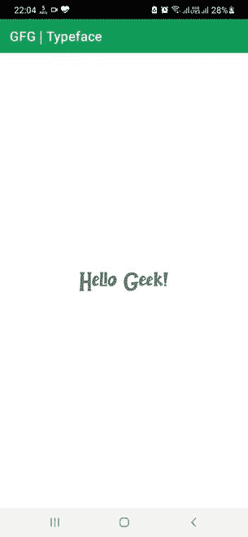

# 如何在安卓中更改 TextView 的字体？

> 原文:[https://www . geeksforgeeks . org/如何更改安卓文本视图字体/](https://www.geeksforgeeks.org/how-to-change-typeface-of-textview-in-android/)

字体是字母的一种特殊设计，它在风格、大小和重量变化方面与其他字体不同。一般来说，您的设备或软件上有很多本地字体可供使用。然而，在互联网上有更多的字体可以下载并用于各自的作品。


类似地，可以引入这样的字体来显示文本视图中的文本。因此，在本文中，我们将向您展示如何使用下载字体，并将其应用于安卓应用程序的文本视图中的文本。

### 逐步实施

**第一步:在安卓工作室新建项目**

要在安卓工作室创建新项目，请参考[如何在安卓工作室创建/启动新项目](https://www.geeksforgeeks.org/android-how-to-create-start-a-new-project-in-android-studio/)。我们在 **Kotlin** 中演示了该应用程序，因此在创建新项目时，请确保选择 Kotlin 作为主要语言。

**步骤 2:使用 activity_main.xml 文件**

导航到**应用程序> res >布局> activity_main.xml** ，并将下面的代码添加到该文件中。下面是 **activity_main.xml** 文件的代码。在布局文件中添加一个[文本视图](https://www.geeksforgeeks.org/textview-in-kotlin/)。

## 可扩展标记语言

```
<?xml version="1.0" encoding="utf-8"?>
<RelativeLayout 
    xmlns:android="http://schemas.android.com/apk/res/android"
    xmlns:app="http://schemas.android.com/apk/res-auto"
    xmlns:tools="http://schemas.android.com/tools"
    android:layout_width="match_parent"
    android:layout_height="match_parent"
    tools:context=".MainActivity">

    <!--TextView to display the text-->
    <TextView
        android:id="@+id/text_view"
        android:layout_width="wrap_content"
        android:layout_height="wrap_content"
        android:layout_centerInParent="true"
        android:text="Hello Geek!"
        android:textSize="40sp"/>

</RelativeLayout>
```

**第三步:下载所需字体并保存在资产文件夹**中

我们从[这里](//www.dafont.com/jelly-bomb.font)下载一个字体。但是，您可以下载自己选择的字体。现在，只需复制下载的字体文件并将其粘贴到资产文件夹中。如果您对资产文件夹一无所知，或者您的文件夹中缺少该文件夹，请按照安卓工作室中[资产文件夹上的这篇文章创建一个新的资产文件夹。](https://www.geeksforgeeks.org/assets-folder-in-android/)

**第 4 步:使用**T2【主活动. kt】文件

转到 **MainActivity.kt** 文件，参考以下代码。下面是 **MainActivity.kt** 文件的代码。代码中添加了注释，以更详细地理解代码。

## 我的锅

```
import android.graphics.Typeface
import androidx.appcompat.app.AppCompatActivity
import android.os.Bundle
import android.widget.TextView

class MainActivity : AppCompatActivity() {
    override fun onCreate(savedInstanceState: Bundle?) {
        super.onCreate(savedInstanceState)
        setContentView(R.layout.activity_main)

        val mTextView = findViewById<TextView>(R.id.text_view)

        // Creating a typeface
        val font = Typeface.createFromAsset(assets, "JellyBomb.ttf")

        // Setting the TextView typeface
        mTextView.typeface = font
    }
}
```

**输出:**

您可以看到字体应用于文本视图中的文本。

