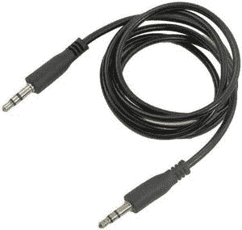

# 如何编程检查安卓系统中 AUX 是否插电？

> 原文:[https://www . geeksforgeeks . org/如何以编程方式检查 aux 是否插入 Android/](https://www.geeksforgeeks.org/how-to-check-if-aux-is-plugged-or-not-in-android-programmatically/)

**AUX(辅助)端口**是大多数日常使用的电子设备中常见的端口。它是一个标准通信端口，用于将音频信号从一台设备传输到另一台设备。我们大多在手机、电脑、电视机、扬声器、耳机和头戴式耳机上观察它们。在播放音乐时，如果我们在手机和外部扬声器(如耳机)之间建立有线电缆，音乐应用程序必须快速从其先前的扬声器断开连接，并开始在耳机中播放。在这里，设备有必要知道是否插入了辅助设备。



因此，在本文中，我们将向您展示如何通过编程检查辅助电缆是否插入安卓系统。

### 逐步实施

**第一步:在安卓工作室新建项目**

要在安卓工作室创建新项目，请参考[如何在安卓工作室创建/启动新项目](https://www.geeksforgeeks.org/android-how-to-create-start-a-new-project-in-android-studio/)。我们在 **Kotlin** 中演示了该应用程序，因此在创建新项目时，请确保选择 Kotlin 作为主要语言。

**步骤 2:使用**T2【主活动. kt】文件

转到 **MainActivity.kt** 文件，参考以下代码。下面是 **MainActivity.kt** 文件的代码。代码中添加了注释，以更详细地理解代码。

## 我的锅

```
import android.content.BroadcastReceiver
import android.content.Context
import android.content.Intent
import android.content.IntentFilter
import androidx.appcompat.app.AppCompatActivity
import android.os.Bundle
import android.widget.Toast

class MainActivity : AppCompatActivity() {
    override fun onCreate(savedInstanceState: Bundle?) {
        super.onCreate(savedInstanceState)
        setContentView(R.layout.activity_main)

        // Declaring a broadcast receiver to 
        // check if headset plug is plugged in
        val mBroadcastReceiver = object : BroadcastReceiver(){
            override fun onReceive(context: Context?, intent: Intent) {
                val mAction = intent.action
                if (Intent.ACTION_HEADSET_PLUG == mAction) {
                    if (intent.getIntExtra("state", -1) == 0) {
                        Toast.makeText(applicationContext, "AUX not plugged in", Toast.LENGTH_LONG).show()
                    }
                    if (intent.getIntExtra("state", -1) == 1) {
                        Toast.makeText(applicationContext, "AUX plugged in", Toast.LENGTH_LONG).show()
                    }
                }
            }
        }

        // Declaring a receiver filter for registering
        val mReceiverFilter = IntentFilter(Intent.ACTION_HEADSET_PLUG)

        // Registering both broadcast receiver with receiver filter
        registerReceiver(mBroadcastReceiver, mReceiverFilter)
    }
}
```

**输出:**

最初，没有插入辅助电缆。所以我们没有插上辅助设备。然后我们手动插入辅助电缆，我们得到一个肯定的祝酒词。

<video class="wp-video-shortcode" id="video-684164-1" width="640" height="360" preload="metadata" controls=""><source type="video/mp4" src="https://media.geeksforgeeks.org/wp-content/uploads/20210816231205/o108.mp4?_=1">[https://media.geeksforgeeks.org/wp-content/uploads/20210816231205/o108.mp4](https://media.geeksforgeeks.org/wp-content/uploads/20210816231205/o108.mp4)</video>