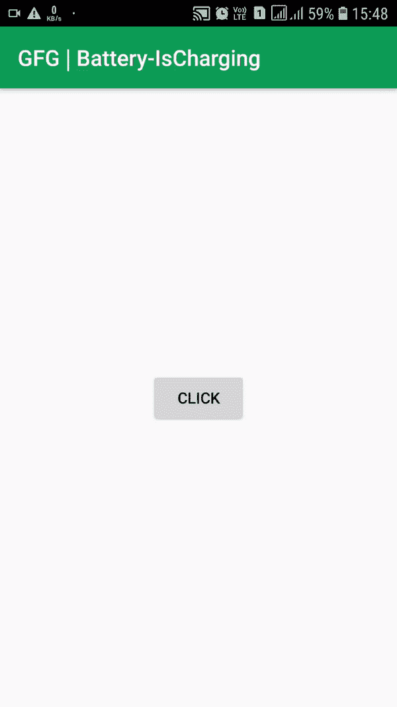

# 如何在安卓编程检查电池是否在充电？

> 原文:[https://www . geesforgeks . org/如何通过编程检查电池是否在安卓系统中充电/](https://www.geeksforgeeks.org/how-to-check-if-the-battery-is-charging-or-not-in-android-programmatically/)

充电状态可以随着设备的插入而快速改变，因此监控充电状态的变化并相应地改变刷新率至关重要。每当设备接通或断开电源时，电池管理器都会广播一个操作。即使应用程序没有明显运行，接收这些事件也很重要。此类事件应该会影响您启动应用程序以启动后台更新的频率。因此，您应该在清单中注册一个[广播接收器](https://www.geeksforgeeks.org/components-android-application/)，通过在意图过滤器(过滤器)中定义**动作 _ 电源 _ 连接**和**动作 _ 电源 _ 断开**来监听这两个事件。下面给出了一个 GIF 示例，来了解一下 我们在本文中要做什么 。 注意，我们要用 **Kotlin** 语言来实现这个项目。 关注状态栏中的电池状态。



### **接近**

**第一步:创建新项目**

要在安卓工作室创建新项目，请参考[如何在安卓工作室创建/启动新项目](https://www.geeksforgeeks.org/android-how-to-create-start-a-new-project-in-android-studio/)。注意选择**科特林**作为编程语言。

**步骤 2:使用 activity_main.xml 文件**

转到**activity _ main . XML**文件，该文件代表项目的 UI。添加一个按钮，这样每当用户点击按钮时，屏幕上会弹出一条带有电池状态(充电与否)的消息。下面是**activity _ main . XML**文件的代码。

## 可扩展标记语言

```kt
<?xml version="1.0" encoding="utf-8"?>
<RelativeLayout 
    xmlns:android="http://schemas.android.com/apk/res/android"
    xmlns:app="http://schemas.android.com/apk/res-auto"
    xmlns:tools="http://schemas.android.com/tools"
    android:layout_width="match_parent"
    android:layout_height="match_parent"
    tools:context=".MainActivity">

    <Button
        android:id="@+id/btn"
        android:layout_width="wrap_content"
        android:layout_height="wrap_content"
        android:layout_centerInParent="true"
        android:text="Click"
        />

</RelativeLayout>
```

**第三步:使用 MainActivity.kt 文件**

最后，转到 **MainActivity.kt** 文件，参考以下代码。下面是 **MainActivity.kt** 文件的代码。代码中添加了注释，以更详细地理解代码。

## 我的锅

```kt
import android.content.Intent
import android.content.IntentFilter
import android.os.BatteryManager
import androidx.appcompat.app.AppCompatActivity
import android.os.Bundle
import android.widget.Button
import android.widget.Toast

class MainActivity : AppCompatActivity() {
    override fun onCreate(savedInstanceState: Bundle?) {
        super.onCreate(savedInstanceState)
        setContentView(R.layout.activity_main)

        // Button onclick will display the status of charging
        val btn = findViewById<Button>(R.id.btn)

        btn.setOnClickListener {

              // Intent to check the actions on battery
            val batteryStatus: Intent? = IntentFilter(Intent.ACTION_BATTERY_CHANGED).let { ifilter ->
                applicationContext.registerReceiver(null, ifilter)
            }

            // isCharging if true indicates charging is ongoing and vice-versa
            val status: Int = batteryStatus?.getIntExtra(BatteryManager.EXTRA_STATUS, -1) ?: -1
            val isCharging: Boolean = status == BatteryManager.BATTERY_STATUS_CHARGING
                    || status == BatteryManager.BATTERY_STATUS_FULL

              // Display whatever the state in the form of a Toast
            if(isCharging) {
                Toast.makeText(applicationContext, "Charging", Toast.LENGTH_LONG).show()
            } else {
                Toast.makeText(applicationContext,"Not Charging", Toast.LENGTH_LONG).show()
            }
        }
    }
}
```

### 输出:在物理设备上运行

注意状态栏中的电池状态。

<video class="wp-video-shortcode" id="video-496272-1" width="640" height="360" preload="metadata" controls=""><source type="video/mp4" src="https://media.geeksforgeeks.org/wp-content/uploads/20200921221701/is-Charging-1.mp4?_=1">[https://media.geeksforgeeks.org/wp-content/uploads/20200921221701/is-Charging-1.mp4](https://media.geeksforgeeks.org/wp-content/uploads/20200921221701/is-Charging-1.mp4)</video>