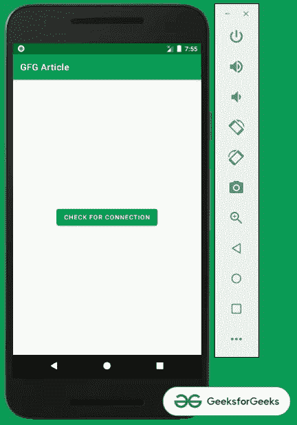
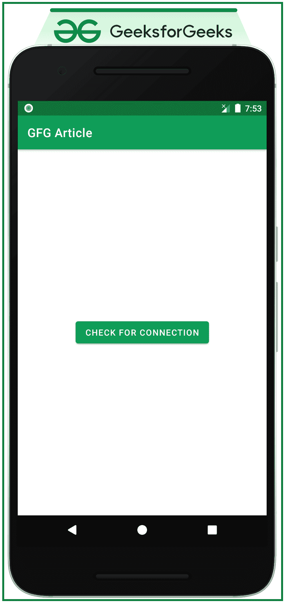

# 如何在科特林检查互联网连接？

> 原文:[https://www . geeksforgeeks . org/如何检查互联网连接 in-kotlin/](https://www.geeksforgeeks.org/how-to-check-internet-connection-in-kotlin/)

如果安卓应用程序正在开发，这是基于互联网的，那么必须有一个功能来检查互联网连接，并通知用户没有互联网可用。所以在这篇文章中，我们一步一步地展示了它。如何检查互联网连接？请看下面这张概述讨论的图片。



### 逐步实施

**第一步:创建一个空的活动项目**

创建一个空的活动安卓工作室项目。参考[如何在安卓工作室](https://www.geeksforgeeks.org/android-how-to-create-start-a-new-project-in-android-studio/)新建/启动一个项目，了解如何创建一个空的活动项目。并选择**科特林**作为编程语言。

**第二步:使用 acitivity _ main.xml 文件**

*   应用程序的主布局只包含一个按钮。点击后，会出现一个包含连接状态的祝酒词。
*   要实现相同的用户界面，请在**activity _ main . XML**文件中调用以下代码。

## 可扩展标记语言

```kt
<?xml version="1.0" encoding="utf-8"?>
<androidx.constraintlayout.widget.ConstraintLayout
    xmlns:android="http://schemas.android.com/apk/res/android"
    xmlns:app="http://schemas.android.com/apk/res-auto"
    xmlns:tools="http://schemas.android.com/tools"
    android:layout_width="match_parent"
    android:layout_height="match_parent"
    tools:context=".MainActivity">

    <Button
        android:id="@+id/buttonCheck"
        android:layout_width="wrap_content"
        android:layout_height="wrap_content"
        android:text="CHECK FOR CONNECTION"
        android:textColor="@color/white"
        app:layout_constraintBottom_toBottomOf="parent"
        app:layout_constraintLeft_toLeftOf="parent"
        app:layout_constraintRight_toRightOf="parent"
        app:layout_constraintTop_toTopOf="parent" />

</androidx.constraintlayout.widget.ConstraintLayout>
```

**输出 UI:**



**第三步:使用 MainActivity.kt 文件**

*   MainActivity.kt 文件包含一些已经内置的用来处理网络连接的应用编程接口。
*   首先，我们应该向 ConnectivityManager 服务注册该活动。
*   其次，我们需要检查安卓版本。如果版本低于 M，则使用 activeNetworkInfo API，或者如果版本等于或高于 M，则使用 NetworkCapabilities API。
*   为了实现相同的调用，在 MainActivity.kt 文件中添加了以下代码，以便更好地理解。

## 我的锅

```kt
import android.content.Context
import android.net.ConnectivityManager
import android.net.NetworkCapabilities
import android.os.Build
import androidx.appcompat.app.AppCompatActivity
import android.os.Bundle
import android.widget.Button
import android.widget.Toast

class MainActivity : AppCompatActivity() {

    override fun onCreate(savedInstanceState: Bundle?) {
        super.onCreate(savedInstanceState)
        setContentView(R.layout.activity_main)

        // register the UI element button
        val checkButton: Button = findViewById(R.id.buttonCheck)

        // handle the button click to trigger
        // checkForInternet function
        // and show the Toast message according to it.
        checkButton.setOnClickListener {
            if (checkForInternet(this)) {
                Toast.makeText(this, "Connected", Toast.LENGTH_SHORT).show()
            } else {
                Toast.makeText(this, "Disconnected", Toast.LENGTH_SHORT).show()
            }
        }
    }

    private fun checkForInternet(context: Context): Boolean {

        // register activity with the connectivity manager service
        val connectivityManager = context.getSystemService(Context.CONNECTIVITY_SERVICE) as ConnectivityManager

        // if the android version is equal to M
        // or greater we need to use the
        // NetworkCapabilities to check what type of
        // network has the internet connection
        if (Build.VERSION.SDK_INT >= Build.VERSION_CODES.M) {

            // Returns a Network object corresponding to 
            // the currently active default data network.
            val network = connectivityManager.activeNetwork ?: return false

            // Representation of the capabilities of an active network.
            val activeNetwork = connectivityManager.getNetworkCapabilities(network) ?: return false

            return when {
                // Indicates this network uses a Wi-Fi transport,
                // or WiFi has network connectivity
                activeNetwork.hasTransport(NetworkCapabilities.TRANSPORT_WIFI) -> true

                // Indicates this network uses a Cellular transport. or 
                // Cellular has network connectivity
                activeNetwork.hasTransport(NetworkCapabilities.TRANSPORT_CELLULAR) -> true

                // else return false
                else -> false
            }
        } else {
            // if the android version is below M
            @Suppress("DEPRECATION") val networkInfo =
                connectivityManager.activeNetworkInfo ?: return false
            @Suppress("DEPRECATION")
            return networkInfo.isConnected
        }
    }
}
```

**输出:**

<video class="wp-video-shortcode" id="video-644412-1" width="640" height="360" preload="metadata" controls=""><source type="video/mp4" src="https://media.geeksforgeeks.org/wp-content/uploads/20210713195911/Untitled.mp4?_=1">[https://media.geeksforgeeks.org/wp-content/uploads/20210713195911/Untitled.mp4](https://media.geeksforgeeks.org/wp-content/uploads/20210713195911/Untitled.mp4)</video>