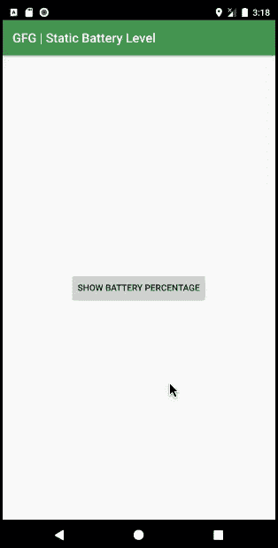

# 如何在安卓中编程检查电池电量？

> 原文:[https://www . geesforgeks . org/如何以编程方式检查安卓系统中的电池电量/](https://www.geeksforgeeks.org/how-to-check-the-battery-level-in-android-programmatically/)

有时，确定当前的电池电量是有用的。如果电池电量低于一定水平，您可以选择降低后台更新的速度。但是不能连续监控电池状态。一般来说，持续监控电池电量的影响比应用程序的正常行为对电池的影响更大。因此，最好只监控电池电量的实质性变化。下面给出了一个 GIF 示例，来了解一下我们将在本文中做什么。 注意，我们要用 **Kotlin** 语言来实现这个项目。



### 接近

**第一步:创建新项目**

要在安卓工作室创建新项目，请参考[如何在安卓工作室创建/启动新项目](https://www.geeksforgeeks.org/android-how-to-create-start-a-new-project-in-android-studio/)。注意选择**科特林**作为编程语言。

**步骤 2:使用 activity_main.xml 文件**

转到 **activity_main.xml** 文件，该文件代表项目的 UI。添加一个按钮，这样每当用户点击按钮时，屏幕上会弹出一条带有电量百分比的[吐司](https://www.geeksforgeeks.org/android-what-is-toast-and-how-to-use-it-with-examples/)信息。下面是**activity _ main . XML**文件的代码。

## 可扩展标记语言

```kt
<?xml version="1.0" encoding="utf-8"?>
<RelativeLayout 
    xmlns:android="http://schemas.android.com/apk/res/android"
    xmlns:app="http://schemas.android.com/apk/res-auto"
    xmlns:tools="http://schemas.android.com/tools"
    android:layout_width="match_parent"
    android:layout_height="match_parent"
    tools:context=".MainActivity">

    <Button
        android:id="@+id/showBtn"
        android:layout_width="wrap_content"
        android:layout_height="wrap_content"
        android:layout_centerInParent="true"
        android:text="show battery percentage"
        />

</RelativeLayout>
```

**第三步:使用 MainActivity.kt 文件**

最后，转到 **MainActivity.kt** 文件，参考以下代码。下面是 **MainActivity.kt** 文件的代码。代码中添加了注释，以更详细地理解代码。

## 我的锅

```kt
import android.os.BatteryManager
import androidx.appcompat.app.AppCompatActivity
import android.os.Bundle
import android.widget.Toast

class MainActivity : AppCompatActivity() {
    override fun onCreate(savedInstanceState: Bundle?) {
        super.onCreate(savedInstanceState)
        setContentView(R.layout.activity_main)

        // Declare button, that will show battery percentage when clicked
        val btn = findViewById<Button>(R.id.showBtn)

        btn.setOnClickListener{

        // Call battery manager service
        val bm = applicationContext.getSystemService(BATTERY_SERVICE) as BatteryManager

          // Get the battery percentage and store it in a INT variable
        val batLevel:Int = bm.getIntProperty(BatteryManager.BATTERY_PROPERTY_CAPACITY)

        // Display the variable using a Toast
        Toast.makeText(applicationContext,"Battery is $batLevel%",Toast.LENGTH_LONG).show()
        }
    }
}
```

### 输出:在模拟器上运行

<video class="wp-video-shortcode" id="video-496263-1" width="640" height="360" preload="metadata" controls=""><source type="video/mp4" src="https://media.geeksforgeeks.org/wp-content/uploads/20201001103139/BatteryLevel.mp4?_=1">[https://media.geeksforgeeks.org/wp-content/uploads/20201001103139/BatteryLevel.mp4](https://media.geeksforgeeks.org/wp-content/uploads/20201001103139/BatteryLevel.mp4)</video>