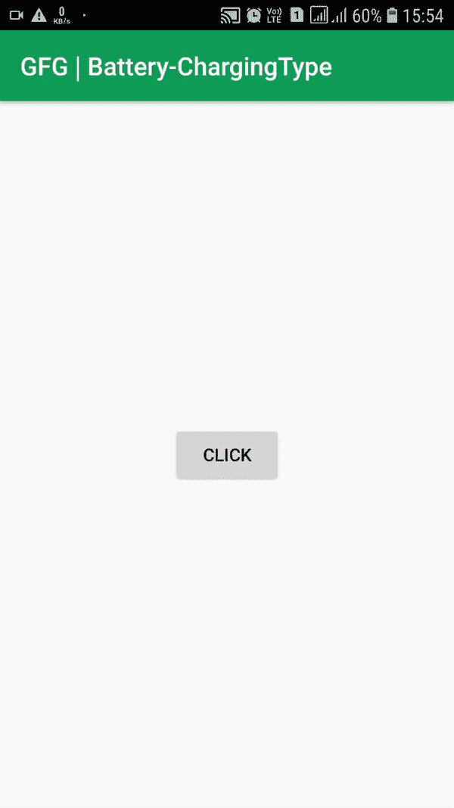

# 如何在安卓中编程检查充电类型(USB/AC)？

> 原文:[https://www . geeksforgeeks . org/如何以编程方式检查安卓系统中的充电类型-USB-AC/](https://www.geeksforgeeks.org/how-to-check-the-type-of-charging-usb-ac-in-android-programmatically/)

当改变后台更新的频率以缩小这些更新对电池寿命的影响时，检查当前的电池电量和充电状态是一个极好的开始。执行应用程序更新对电池寿命的影响取决于设备的电池电量和充电状态。当设备通过交流电充电时，执行更新的影响可以忽略不计，因此在大多数情况下，只要设备连接到壁式充电器，刷新率就会最大化。相反，如果设备正在放电，降低更新速率有助于延长电池寿命。同样，您将检查电池电量，当电池电量几乎耗尽时，可能会降低更新的频率，甚至停止更新。任何智能手机都有 **2** 种充电方式:

*   **USB 充电:**通用串行总线充电:从笔记本电脑的 USB 端口等 USB 插座充电:**最大 500 毫安**。
*   **交流充电:**交流充电:从壁式充电器充电:**最大 2 安培**。

下面给出了一个 GIF 示例，来了解一下我们将在本文中做什么。 注意，我们要用 **Kotlin** 语言来实现这个项目。



### 方法

**第一步:创建新项目**

要在安卓工作室创建新项目，请参考[如何在安卓工作室创建/启动新项目](https://www.geeksforgeeks.org/android-how-to-create-start-a-new-project-in-android-studio/)。注意选择**科特林**作为编程语言。

**步骤 2:使用 activity_main.xml 文件**

转到**activity _ main . XML**文件，该文件代表项目的 UI。增加一个按钮，这样每当用户点击按钮时，屏幕上会弹出一条带有电池充电类型的消息。下面是**activity _ main . XML**文件的代码。

## 可扩展标记语言

```kt
<?xml version="1.0" encoding="utf-8"?>
<RelativeLayout 
    xmlns:android="http://schemas.android.com/apk/res/android"
    xmlns:app="http://schemas.android.com/apk/res-auto"
    xmlns:tools="http://schemas.android.com/tools"
    android:layout_width="match_parent"
    android:layout_height="match_parent"
    tools:context=".MainActivity">

    <Button
        android:id="@+id/btn"
        android:layout_width="wrap_content"
        android:layout_height="wrap_content"
        android:layout_centerInParent="true"
        android:text="Click"
        />

</RelativeLayout>
```

**第三步:使用 MainActivity.kt 文件**

最后，转到 **MainActivity.kt** 文件，参考以下代码。下面是 **MainActivity.kt** 文件的代码。代码中添加了注释，以更详细地理解代码。

## 我的锅

```kt
import android.content.Intent
import android.content.IntentFilter
import android.os.BatteryManager
import androidx.appcompat.app.AppCompatActivity
import android.os.Bundle
import android.widget.Button
import android.widget.Toast

class MainActivity : AppCompatActivity() {
    override fun onCreate(savedInstanceState: Bundle?) {
        super.onCreate(savedInstanceState)
        setContentView(R.layout.activity_main)

        // Button onclick will display the type of charging
        val btn = findViewById<Button>(R.id.btn)
        btn.setOnClickListener {

            // Intent to check the actions on battery
            val batteryStatus: Intent? =
                IntentFilter(Intent.ACTION_BATTERY_CHANGED).let { ifilter ->
                    applicationContext.registerReceiver(null, ifilter)
                }

            // isCharging if true indicates charging is ongoing and vice-versa
            val status: Int = batteryStatus?.getIntExtra(BatteryManager.EXTRA_STATUS, -1) ?: -1
            val isCharging: Boolean = status == BatteryManager.BATTERY_STATUS_CHARGING
                    || status == BatteryManager.BATTERY_STATUS_FULL

            // usbCharge is true when connected to usb port and same with the ac wall charger
            val chargePlug: Int = batteryStatus?.getIntExtra(BatteryManager.EXTRA_PLUGGED, -1) ?: -1
            val usbCharge: Boolean = chargePlug == BatteryManager.BATTERY_PLUGGED_USB
            val acCharge: Boolean = chargePlug == BatteryManager.BATTERY_PLUGGED_AC

            // Display whatever the state in the form of a Toast
            when {
                usbCharge -> {
                    Toast.makeText(applicationContext, "USB Charging", Toast.LENGTH_LONG).show()
                }
                acCharge -> {
                    Toast.makeText(applicationContext, "AC Charging", Toast.LENGTH_LONG).show()
                }
                else -> {
                    Toast.makeText(applicationContext, "Not Charging", Toast.LENGTH_LONG).show()
                }
            }
        }
    }
}
```

### 输出:在物理设备上运行

注意状态栏中的电池状态。动作的顺序:

1.  最初没有联系。
2.  连接到笔记本电脑的 USB 端口。
3.  断开连接。
4.  已连接至交流壁式充电器。
5.  断开连接。

<video class="wp-video-shortcode" id="video-496281-1" width="640" height="360" preload="metadata" controls=""><source type="video/mp4" src="https://media.geeksforgeeks.org/wp-content/uploads/20200921223736/Chargingtype-1.mp4?_=1">[https://media.geeksforgeeks.org/wp-content/uploads/20200921223736/Chargingtype-1.mp4](https://media.geeksforgeeks.org/wp-content/uploads/20200921223736/Chargingtype-1.mp4)</video>